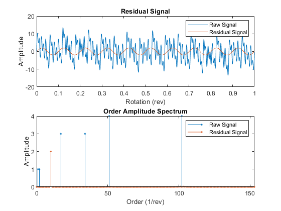

# <center>MATLAB 预测性维护工具箱介绍</center>

**用途：**本工具箱可标记数据、设计寿命健康因子并预测机器剩余寿命

**主要功能：**探索、提取数据特征并按指定的指标做出特征排序，相关技术包括基于数据和基于模型的方法，如统计分析、时频域分析。简单的寿命监控例子包括通过从振动数据的时频特征提取，监控转动机器的轴承或变速箱的健康状况。对于预测寿命可使用生存模型、相似性模型和基于趋势分析的模型预测剩余寿命

**主要模块：**数据管理、数据预处理、健康状况指标识别、检测和预测故障、预测剩余寿命、部署算法

**数据导入方式：**本地、云储存、分布式文件系统、Simulink仿真数据

**主要部件：**预测性维护工具箱主要由Signal Processing Toolbox，Statistic and Machine Learning Toolbox，System Identification Toolbox组成，大部分函数都可以在这三个工具箱中找到

下面介绍仅包含在Predictive Maintenance Toolbox中的函数，同时给出各个模块对应的功能样例和几个与实际生产过程相关的应用案例

<div STYLE="page-break-after: always;"></div>
# 1. 工具箱函数（主要介绍新增函数）

## 1.1. 数据管理

`fileEnsembleDatastore`用来读取文件夹中符合文件扩展形式的所有数据文件，如

```matlab
fensemble = fileEnsembleDatastore('D:\RQMS\电流传感器故障\data\ERX5\','.csv')
fensemble = fileEnsembleDatastore('D:\RQMS\电流传感器故障\data\ERX5\','.csv','ConditionVariables',["FaultCond";"ID"])
```

此时结果`fensemble`具有以下属性，属于object类型


之后的几个函数都是基于这个`fileEnsembleDatastore`展开的操作

`simulationEnsembleDatastore`直接从`simulink`模型中读取数据到对象中，其中`generateSimulationEnsemble`函数直接用来读取`simulink`数据

`read`和`writeToLastMemberRead`同属于对数据存储对象操作的函数，分别为从集成的数据存储中读取一部分子数据集和写数据到集成数据集中的某一子数据集中

## 1.2. 数据预处理

本文档仅介绍预测性维护工具箱新引入的函数，对于包含在别的工具箱中用到的函数不加介绍

**信号分析函数**

- `tsadifference`，时间同步平均信号的差分信号

  

- `tsaregular`，时间同步平均信号的正则信号


- `tsaresidual`，时间同步平均信号的残值信号

  

使用形式：

```matlab
Y = tsa__(X,fs,rpm,orderList)
Y = tsa__(X,t,rpm,orderList)
Y = tsa__(XT,rpm,orderList)
[Y,S] = tsa__(___)
___ = tsa__(___)
```

其中，X表示mat形式的时间同步平均信号，XT表示timetable形式的时间同步平均信号，fs表示TSA信号的采样频率，t表示采样时间，rpm表示机器转速，orderList表示需要在TSA信号中被滤除的阶数

**频率带生成函数**

- `bearingFaultBands`，围绕滚珠或滚子轴承的特征故障频率生成频带或进行光谱特征提取

- `gearMeshFaultBands`，围绕啮合齿轮的特征故障频率构造频带或进行频谱特征提取

- `faultBands`，生成故障频带进行光谱特征提取

前两个函数的输入参数都有赖于轴承或者齿轮的参数，非常具有特异性，不具有普遍性，就不展开细述

`faultBands`主要基于机器的基础频率和基础频率的谐振得出故障频率带，示例如下

```matlab
F0 = 60;  %故障频率为60Hz
N0 = 1:2; %基频谐波
slip = 0.03; 
F1 = 2*slip*F0; %第一边到基频的距离
N1 = 1:3; %基频边带及其谐波
```

```matlab
faultBands(F0,N0)
```


```matlab
faultBands(F0,N0,F1,N1)
```


## 1.3. 健康状况指标识别

**表征混沌运动过程**

`phaseSpaceReconstruction`，将观测到的时间序列转化为状态向量，将作为下列`approximateEntropy`，`correlationDimension`，`lyapunovExponent`三项指标计算的第一步。最终求得三个值，空间重构后的数据`XR`，预计的延迟值`eLag`，嵌入维度`eDim`。例如某个空间重构后的时序数据在求得`eLag`和`eDim`后的图像如下


其中$x_1(t),x_1(t+10),x_1(t+20)$ 中的$10,20$表示相位差，即`eLag`产生的结果

`approximateEntropy`，近似熵，用来计算非线性时间序列正则性测度。简单来说信号的随机性越高，正则性越低，近似熵越小，反之越大。对于时序信号数据可直接使用该函数，对于观测到的数据，可使用上述相空间重构函数重构数据并得到`eLag`和`eDim`后带入函数求得近似熵。具体原理参考论文[^1]

`correlationDimension`，混沌信号的复杂度度量指标

 `lyapunovExponent`，李雅普诺夫指数，表示相空间相邻轨迹的平均指数发散率的数值特征，用于识别混沌运动的指标之一

**时序数据的频谱特征分析**

`faultBandMetrics`，针对功率谱中特定故障频率带的频谱指标

`gearConditionMetrcs`，齿轮状态监控的标准指标

`tfmoment`，信号时频分布的联合力矩

`tfsmoment`，信号时频分布的条件谱矩

`tftmoment`，信号时频分布的条件时间矩

## 1.4. 检测、预测故障和寿命预测

主要分为趋势分析方法、模型和具有其他辅助功能的函数

**趋势分析**

`monotonicity`，对健康状况指标单调性的量化指标，标准为0-1，0表示无单调性，1表示完全单调。输入数据类型为`cell`,` table`,` timetable`,` tall`, `fileEnsembleDatastore`，样例如下


`prognosability`，度量失效时健康状况指标的可预测性，原理是可预测特征在初始值和终值之间的范围具有更小的可变性，数据依据为多次全寿命周期测得的该时序数据的特征轨迹。之后可以从可预测性大的特征入手构造健康状况指标。数值范围0-1，0表示不可预测，1表示完全可预测。样例如下


`trendability`，度量健康状况指标轨迹间的相似性。数值为0-1之间，0表示无趋势，1表示趋势明显。样例如下


**模型**

`exponentialDegradationModel`，对RUL预测建立指数退化模型

`linearDegradationModel`，对RUL预测建立线性退化模型

`hashSimilarityModel`，用于预测RUL的散列特征相似性模型，散列特征相似性模型将每个训练数据的退化曲线数据转换为一系列散列特征，例如数据的平均值、标准差、峰值、功率、最小值或最大值

`pairwiseSimilarityModel`，基于两两比较（用测试数据的相似性曲线和训练数据的相似性曲线进行两两对比）的用于预测RUL的相似性模型，计算原理为相关性或动态时间规整

`residualSimilarityModel`，基于残值对比的用于预测RUL的相似性模型，需事先给定部件退化模型，然后基于该模型对所有退化数据做拟合，得出拟合模型和给定模型的残差，以此为依据预测RUL

`covarianteSurvivalModel`，评估剩余使用寿命的比例风险生存模型，该模型使用关于组件寿命和相关协变量的历史信息来描述测试组件的生存概率

`reliabilitySurvialModel`，建立部件失效时间的概率分布，估计剩余使用寿命的概率失效时间模型

以上模型使用的共同前提是，有一组相似部件的全寿命失效模型数据，如多台在被生产制造出来时具有相同配置的机器

**其他功能函数**

`predictRUL`，预测RUL，与上述模型搭配使用

`compare`，为相似性模型比较测试数据和历史训练数据，样例如下，黄色曲线为测试数据


`fit`，模型拟合

`restart`，重置RUL预测的退化模型

`update`，使用最新的退化过程测量数据，更新退化剩余寿命模型的后验参数分布

## 1.5. 部署算法

主要有`codegen`和`mcc`两种方式，第一种直接从`matlab`代码生成`C/C++`代码，第二种编译`matlab`函数进行部署

`codegen`： 具体内容和配置可以在Matlab Coder App中完成，随后生成指定文件

`mcc`：

- `mcc options mfilename1 mfilename2...mfilenameN`直接用来编译
- `mcc -m options mfilename`和`mcc -e options mfilename`用来生成单一`.exe`程序
- `mcc -H -W hadoop:archiveName,CONFIG:configFile`用来生成Hadoop集群可执行的程序

<div STYLE="page-break-after: always;"></div>
# 2. 示例（结合各个相关APP展示）

以下示例主要展示预测性维护工具箱在部件故障诊断、预诊断和寿命预测方面的样例。整个建模过程的流程如下：


## 2.1. 数据预处理

### 背景知识

数据预处理包括：

- 离群值、缺失值去除，偏移消除和非趋势消除
- 噪点减少，如滤波或平滑化
- 时频域转换
- 其他高级信号处理方法如短时傅里叶变换、向有序域的转换

有时，数据预处理的步骤可能和健康状态指示量的设计相重叠，可以将预处理步骤看做状态指示量设计的前提步骤。通常，数据预处理步骤会要求具备一定的专家知识，如当变速箱转速会随着时间变化时，将汽车变速箱测得的振动信号转换成用于旋转机械有序域的操作可能有用，但是这样的预处理操作不会对汽车悬架系统的振动信号分析有用，因为汽车悬架可看作刚体。对于数据预处理的具体介绍可参考[^2]

### 案例1：针对泵诊断的特征分析和选择

#### 第一步：导入数据

```matlab
load('savedPumpData')
pumpData
```

数据格式如下

```matlab
pumpData=240×3 table
           flow                pressure         faultCode
    __________________    __________________    _________

    {1201x1 timetable}    {1201x1 timetable}       0     
    {1201x1 timetable}    {1201x1 timetable}       0     
    {1201x1 timetable}    {1201x1 timetable}       100   
    {1201x1 timetable}    {1201x1 timetable}       100   
    {1201x1 timetable}    {1201x1 timetable}       100   
    {1201x1 timetable}    {1201x1 timetable}       100   
    {1201x1 timetable}    {1201x1 timetable}       100   
    {1201x1 timetable}    {1201x1 timetable}       100   
    {1201x1 timetable}    {1201x1 timetable}       100   
    {1201x1 timetable}    {1201x1 timetable}       100   
    {1201x1 timetable}    {1201x1 timetable}       100   
    {1201x1 timetable}    {1201x1 timetable}       100   
    {1201x1 timetable}    {1201x1 timetable}       0     
    {1201x1 timetable}    {1201x1 timetable}       100   
    {1201x1 timetable}    {1201x1 timetable}       100   
    {1201x1 timetable}    {1201x1 timetable}       100   
      ⋮
```

其中自变量为泵的流量和压力，故障类型分为3种，泵缸泄露、泵入口堵塞、泵轴承磨损，数据包含无故障、单一故障和多故障并发的情况。

#### 第二步：使用Diagnostic Feature Designer APP分析该案例

**导入数据到APP中**


**根据故障码可视化数据**


**提取时域特征，**如信号均值、标准差、均方根、波形因数（均方根和绝对值均值的比率）、峰值、谷值、最大峰值、峰值系数（绝对值的最大值和均方根的比率）、脉冲因数（绝对值的最大值和绝对值均值的比率）、余隙系数、信噪比、总谐波失真、信纳比等，具体需要的特征可在APP中选择


提取得到的结果如下，每一条柱代表一条信号得到的该特征，每幅图中共有240条柱


除了上述时序信号特征提取方法外，APP还提供了针对转动机械的信号提取方法以及非线性特征的提取方法。

**提取频域特征**，水泵在不同故障发生工作时的流量周期性特性可以通过功率谱表现出来，因此首先计算得到流量的功率谱。计算时可选参数如下：


设定阶数为20，采用自回归算法不使用窗口方法得到流量和压力的功率谱如下：


由功率谱可知当频率为25-250Hz时，各个故障之间区分较明显，因此接下来基于该频率段进行频域特征提取。

**特征查看**

前面步骤中得到的特征可在Feature Table View中查看，其中列名为特征名，行索引为240条输入信号的索引


要想查看这些特征可使用Histogram进行可视化

**特征重要性排序和导出**

点击APP中的Rank Features，系统默认根据单向方差分析（one-way ANOVA）为判断依据对特征进行排序，得到结果如下：


除单向方差分析外，还可选择卡方分析中的kruskal-wallis检验作为特征排序的判断依据，综合两种方法得到的结果如下：


可以看出，两种方法得到的结果有所差异，此处使用单向方差分析得到的特征排序进行特征选择。

**建模**

到此处时，可直接从得到的特征排行中选取想要使用的n个特征（n可根据具体需求自定义）导出到classification learner APP中训练机器学习模型，操作如下：

导入 

训练后得到的结果如下：


参考：https://ww2.mathworks.cn/help/predmaint/ug/analyze-and-select-features-for-pump-diagnostics.html

## 2.2. 状态指标设计

### 2.2.1. 基于信号的状态指示器

#### 背景知识

部件信号特征在其发生退化时，会有某些稳定特性趋势的变化，基于信号的健康因子设计方法可以构造这些特征并用来识别健康和有故障的机械部件或者用来指示部件老化磨损及其他持续性故障的发展规律。

基于信号的健康因子构造从以下几个方面构造特征，时域、频域、时频分析，典型的信号特征包括：

1. 信号均值，当系统表现发生变化时该值也会变化
2. 信号中混沌行为的测量量，该量可能是故障状态的指示量
3. 信号频谱中的峰值幅值，或峰值幅值出现时的频率，前提是频域中该量的行为表现可指示机械状态变化

工具箱中具体的函数如下所示

##### 时域状态指标

###### 简单时域状态指标

1. `peak2peak`，峰峰值，信号最大最小值的差
2. `envelope`，信号包络
3. `dtw`，两个信号之间的距离，通过动态时间规整（dynamic time warping）计算得到
4. `rainflow`，疲劳分析中的雨流计数法

###### 时序数据的非线性特征

1.  `lyapunovExponent`，计算最大李雅普诺夫指数，该量标志着附近相空间轨迹的分离率
2. `approximateEntropy`，估计时域信号的近似熵，近似熵定量描述信号中规律性或不规则性的数量
3. `correlationDemension`，估计信号的关联维数，该量定量描述信号所占相空间的维数。关联维数的变化指示着潜在系统的相空间行为变化

以上几个特征的计算均依赖于相空间重构方法`phaseSpaceReconstruction`，该方法重构包含所有动态系统变量的相空间

##### 频域状态指标

1. `meanfreq`，信号功率谱的平均频率
2. `powerbw`，信号的3-dB功率带宽
3. `findpeaks`，局部最大值在信号中的值和出现的位置，在频域中该指标指示了频谱中的峰值出现时的频率

##### 时频状态指标

###### 时频谱特性

1. `pkurtosis`，谱峭度，通过在频域内区分平稳高斯信号和非平稳或非高斯信号来表征信号特征。当稳定的高斯噪点存在时，谱峭度表现为较小值，在瞬态发生的频率上表现为较大值。谱峭度本身就是一个状态指标。使用`pkurtosis`提取特征前，可以使用`kurtogram`可视化谱峭度。作为其他包络分析的预处理步骤，谱峭度可以提供关键的输入量，如最优带宽

2. `pentropy`，谱熵，通过提供信号信息量的度量来表征信号特征。通常平稳的机械操作表现为单一信号，比如白噪点，更大的信息量一般指示着机械磨损或故障

###### 时频矩

1. `tfsmoment`，信号时频分布的条件谱矩
2. `tftmoment`，信号时频分布的条件时间矩
3. `tfmoment`，信号时频分布的联合力矩

参考：https://ww2.mathworks.cn/help/predmaint/ug/signal-based-condition-indicators.html

#### 案例2：使用振动信号进行状态监测和预诊断

##### 第一步：问题描述

该案例展示如何从球轴承的振动信号出发，进行健康状态监测并进行故障预诊断。数据来自球轴承信号模拟器，其中的故障为轴承外圈的单点缺陷。缺陷等级通过缺陷深度分为3微米到3毫秒级

##### 第二步：数据描述及可视化

采用频率为20 kHz，每个部分包含1秒时长的数据。`pdmBearingConditionMonitoringData.mat`数据中`defectDepthVec`记录存储缺陷深度随时间变化的过程，其中`expTime`表示以分钟为单位的时间轴

**导入数据**

```matlab
% 导入数据
load pdmBearingConditionMonitoringData.mat
% 定义数据点个数
numSamples = length(data);
% 定义采用频率
fs = 20E3;          % unit: Hz
```

**数据可视化**

缺陷深度随时间变化

```matlab
plot(expTime,defectDepthVec);
xlabel('Time (min)');
ylabel('Defect depth (m)');
```


健康和故障数据可视化

```matlab
time = linspace(0,1,fs)';

% 健康轴承数据，data中第一条
subplot(2,1,1);
plot(time,data{1});
xlabel('Time(s)');
ylabel('Acceleration(m/s^2)');
legend('Healthy bearing signal');

% 故障轴承数据，data中最后一条
subplot(2,1,2);
plot(time,data{end});
xlabel('Time(s)');
ylabel('Acceleration(m/s^2)');
legend('Faulty bearing signal');
```


##### 第三步：特征提取

提取常用的时域特征（均方根、峰值、谷值等）或频域特征（频率峰值、频率均值等）

以下方法用来提取频谱，其中500表示滑动窗口的长度，450表示相邻窗口重叠数据的长度，即滑动窗口的重叠度为90%，同时设置用来快速傅里叶变换的数据个数为512，`fs`表示采样频率

```matlab
[~,fvec,tvec,P0] = spectrogram(data{1},500,450,512,fs);
```

以上命令表示提取第一条数据的频谱信息，得到的`P0`表示频谱，`fvec`表示频率向量，`tvec`表示时间向量

**可视化频谱信息**

```matlab
clf;
imagesc(tvec,fvec,P0)
xlabel('Time(s)');
ylabel('Frequency(Hz)');
title('Healthy Bearing Signal Spectrogram');
axis xy
```


因使用的是第一条数据的频谱信息，因此该频谱为球轴承健康时的振动信号频谱图

之后，对出现缺陷的球轴承数据使用同样操作得到球轴承故障时的振动信号频谱图

```matlab
[~,fvec,tvec,Pfinal] = spectrogram(data{end},500,450,512,fs);
imagesc(tvec,fvec,Pfinal)
xlabel('Time(s)');
ylabel('Frequency(Hz)');
title('Faulty Bearing Signal Spectrogram');
axis xy
```


可以看出，故障数据的频谱图显示，振动信号频率聚集于更高的频率段

**从频谱图中提取可用来区分健康于故障状态的健康指示量**

本例中提取频谱中的平均峰值频率作为健康指示量，假设频谱记为$P(t,\omega)$ ，则每个时刻的峰值频率为
$$
PeakFreq=argmax_\omega(P(t,\omega))
$$
峰值频率的均值定义为
$$
meanPeakFreq=\frac1T\int^T_0PeakFreq(t)dt
$$
代码如下：

计算首条健康轴承数据

```matlab
[~,I0] = max(P0);               % 找出峰值频率出现的位置
meanPeakFreq0 = mean(fvec(I0))  % 计算峰值频率的均值
```

得到`I0`表示峰值频率在频率带上出现的位置，可以据此找到当前的峰值频率，并对一条频谱上的所有峰值频率做均值，得到`meanPeakFreq0`表示首条健康轴承数据的健康指示量，计算得到该值为666.4602 Hz

同样的操作计算末条故障轴承数据

```matlab
[~,Ifinal] = max(Pfinal);               % 找出峰值频率出现的位置
meanPeakFreqFinal = mean(fvec(Ifinal))  % 计算峰值频率的均值
```

得到末条故障轴承数据的健康指示量峰值频率均值`meanPeakFreqFinal`，计算得到该值为2.8068 kHz

同时观察处于中间状态（取第一条和最后一条中间的数据）的轴承数据，此时缺陷开始出现并影响振动信号，但还不够深

```matlab
[~,fvec,tvec,Pmiddle] = spectrogram(data{end/2},500,450,512,fs);
imagesc(tvec,fvec,Pmiddle)
xlabel('Time(s)');
ylabel('Frequency(Hz)');
title('Bearing Signal Spectrogram');
axis xy
```


从图中可以看出，高频噪点充满了几乎整个频谱图，这种现象混合了原始正常振动信号和微小故障出现后导致的异常信号。为了更好地计算峰值频率均值，可以使用滤波方法去除这些高频噪点

此例中使用中值滤波平滑化处理掉高频噪点，同时保留高频中有用的部分

```matlab
dataMiddleFilt = medfilt1(data{end/2},3);
```

之后画出新的频谱图，此时的高频噪声部分可以得到有效的抑制

```matlab
[~,fvec,tvec,Pmiddle] = spectrogram(dataMiddleFilt,500,450,512,fs);
imagesc(tvec,fvec,Pmiddle)
xlabel('Time(s)');
ylabel('Frequency(Hz)');
title('Filtered Bearing Signal Spectrogram');
axis xy
```


从上述过程可以看出，峰值频率均值可以有效地区分健康和故障的球轴承数据，因此对`cell`型数据`data`中存储的每条数据做上述的频谱分析并得到各自的峰值频率均值，如下

```matlab
% 开启进度条
h = waitbar(0,'Start to extract features');
% 初始化存储峰值频率均值的数组
meanPeakFreq = zeros(numSamples,1);
for k = 1:numSamples
    % 获取当前第k条数据
    curData = data{k};
    % 使用中值滤波，长度为3
    curDataFilt = medfilt1(curData,3);
    % 计算频谱
    [~,fvec,tvec,P_k] = spectrogram(curDataFilt,500,450,512,fs);
    % 计算每个时刻的峰值频率
    [~,I] = max(P_k);
    meanPeakFreq(k) = mean(fvec(I));
    % 进度条，用来展示处理了多少条数据
    waitbar(k/numSamples,h,'Extracting features');
end
close(h);
```

得到所有时间片段的峰值频率均值后，可以画出该量随时间变化的图像

```matlab
plot(expTime,meanPeakFreq);
xlabel('Time(min)');
ylabel('Mean peak frequency (Hz)');
grid on;
```


可以看出，随着球轴承缺陷深度的加大，即故障越来越严重时，峰值频率均值也呈现增长的趋势

##### 第四步：状态监测及预诊断

在该部分中，状态监测及故障预诊断通过使用预先设定的阈值和动态模型实现。对于状态监测，当峰值频率均值超过该阈值时，发出警告。对于预诊断，建立动态模型预测接下来几个小时内的峰值频率均值，同样地当该值超过了预先设定的阈值时，发出警告

模型预测的过程需要用到`forecast`函数，因此事先定义好一些与该函数相关的量

```matlab
tStart = 200;               % 开始时间，表示使用初始的200条数据来初始化建立动态模型
timeSeg = 100;              % 用来建立动态模型的数据长度
forecastLen = 10;           % 定义预测的未来时间段范围
batchSize = 10;             % 定义更新动态模型的数据块大小
```

如前所述，在建模前需要先找到应该设定的阈值，在基于前200条数据表征正常数据，其他数据表征故障数据的前提下，可以分别画出正常数据和故障数据得到的峰值频率均值的概率分布函数，代码如下：

加载峰值频率均值数据（该数据来自另一次仿真，可以看作是更大的训练集数据）

```matlab
load pdmBearingConditionMonitoringStatistics.mat
```

分别画出正常数据和故障数据的概率分布函数图像

```matlab
plot(pFreq,pNormal,'g--',pFreq,pFaulty,'r');
xlabel('Mean peak frequency(Hz)');
ylabel('Probability Distribution');
legend('Normal Bearing','Faulty Bearing');
```


从图上可以看出，2000 Hz可以作为区分正常数据和故障数据阈值时，可以把轴承使用到最大寿命

此时，设定阈值为2000

```matlab
threshold = 2000
```

之后准备初始动态模型的输入数据

```matlab
samplingTime = 60*(expTime(2)-expTime(1));                  % 单位：秒
tsFeature = iddata(meanPeakFreq(1:tStart),[],samplingTime); %将峰值频率均值数据存为iddata形式
```

其中`iddata`方法（`iddata`数据形式方便后续建模）用来建立包含200个训练样本的时域数据，每个样本的时间长度为`samplingTime`即600秒，即整个数据集的时间长度为200*600=120000 秒，共2000分钟

画出前200个初始峰值频率均值如下：

```matlab
plot(tsFeature.y)
```


该图像显示，初始数据中包含了常量和噪点，此时的轴承处于健康状态，因为没有明显的瞬态波动出现

此时引入一个二阶状态空间模型（关于状态空间模型的解释可参考[^3]）并使用前200个数据点建模，该模型采用经典形式并指定采样时间，该模型的公式表示如下：
$$
\dot{x(t)}=Ax(t)+Bu(t)+Ke(t) \\
y(t)=Cx(t)+Du(t)+e(t)
$$
其中$A$,$B$,$C$,$D$,$K$为待确定的模型系数矩阵，$u(t)$为输入，$y(t)$为输出，$x(t)$为状态向量，$e(t)$为随机扰动。代码如下：

```matlab
past_sys = ssest(tsFeature,2,'Ts',samplingTime,'Form','canonical')
```

得到如下系统模型：


可以看出输入为空，只有输出，因此模型方程退化为：
$$
{x(t+Ts)}=Ax(t)+Ke(t) \\
y(t)=Cx(t)+e(t)
$$
此时的拟合优度比较低，仅有0.2763%。值得一提的是，此处的拟合优度度量指标使用归一均方根差，计算过程如下：
$$
NRMSE = 1-\frac{\parallel x_{true}-x_{pred}\parallel}{\parallel x_{true}-mean(x_{true})\parallel}
$$
$x_{true}$表示真值，$x_{pred}$表示预测值。当预测的值由常量和噪点组成时，$x_{pred}\approx mean(x_{true})$，此时的$NRMSE$近似于0。为了验证得到的该模型，可视化残值的自相关图像如下：

```matlab
resid(tsFeature,past_sys)
```


图像来看（浅蓝色标记的部分表示99%置信区间拒绝自相关假设，关于回归分析中残差图的使用可参考[^4]），残差随时间延迟并未表现出相关性，说明数据的自相关性不存在，因此生成的回归模型有效

之后，便可以使用识别模型`past_sys`预测峰值频率均值，同时可以计算预测值的标准差

```matlab
[yF,~,~,yFSD] = forecast(past_sys,tsFeature,forecastLen);
```

`tsFeature`表示初始模型使用的前200条数据得到的特征数据，`forecastLen`表示之前定义的预测序列长度，此处设置为10，表示模型每次使用最近的100个数据来预测之后的10个数据。返回的`yF`表示预测值，`yFSD`表示预测值的标准差。以下代码绘制预测值及预测值标准差图像：

```matlab
tHistory = expTime(1:tStart);   %前200条数据作为初始训练数据
forecastTimeIdx = (tStart+1):(tStart+forecastLen); %接下来10条数据的索引
tForecast = expTime(forecastTimeIdx);  %接下来10条数据的时刻

% 绘制历史数据，预测值及预测值95%置信区间
plot(tHistory,meanPeakFreq(1:tStart),'b',...  %历史数据
     tForecast,yF.OutputData,'kx',...  %预测值
     [tHistory; tForecast], threshold*ones(1,length(tHistory)+forecastLen), 'r--',...%阈值 
     tForecast,yF.OutputData+1.96*yFSD,'g--',... % 95%置信区间上界，95%对应1.96由查表得到
     tForecast,yF.OutputData-1.96*yFSD,'g--');  % 95%置信区间下界

ylim([400, 1.1*threshold]);
ylabel('Mean peak frequency (Hz)');
xlabel('Time (min)');
legend({'Past Data', 'Forecast', 'Failure Threshold', '95% C.I'},...
    'Location','northoutside','Orientation','horizontal');
grid on;
```


此时，预测得到的峰值频率均值远小于设定的阈值

接下来，当有新数据进来时，重新预测健康状态指示量的值。同时，设置警告机制以提醒指示量超过阈值的情况

```matlab
for tCur = tStart:batchSize:numSamples  %自初始位置开始遍历所有样本点
    %  将最近的100个数据生成为iddata对象
    tsFeature = iddata(meanPeakFreq((tCur-timeSeg+1):tCur),[],samplingTime);
    
    % 当新数据进来时，喂入之前的模型更新模型参数
    sys = ssest(tsFeature,past_sys);
    % 将之前的模型更新为当前模型，为下一次循环做准备
    past_sys = sys;
    
    % 预测更新后的状态空间模型的输出，同时计算预测值的标准差
    [yF,~,~,yFSD]  = forecast(sys, tsFeature, forecastLen);
    
    % 找到历史数据和预测值的时间轴
    tHistory = expTime(1:tCur);
    forecastTimeIdx = (tCur+1):(tCur+forecastLen);
    tForecast = expTime(forecastTimeIdx);
    
    % 绘制历史数据，预测的峰值频率均值和95%置信区间
    plot(tHistory,meanPeakFreq(1:tCur),'b',...
              tForecast,yF.OutputData,'kx',...
              [tHistory; tForecast], threshold*ones(1,length(tHistory)+forecastLen), 'r--',...
              tForecast,yF.OutputData+1.96*yFSD,'g--',...
              tForecast,yF.OutputData-1.96*yFSD,'g--');

    ylim([400, 1.1*threshold]);
    ylabel('Mean peak frequency (Hz)');
    xlabel('Time (min)');
    legend({'Past Data', 'Forecast', 'Failure Threshold', '95% C.I'},...
           'Location','northoutside','Orientation','horizontal');
    grid on;
    
    % 当监测的变量或者说预测值超过阈值时，显示警告
    if(any(meanPeakFreq(tCur-batchSize+1:tCur)>threshold))
        disp('Monitored variable exceeds failure threshold');
        break;
    elseif(any(yF.y>threshold))
        % 估计系统到达故障阈值的时刻
        tAlarm = tForecast(find(yF.y>threshold,1));
        disp(['Estimated to hit failure threshold in ' num2str(tAlarm-tHistory(end)) ' minutes from now.']);
        break;
    end
end
```


此时，查看当前的模型状态

```matlab
sys
```


此时的拟合优度达到92.53%，证明模型预测得到的结果可信，即此时到达了预警故障的时刻，发出故障预警信息

**参考：**https://ww2.mathworks.cn/help/predmaint/ug/condition-monitoring-and-prognostics-using-vibration-signals.html

### 2.2.2. 基于模型的状态指标

#### 背景知识

状态指标可以捕捉到系统表现性能下降时在模型方面体现出来的变化，基于模型的状态指标可以在以下情形下使用：

1. 从信号分析角度难以识别合适的系统状态指标，它可能发生在除了机械故障状态还有其他因素影响信号的情形，例如想要测量的信号依赖于一个或多个系统其他地方的输入量
2. 拥有对系统的专家知识，可以对系统某些方面的性能表现直接建模，例如根据专家知识知道某个系统变量会随着系统退化而变化
3. 想要基于当前系统状态对未来系统表现做预测或模拟

对于以上情形，将数据拟合到模型并通过观察从模型提取的状态指示量而不是直接分析信号会更有用且有效。基于模型的状态指示量可以基于任意类型的模型，只要该模型适合数据和系统，模型的类型包括静态模型和动态模型。可供提取的模型状态指示量包括以下类型：

1. 模型参数，比如线性拟合的系数，此时系数的变化可能指示着故障的发生
2. 模型参数的统计性质，如方差，当系统表现出从健康状态至故障状态演变时，模型参数可能会超出正常时得出的取值范围
3. 动态属性，如由状态估计得到的系统状态值，或动态模型的极点位置、阻尼系数
4. 由动态模型模拟得出的量

实际使用过程中，需要尝试多种不同的模型及其得出的状态指示量，并比较得出最适合数据、机械状态、故障情形的模型和指示量。

以下通用的方法可以用来找到基于模型的状态指示量：

##### 静态模型

当获得了稳态系统数据以后，可以尝试用这些数据拟合静态模型，然后用静态模型的参数提取状态指示量。例如假设不同机械在不同时间处于不同状态下的特性曲线已知，可以将这些特性曲线通过多项式模型拟合，然后使用多项式模型的系数作为状态指示量

[案例3](#jump1)便是使用这种方法构建的模型。另外，也可以用静态模型分别生成健康数据和故障数据的状态指示量分布，当新的测试数据进来时，可以使用假设检验的方法判断测试数据更可能属于哪个分布，以此监测系统状态

##### 动态模型

对于动态系统，被测信号的改变通常依赖于系统其他地方信号的变化，可以使用该系统的动态模型来生成状态指示量。有些动态模型仅基于时序输出数据，还有一些动态模型基于输入和输出数据。这种情况下，事先不必具备一个确定的描述动态过程的模型来进行模型拟合。相反，系统知识可以帮助选择待拟合模型的类型和结构

MATLAB中可以用来进行模型拟合的函数如下：

- `ssest`，从时域输入输出数据或频域响应数据估计状态空间模型
- `ar`，从时序数据估计一个最小二乘自回归模型
- `nlarx`，使用诸如小波网络、树划分、s型网络等动态非线性估计方法得到的模型非线性表现
- `recursiveARX`，自回归递归估计函数，可以在收集数据的同时用于实时拟合模型。[案例14](#jump2)展示了此种方法的应用

###### 基于模型参数或动态特性的状态指示量

理论上，模型的任意参数都可以作为有效的状态指示量，与静态模型一样，模型参数落在统计置信区间外的情况可以看作故障状态的指示。例如使用`ssest`函数识别状态空间模型时，极点的位置和阻尼系数可能会在故障开始发展的阶段发生变化。此时可以使用线性分析函数如`damp`，`pole`和`zero`从估计得到的模型中提取动态信息

另外一个方法是`modalfit`，该方法通过将信号分解成具有不同频率响应函数的多模态来识别系统的动态特性

有时，某些模型可以用已知的微分方程或具有未知参数的模型结构来表现系统的动态信息。例如，具体物理参数值（如时间常量、共振频率、阻尼系数等）未知的系统模型，可以用线性或非线性的灰盒模型来估计参数值并且追钟这些参数值在不同故障状态下的变化。此处，可用的灰盒参数估计方法包括`pem`和`nlarx`。Simulink模块中的Simulink Design Optimization工具同样可以基于系统输入数据做出这些模型物理参数的估计。

###### 基于残差的状态指示量

另外一种使用动态模型的方法是，模拟模型的输出，并比较模型输出结果和真实值残差来构建状态指示量。最后测试哪些残差量可以用来有效识别健康状态和不同故障状态来选择最优的状态指示量。[案例4](#jump3)展示了此种方法的应用，在该案例中分析了基于估计`nlarx`模型的残差

另一种残差估计的方法是，对于代表健康状况以及不同故障状况的集成数据，识别出多个模型（每条数据代表一个模型）。对于测试数据，计算每个模型产生的残差，具有最小残差信号的模型便是最佳模型，该模型指示了测试数据最有可能属于健康或不同程度故障状态中的某一种（比如健康、轻微故障或严重故障）

对于使用方法`nlarx`，`ar`，`ssest`等方法识别得到的模型，可以使用以下残差分析方法：

- `sim`，模拟模型对于输入信号的响应
- `resid`，计算模型残差

同样地，此处也可以使用Simulink构建残差分析模型。[案例15](#jump4)展示了如何对使用模拟数据建立的模型进行残差分析的过程

##### 状态估计

系统状态值同样可以作为状态指示量，系统状态对应着物理参数，状态值的突然或意外变化可以表征故障状态。状态估计方法如无迹卡尔曼滤波`unscentedKalmanFilter`、增广卡尔曼滤波`extendedKalmanFilter`、粒子滤波`particleFilter`均可用来追踪实时系统状态值，同时监控他们的变化。

[案例8](#jump5)和[案例9](#jump6)展示了如何用状态估计方法监测故障

**参考：**https://ww2.mathworks.cn/help/predmaint/ug/model-based-condition-indicators.html

#### <span id="jump1">案例3：使用稳态实验进行离心泵故障诊断</span>

该案例展示了如何使用基于模型的方法进行不同类型故障的监测和诊断，该案例遵循Rolf Isermann在故障诊断应用程序一书[^5]中给出的离心泵分析

##### 第一步：离心泵相关先验知识介绍

离心泵用途：离心泵通过将来自电机或内燃机产生的旋转动能转化为流体的流体动能来达到输送液体的目的，液体进入泵叶轮后被叶轮加速，并呈放射状向外流入扩散器

离心泵常见故障：

- 气穴现象：流体内部形成的气泡破裂时可能会导致叶轮损伤
- 液体中溶解有气体：压降导致的气体溶解于液体中
- 空转：无液体进入导致缺乏冷却或轴承过温
- 物理侵蚀：硬颗粒或气穴导致的泵体损伤
- 化学腐蚀：腐蚀性液体导致的损伤
- 轴承磨损：通过金属磨损、金属疲劳、点蚀导致的机械损伤
- 减压孔堵塞：导致过载或破坏轴向轴承
- 滑动环密封堵塞：导致更强的摩擦和更低的工作效率
- 密封破损的增加：导致效率损失
- 沉积：有机物沉淀或其他化学反应生成物沉淀
- 震荡：转子损坏或沉积导致的转子不平衡，会造成轴承损伤

典型可用的传感器：

- 入口和出口的压强差$\Delta p$

- 转速$\omega$
- 电机或发动机转矩$M_{mot}$和泵转矩$M_p$
- 泵出口的液体流出率$Q$
- 驱动电机电流、电压、温度
- 液体温度、沉积物

##### 第二步：泵和管路系统的数学模型

由欧拉涡轮方程[^6]得到如下压差$\Delta p$，转速$\omega$，液体流出率$Q$的关系：
$$
H_{th}=h_1\omega^2-h_2\omega Q
$$
其中$H_{th}=\frac{\Delta p}{\rho g}$表示理论扬程（理想状态下无损失），单位为米。$h_1$和$h_2$是比例常数。考虑摩擦损失和冲击损失时，实际扬程为：
$$
H=h_{nn}\omega^2-h_{nv}\omega Q-h_{vv}Q^2
$$
此处，$h_{nn}$，$h_{nv}$，$h_{vv}$是被看作是模型参数的比例常数。对应的泵扭矩为：
$$
M_p=\rho g(h_{nn}\omega Q-h_{nv}Q^2-h_{vv}\frac{Q^3}{\omega})
$$
当电机和泵机械部分施加的扭矩使转速提升时，满足以下关系：
$$
J_p\frac{d\omega (t)}{dt}=M_{mot}(t)-M_p(t)-M_f(t)
$$
此处，$J_P$为电机和泵的惯量比，$M_f$由库仑摩擦力矩$M_{f0}$和粘性摩擦力矩$M_{f1}\omega(t)$组成：
$$
M_f(t)=M_{f0}sign( \omega(t))+M_{f1}\omega(t)
$$
同时，泵被连接到管道系统中，并将液体从较低的储罐传输到较高的储罐。力矩平衡方程如下：
$$
H(t)=a_F\frac{dQ(t)}{dt}+h_{rr}Q^2(t)+H_{static}
$$
此处，$h_{rr}$为管道系统的阻力系数，$a_F=\frac{l}{gA}$，$l$表示管道长度，$A$表示管道横截面积，$H_{static}$表示泵上的储存高度。模型参数$h_{nn}$、$h_{nv}$、$h_{vv}$要么从物理学知识方面得到，要么通过将测量到的传感器信号放入模型的输入/输出中进行拟合估计得到。所使用的模型可能取决于泵运行时的操作工况，例如当泵总是以恒定角速度运行时，则可能不需要使用泵-管道系统的完整非线性模型

##### 第三步：相关故障检测技术

故障检测可通过比较从测量数据中提取的特定特征值和正常运行时得到的阈值的差实现。此时，不同故障的可检测性、可分离性取决于实验的性质和测量的可用性。比如，带压力监测的恒速分析只能检测引发较大压力变化的故障，然而它并不能有效评估故障发生原因。这时，通过测量压差、电机转矩和液体流出率可以检测和分离许多故障源，如气穴、空转、大的沉积、电机故障等

基于模型的方法使用以下技术：

1. 参数估计：使用来自健康状态（标称）的测量数据建模，估计出模型参数并对其不确定性进行量化。然后，测试系统测得数据被重新估计得到参数值，该参数值被用来和标称值（标称状态得到的模型参数估计）对比诊断故障。该技术便是本案例讨论的话题
2. 残差生成：先对健康状态数据建模得到模型，然后通过模型在测试系统上的输出和测试系统测得的实际观测量做残差计算得到残差信号，之后分析残差信号的峰值、方差及其他特性来检测故障。可以设计不同的残差用来区分不同故障源导致的故障。该技术在[案例4](#jump3)中讨论

##### 第四步：恒速实验——通过参数估计进行故障分析

一种对泵进行校准和监测的常见方法是使泵以恒定的角速度运行，并记录泵的静压头和液体流出率。通过改变管道系统阀门位置，液体流出体积可以被调节。流量的增加会造成泵扬程的减少，该泵测量得到的扬程特性可以被用来和供应商提供的数据值对比，其中产生的任意差值都可能指示着潜在的故障。通过Simulink中管道-泵系统的模拟，可以获得输出水头和液体流出率的测量值

当标称转速为2900 RPM时，理想状态下供应商提供的健康水泵的泵扬程特性如下所示：

```matlab
load PumpCharacteristicsData Q0 H0 M0 % 供应商提供的泵扬程数据
figure
plot(Q0, H0, '--');  
xlabel('Discharge Rate Q (m^3/h)')
ylabel('Pump Head (m)')
title('Pump Delivery Head Characteristics at 2900 RPM')
grid on
legend('Healthy pump')
```


能导致泵特性明显改变的故障如下：

1. 间隙处的磨损
2. 叶轮出口的磨损
3. 叶轮出口的沉积物

分析故障水泵时，受不同故障程度影响水泵的转速、转矩、液体流出率等测量数据被记录。例如当故障源发生在间隙垫圈时，测量得到的泵扬程特性在特性曲线上表现为明显的移位，如下：

```matlab
load PumpCharacteristicsData Q1 H1 M1  % 从带有大间隙水泵处测得的数据
hold on
plot(Q1, H1);  

load PumpCharacteristicsData Q2 H2 M2  % 从带有小间隙水泵处测得的数据
plot(Q2, H2);  
legend('Healthy pump','Large clearance','Small clearance')
hold off
```


类似的变化也可以从转矩-流量特性和其他故障类型中看到

对于自动化故障诊断，需要将观察得到的变化转化为定量信息。其中一种可行的方案是将参数化曲线于上图所示的扬程-水流特性曲线中拟合。利用泵-管道动力学控制方程，并利用简化的扭矩关系，得到以下方程：
$$
H\approx h_{nn}\omega^2-h_{nv}\omega Q-h_{vv}Q^2 \\
M_p\approx k_0\omega Q-k_1Q^2+k_2\omega^2
$$
其中，$h_{nn}$，$h_{nv}$，$h_{vv}$，$k_0$，$k_1$，$k_2$是需要估计的参数。如果测量$\omega$，$Q$，$H$和$M_P$的值，这些参数可以用线性最小二乘估计得到。此时，这些参数便是用来开发故障检测和诊断算法的特征

##### 第五步：初步分析——比较参数值

计算并画出上图3条曲线对应的参数估计值，$Q$，$H$和$M_P$使用测量值，$\omega=2900 RPM$作为标称泵转速

```matlab
w = 2900; % RPM
% 健康泵
[hnn_0, hnv_0, hvv_0, k0_0, k1_0, k2_0] = linearFit(0, {w, Q0, H0, M0});
% 大间隙泵
[hnn_1, hnv_1, hvv_1, k0_1, k1_1, k2_1] = linearFit(0, {w, Q1, H1, M1});
% 小间隙泵
[hnn_2, hnv_2, hvv_2, k0_2, k1_2, k2_2] = linearFit(0, {w, Q2, H2, M2});
X = [hnn_0 hnn_1 hnn_2; hnv_0  hnv_1  hnv_2; hvv_0  hvv_1  hvv_2]';
disp(array2table(X,'VariableNames',{'hnn','hnv','hvv'},...
    'RowNames',{'Healthy','Large Clearance', 'Small Clearance'}))
```

得到结果如下：


其中`linearFit`为定义的外部函数，如下：

```matlab
function varargout = linearFit(Form, Data)
%linearFit 线性最小二乘针对泵扬程和扭矩参数的解
%
% 如果Form==0，接收单条输入返回单条输出，即处理过程仅针对一次实验
% 如果Form==1，接收集成数据并返回紧凑型参数向量，即处理过程针对多次实验（集成）
if Form==0
   w = Data{1};
   Q = Data{2};
   H = Data{3};
   M = Data{4};
   n = length(Q);
   if isscalar(w), w = w*ones(n,1); end
   Q = Q(:); H = H(:); M = M(:);
   Predictor = [w.^2, w.*Q, Q.^2];
   Theta1 = Predictor\H;
   hnn =  Theta1(1);
   hnv = -Theta1(2);
   hvv = -Theta1(3);
   Theta2 = Predictor\M;
   k0 =  Theta2(2);
   k1 = -Theta2(3);
   k2 =  Theta2(1);
   varargout = {hnn, hnv, hvv, k0, k1, k2};
else
   H = cellfun(@(x)x.Head,Data,'uni',0);
   Q = cellfun(@(x)x.Discharge,Data,'uni',0);
   M = cellfun(@(x)x.Torque,Data,'uni',0);
   W = cellfun(@(x)x.Speed,Data,'uni',0);
   N = numel(H);

   Theta1 = zeros(3,N);
   Theta2 = zeros(3,N);
   
   for kexp = 1:N
      Predictor = [W{kexp}.^2, W{kexp}.*Q{kexp}, Q{kexp}.^2];
      X1 = Predictor\H{kexp};
      hnn =  X1(1);
      hnv = -X1(2);
      hvv = -X1(3);
      X2 = Predictor\M{kexp};
      k0 =  X2(2);
      k1 = -X2(3);
      k2 =  X2(1);
      
      Theta1(:,kexp) = [hnn; hnv; hvv];
      Theta2(:,kexp) = [k0; k1; k2];
   end
   varargout = {Theta1', Theta2'};
end
end
```

$k_0$，$k_1$，$k_2$的估计值展示如下：

```matlab
Y = [k0_0 k0_1 k0_2; k1_0  k1_1  k1_2; k2_0  k2_1  k2_2]';
disp(array2table(Y,'VariableNames',{'k0','k1','k2'},...
    'RowNames',{'Healthy','Large Clearance', 'Small Clearance'}))
```


由结果分析出以下三点：

- 随着间隙距较大时，$h_{nn}$和$k_0$取值减小，但对于小间隙的情况又大于标称值
- $h_{vv}$和$k_2$的值对于大间隙变大，对于小间隙变小
- $h_{nv}$和$k_1$对于间隙距的依赖关系不明

##### 第六步：考虑不确定性分析

初步分析的结果展示了模型参数如何随故障情况的变化而变化。然而，即使对于健康水泵，测量导致的噪点，流体污染，粘度变化以及电机运行时的滑转扭矩特性等因素都会对测量数据造成偏差。这些测量时的变数都给参数估计带来了不确定型

现采集五组来自健康无故障运行在2900 RPM转速下同时调节节流阀处于10个不同位置的水泵数据，如下：

```matlab
load FaultDiagnosisData HealthyEnsemble
H = cellfun(@(x)x.Head,HealthyEnsemble,'uni',0);
Q = cellfun(@(x)x.Discharge,HealthyEnsemble,'uni',0);
plot(cat(2,Q{:}),cat(2,H{:}),'k.')
title('Pump Head Characteristics Ensemble for 5 Test Runs')
xlabel('Flow rate (m^3/hed)')
ylabel('Pump head (m)')
```


图像显示即使对于运行于实际工况中的健康水泵，特性曲线也会有较大偏差，这种偏差应该在诊断模型建模时被考虑到。下一节将讨论这种情况下的故障诊断和带噪点数据分离的技术

##### 第七步：异常检测

在大多数情形下，往往只能获得健康水泵数据。在这种情况下，可以使用可用测量数据来创建健康状态的统计描述，如使用参数向量的均值和协方差等。之后将测试水泵的测量数据和得到的标称统计结果进行对比，依次确定测试水泵是否健康。通常，故障水泵测试数据得到的特征值会被检测为异常值

以下代码用来估计泵扬程和扭矩参数值的均值和协方差

```matlab
load FaultDiagnosisData HealthyEnsemble
[HealthyTheta1, HealthyTheta2] = linearFit(1, HealthyEnsemble);  %线性拟合得到h和k系列参数向量
meanTheta1 = mean(HealthyTheta1,1);  %hnn,hnv,hvv等值的平均值
meanTheta2 = mean(HealthyTheta2,1);  %k0,k1,k2等值的平均值
covTheta1  = cov(HealthyTheta1);  %hnn,hnv,hvv等值的协方差
covTheta2  = cov(HealthyTheta2);  %k0,k1,k2等值的协方差
```

之后便可可视化估计得到的模型参数值，因测量得到数据的不确定性，此处加上一个置信度为74%的置信区间，相对应着两个标准差（$\sqrt{chi2inv(0.74,3)}\approx2$，3表示自由度，此过程为卡方分布[^7]中的已知置信度和自由度求范围的问题）

绘图前，先定义一个画三维平面的函数如下：

```matlab
function helperPlotConfidenceEllipsoid(M,C,n,color)
%helperPlotConfidenceEllipsoid Plot confidence region for 3D data.
%
% This function is only in support of
% CentrifugalPumpFaultDiagnosisUsingSteadyStateExperimentsExample. It may
% change in a future release.

% Copyright 2017 The MathWorks, Inc.

%Compute the surface points of a N standard deviations ellipsoid
%corresponding to the provided mean (M) and covariance (C) data.
[U,L] = eig(C);

% For n standard deviation spread of data, the radii of the ellipsoid will
% be given by n*SQRT(eigenvalues) 
l = 50;
radii = n*sqrt(diag(L)); 
[xc,yc,zc] = ellipsoid(0,0,0,radii(1),radii(2),radii(3),l);
%
a = kron(U(:,1),xc); b = kron(U(:,2),yc); c = kron(U(:,3),zc);
data = a+b+c; 
nc = size(data,2);
x = data(1:nc,:)+M(1); 
y = data(nc+1:2*nc,:)+M(2); 
z = data(2*nc+1:end,:)+M(3);

if isscalar(color), color = color*ones(1,3); end
ColorMap(:,:,1) = color(1)*ones(l+1);
ColorMap(:,:,2) = color(2)*ones(l+1);
ColorMap(:,:,3) = color(3)*ones(l+1);

sc = surf(x,y,z,ColorMap); 
shading interp
alpha(sc,0.4); 
camlight headlight 
lighting phong
```

之后画出$h_{nn}$，$h_{nv}$，$h_{vv}$三个模型参数构成的椭圆平面

```matlab
% 泵扬程参数的置信椭圆面
f = figure;
f.Position(3) = f.Position(3)*2;
subplot(121)
helperPlotConfidenceEllipsoid(meanTheta1,covTheta1,2,0.6);   
xlabel('hnn')
ylabel('hnv')
zlabel('hvv')
title('2-sd Confidence Ellipsoid for Pump Head Parameters')
hold on
```

以及$k_0$，$k_1$，$k_2$三个模型参数构成的椭圆平面

```matlab
% 泵转矩参数的置信椭圆面
subplot(122)
helperPlotConfidenceEllipsoid(meanTheta2,covTheta2,2,0.6); 
xlabel('k0')
ylabel('k1')
zlabel('k2')
title('2-sd Confidence Ellipsoid for Pump Torque Parameters')
hold on
```

得到图像如下：


这两个椭圆面基本框定了$h_{nn}$，$h_{nv}$，$h_{vv}$，$k_0$，$k_1$，$k_2$六个模型参数值在74%置信区间时的正常值范围

对之后测量得到的水泵数据，可通过同样的处理把散点绘制到图像中，如下加载测试数据后的情况：

```matlab
load FaultDiagnosisData TestEnsemble
```

测试数据中包含了一组10条时序测量数据，表征了水泵阀门处于10个不同位置时的水泵转速、扭矩、扬程和流出率数据。所有测试数据对应的水泵都有不同程度的间隙缝问题

现查看其中一条数据的前5个时间点如下：

```matlab
disp(TestEnsemble{1}(1:5,:)) % 第一条数据测得的前5行
```


对测试数据，同样画出他们估计得到的模型参数值相对于正常值范围的图像如下：

```matlab
% TestTheta1: 泵扬程参数
% TestTheta2: 泵扭矩参数
[TestTheta1,TestTheta2] = linearFit(1, TestEnsemble);
subplot(121)
plot3(TestTheta1(:,1),TestTheta1(:,2),TestTheta1(:,3),'g*')
view([-42.7 10])
subplot(122)
plot3(TestTheta2(:,1),TestTheta2(:,2),TestTheta2(:,3),'g*')
view([-28.3 18])
```


从图上可以看出，哪些位于椭圆外部的绿色点可以看作异常点，椭圆内的点可能来自健康水泵或者逃过了针对该故障模式检测的异常水泵（即该方法不适用于其他泵异常情况）。同时可以看出，有些在泵扬程模型参数图中的异常点在泵扭矩模型参数图中不一定会被认定为异常点，这可能是因为左图和右图能检测到的故障源不同，或者压力和扭矩的测量存在潜在的可靠性问题

##### 第八步：使用置信区域定量化异常检测

至此仍然存在一个问题，故障程度的评估，可简单理解为第七步中的点距离椭圆面的距离该如何量化描述。此时马氏距离[^8]`mahal`可以被用来描述测试样本距离正常样本的偏离程度，如下：

```matlab
ParDist1 = mahal(TestTheta1, HealthyTheta1);  % 泵扬程参数
```

当使用74%作为可接受的健康数据参数偏差时，任意在`ParDist1`中大于$2^2=4$的值都将被视为异常值（因为通过函数`mahal`计算得到的是马氏距离的平方，而2表示卡方分布中，74%置信区间位置相对均值的偏离值，即马氏距离平方为$2^2=4$），即指示着泵故障

下面将这些距离值加入到上述的绘图中，异常值将被标注为红线，在此之前再次引入一个外部函数`helperAddDistanceLines`用来给点到椭圆的距离度量加上实线表示

```matlab
function helperAddDistanceLines(PlotNo, Distance, Mean, TestTheta, Threshold)
%helperAddDistanceLines Add Mahanobis distance lines to the confidence region plot.
%
% This function is only in support of
% CentrifugalPumpFaultDiagnosisUsingSteadyStateExperimentsExample. It may
% change in a future release.

% Copyright 2017 The MathWorks, Inc.

subplot(1,2,PlotNo)
hold on
for ct = 1:size(TestTheta,1)
   if Distance(ct)>Threshold^2
      Color = [1 0 0];
   else
      Color = [0 1 .2];
   end
   line([Mean(1);TestTheta(ct,1)],...
      [Mean(2);TestTheta(ct,2)],...
      [Mean(3); TestTheta(ct,3)],'Color',Color)
   text(TestTheta(ct,1),TestTheta(ct,2),TestTheta(ct,3),num2str(Distance(ct),2))
end
```

对泵扬程数据，结果如下：

```matlab
Threshold = 2;
disp(table((1:length(ParDist1))',ParDist1, ParDist1>Threshold^2,...
    'VariableNames',{'PumpNumber','SampleDistance','Anomalous'}))
```


对泵扭矩数据，结果如下：

```matlab
ParDist2 = mahal(TestTheta2, HealthyTheta2);  % 泵扭矩参数
disp(table((1:length(ParDist2))',ParDist2, ParDist2>Threshold^2,...
    'VariableNames',{'PumpNumber','SampleDistance','Anomalous'}))
```


将结果绘制到椭圆面图像中：

```matlab
helperAddDistanceLines(1, ParDist1, meanTheta1, TestTheta1, Threshold);
helperAddDistanceLines(2, ParDist2, meanTheta2, TestTheta2, Threshold);
view([8.1 17.2])
```


这样，不仅能识别水泵是否有故障，同时还能量化故障的严重程度

##### 第九步：使用一类支持向量机（one-class SVM）算法定量化异常检测

另一种有效的方式便是使用健康水泵得到的模型参数估计值建立一类支持向量机（one-class SVM）分类算法模型，该算法一般用做异常点检测，训练数据都属于一类，即健康数据。如前面得出的结论所述，$h_{nn}$，$h_{vv}$在指示潜在故障方面更明显，因此使用这两个变量作为分类算法的输入

```matlab
nc = size(HealthyTheta1,1);
rng(2)  % 随机种子生成，以便结果可以再现
SVMOneClass1 = fitcsvm(HealthyTheta1(:,[1 3]),ones(nc,1),...
    'KernelScale','auto',...
    'Standardize',true,...
    'OutlierFraction',0.0455);
```

模型拟合完成后，通过以下代码可视化模型边界及各个测试点相对模型的位置

绘图函数`helperPlotSVM`如下：

```matlab
function helperPlotSVM(SVMModel,TestData)
%helperPlotSVM Generate SVM boundary and view outliers.
%
% This function is only in support of
% CentrifugalPumpFaultDiagnosisUsingSteadyStateExperimentsExample. It may
% change in a future release.

% Copyright 2017-2018 The MathWorks, Inc.

svInd = SVMModel.IsSupportVector;
dd = min(abs(diff(TestData)))/10;

[X1,X2] = meshgrid(min(TestData(:,1)):dd(1):max(TestData(:,1)),...
   min(TestData(:,2)):dd(2):max(TestData(:,2)));
[~,score] = predict(SVMModel,[X1(:),X2(:)]);
scoreGrid = reshape(score,size(X1,1),size(X2,2));
[~,score1] = predict(SVMModel,TestData);
outlierInd = score1>0;

plot(TestData(:,1),TestData(:,2),'k.')
hold on
plot(TestData(svInd,1),TestData(svInd,2),'go','MarkerSize',6)
plot(TestData(outlierInd,1),TestData(outlierInd,2),'ro','MarkerSize',10)
[C,h] = contour(X1,X2,scoreGrid);
clabel(C,h,0,'Color','k','LabelSpacing',50,'FontSize',6);
colorbar;
legend('Data','Support Vector','Outliers')
hold off
end
```

针对泵扬程模型参数的可视化结果如下：

```matlab
figure
helperPlotSVM(SVMOneClass1,TestTheta1(:,[1 3]))
title('SVM Anomaly Detection for Pump Head Parameters')
xlabel('hnn')
ylabel('hvv')
```


针对泵扭矩模型参数的可视化结果如下：

```matlab
SVMOneClass2 = fitcsvm(HealthyTheta2(:,[1 3]),ones(nc,1),...
    'KernelScale','auto',...
    'Standardize',true,...
    'OutlierFraction',0.0455);
figure
helperPlotSVM(SVMOneClass2,TestTheta2(:,[1 3]))
title('SVM Anomaly Detection for Torque Parameters')
xlabel('k0')
ylabel('k2')
```


两图中，等高线0以内的数据点都被认定为异常点

##### 第十步：以稳态参数为特征进行故障分离

假如测试故障水泵的故障类型可知时，可以开发出不但能检测到故障而且能识别故障类型的算法

###### 使用似然比检验区分间隙距故障

首先，可将间隙距的变化划分为两大类，变大和变小（泵扬程特性曲线中的红线和黄线）。之后加载测试水泵数据，这些水泵的间隙距事先都已知晓（变大或变小）。最后便可以依此建立一个三大类的分类模型，这三类分别是：

- 正常间距（健康水泵）
- 大间距
- 小间距

代码如下：

```matlab
load LabeledGapClearanceData HealthyEnsemble LargeGapEnsemble SmallGapEnsemble
```

该集成数据包含了50个水泵数据（50次独立实验），之后像之前一样使用线性稳态模型拟合并得到针对泵扬程和扭矩数据的模型参数估计值

```matlab
[HealthyTheta1, HealthyTheta2] = linearFit(1,HealthyEnsemble);
[LargeTheta1, LargeTheta2]     = linearFit(1,LargeGapEnsemble);
[SmallTheta1, SmallTheta2]     = linearFit(1,SmallGapEnsemble);
```

之后使用柱形图函数`helperPlotHistogram`可视化得到的模型参数估计值的分布图

```matlab
function helperPlotHistogram(Theta1, Theta2, Theta3, names)
%helperPlotHistogram Plot histograms of pump parameters.
%
% This function is only in support of
% CentrifugalPumpFaultDiagnosisUsingSteadyStateExperimentsExample. It may
% change in a future release.

% Copyright 2017 The MathWorks, Inc.
f = figure;
subplot(311)
localAdjustMarkers(histfit(Theta1(:,1)));
hold on
localAdjustMarkers(histfit(Theta2(:,1)))
localAdjustMarkers(histfit(Theta3(:,1)))
ylabel(names{1})
if strcmp(names{1},'hnn')
   title('Fault Mode Histograms: Head Parameters')
else
   title('Fault Mode Histograms: Torque Parameters')
end
L = findall(gca,'Type','line','Tag','PDF');
uistack(L,'top');

subplot(312)
hg = histfit(Theta1(:,2));
hasbehavior(hg(2),'legend',false)
localAdjustMarkers(hg)
hold on
hg = histfit(Theta2(:,2));
hasbehavior(hg(2),'legend',false)
localAdjustMarkers(hg)
hg = histfit(Theta3(:,2));
hasbehavior(hg(2),'legend',false);
localAdjustMarkers(hg)
ylabel(names{2})
legend('Healthy','Large', 'Small')
L = findall(gca,'Type','line','Tag','PDF');
uistack(L,'top');

subplot(313)
localAdjustMarkers(histfit(Theta1(:,3)))
hold on
localAdjustMarkers(histfit(Theta2(:,3)))
localAdjustMarkers(histfit(Theta3(:,3)))
ylabel(names{3})
L = findall(gca,'Type','line','Tag','PDF');
uistack(L,'top');

f.Position(4) = f.Position(4)*1.8571;
centerfig(f)

%--------------------------------------------------------------------------
function localAdjustMarkers(hh)
% 配置概率密度函数曲线标记以提升可读性

Col = hh(1).FaceColor;
hh(2).Color = Col*0.7;
hh(1).FaceColor = min(Col*1.2,[1 1 1]);
hh(1).EdgeColor = Col*0.9;
hh(1).FaceAlpha = 0.5;
hh(2).Tag = 'PDF';
```

泵扬程模型参数分布图：

```matlab
helperPlotHistogram(HealthyTheta1, LargeTheta1, SmallTheta1, {'hnn','hnv','hvv'})
```


图上结果显示，参数$h_{nn}$具有比较好的故障模式分离能力，参数$h_{nv}$和$h_{vv}$的概率密度函数在三种模式下具有较大的重叠部分，不太合适用来分离这三种故障模式

泵扭矩模型参数分布图：

```matlab
helperPlotHistogram(HealthyTheta2, LargeTheta2, SmallTheta2, {'k0','k1','k2'})
```


从上图可以看出，对于泵扭矩模型估计参数分布来说，$k_0$，$k_1$，$k_2$三个参数都不太能很好地区分三种故障模式。好在均值和方差方面的一些变化依然可以很好地被三类分类器使用。假如概率密度函数在均值和方差的分离方面表现出了比较好的能力，便可以设计一个似然比检验[^9]评估测试数据更可能属于哪一类

首先设定三个假说：

- $H_0$：泵扬程模型参数属于正常水泵
- $H_1$：泵扬程模型参数属于大间隙水泵
- $H_2$：泵扬程模型参数属于小间隙水泵

之后测试数据得到的模型参数，该数据的类被分配给三个函数中概率密度函数值最大的那一类，例如假设$H_0$成立即参数的类为正常水泵，则$p(H_0)>p(H_1)$。之后得到的结果按照真实值和预测值画出混淆矩阵如下（最大似然检验函数定义为`pumpModeLikelihoodTest`）：

```matlab
function pumpModeLikelihoodTest(HealthyTheta, LargeTheta, SmallTheta)
%pumpModeLikelihoodTest Generate predictions based on PDF values and plot confusion matrix.
%mvnpdf函数用来计算概率密度函数值

m1 = mean(HealthyTheta);
c1 = cov(HealthyTheta);
m2 = mean(LargeTheta);
c2 = cov(LargeTheta);
m3 = mean(SmallTheta);
c3 = cov(SmallTheta);

N = size(HealthyTheta,1);

% True classes
% 1: Healthy: group label is 1.
X1t = ones(N,1);
% 2: Large gap: group label is 2.
X2t = 2*ones(N,1);
% 3: Small gap: group label is 3.
X3t = 3*ones(N,1);

% Compute predicted classes as those for which the joint PDF has the maximum value.
X1 = zeros(N,3); 
X2 = zeros(N,3); 
X3 = zeros(N,3); 
for ct = 1:N
   % Membership probability density for healthy parameter sample
   HealthySample  = HealthyTheta(ct,:);
   x1 = mvnpdf(HealthySample, m1, c1);
   x2 = mvnpdf(HealthySample, m2, c2);
   x3 = mvnpdf(HealthySample, m3, c3);
   X1(ct,:) = [x1 x2 x3];
   
   % Membership probability density for large gap pump parameter
   LargeSample  = LargeTheta(ct,:);
   x1 = mvnpdf(LargeSample, m1, c1);
   x2 = mvnpdf(LargeSample, m2, c2);
   x3 = mvnpdf(LargeSample, m3, c3);
   X2(ct,:) = [x1 x2 x3];
   
   % Membership probability density for small gap pump parameter
   SmallSample  = SmallTheta(ct,:);
   x1 = mvnpdf(SmallSample, m1, c1);  
   x2 = mvnpdf(SmallSample, m2, c2);
   x3 = mvnpdf(SmallSample, m3, c3);
   X3(ct,:) = [x1 x2 x3];
end

[~,PredictedGroup] = max([X1;X2;X3],[],2);
TrueGroup = [X1t; X2t; X3t];
C = confusionmat(TrueGroup,PredictedGroup);
heatmap(C, ...
    'YLabel', 'Actual condition', ...
    'YDisplayLabels', {'Healthy','Large Gap','Small Gap'}, ...
    'XLabel', 'Predicted condition', ...
    'XDisplayLabels', {'Healthy','Large Gap','Small Gap'}, ...
    'ColorbarVisible','off');
end
```

```matlab
% 泵扬程混淆矩阵
figure
pumpModeLikelihoodTest(HealthyTheta1, LargeTheta1, SmallTheta1)
```


混淆矩阵显示，各种故障模式被很好的分离，这一点从$h_{nn}$的分布图象中也能看出

```matlab
% 泵扭矩混淆矩阵
pumpModeLikelihoodTest(HealthyTheta2, LargeTheta2, SmallTheta2)
```


相比泵扬程的结果，泵扭矩的结果稍稍差一点，但依然有比较高的97%分类正确率，即使从参数分布的图像看来，三种模式具有很多的重合部分。这是因为概率密度函数值的计算不仅被均值影响也会被方差影响（意思是虽然从均值是看三者比较接近，但结合方差信息后便能比较好的区分）

###### 使用Bagging树模型做故障模式多分类

当需要将故障从一堆故障模式中确定出来时，本方法更合适。考虑以下模式：

1. 健康
2. 间隙距磨损
3. 叶轮出口小量沉积
4. 叶轮进口沉积
5. 叶轮出口物理磨损
6. 叶片折断
7. 气穴

此时，分类问题变的困难，因为可用的参数尚且只有3种，而操作模式有7种。

这时，就可以使用Bagging树分类模型（基于决策树的集成算法，随机森林便是Baggin树模型的进阶版本）加以区分。输入为来自以上7种情况下，50条带标记的数据。先对每条数据估计得到参数，然后使用来自每种模式的参数估计子集来训练分类器，代码如下：

```matlab
load MultipleFaultsData
% 计算泵扬程参数
HealthyTheta = linearFit(1, HealthyEnsemble);
Fault1Theta  = linearFit(1, Fault1Ensemble);
Fault2Theta  = linearFit(1, Fault2Ensemble);
Fault3Theta  = linearFit(1, Fault3Ensemble);
Fault4Theta  = linearFit(1, Fault4Ensemble);
Fault5Theta  = linearFit(1, Fault5Ensemble);
Fault6Theta  = linearFit(1, Fault6Ensemble);

% 对每种操作工况打上对应的标签
Label = {'Healthy','ClearanceGapWear','ImpellerOutletDeposit',...
    'ImpellerInletDeposit','AbrasiveWear','BrokenBlade','Cavitation'};
VarNames = {'hnn','hnv','hvv','Condition'};
% 将参数和对应的标签集成为table型数据
N = 50; 
T0 = [array2table(HealthyTheta),repmat(Label(1),[N,1])];
T0.Properties.VariableNames = VarNames;
T1 = [array2table(Fault1Theta), repmat(Label(2),[N,1])];
T1.Properties.VariableNames = VarNames;
T2 = [array2table(Fault2Theta), repmat(Label(3),[N,1])];
T2.Properties.VariableNames = VarNames;
T3 = [array2table(Fault3Theta), repmat(Label(4),[N,1])];
T3.Properties.VariableNames = VarNames;
T4 = [array2table(Fault4Theta), repmat(Label(5),[N,1])];
T4.Properties.VariableNames = VarNames;
T5 = [array2table(Fault5Theta), repmat(Label(6),[N,1])];
T5.Properties.VariableNames = VarNames;
T6 = [array2table(Fault6Theta), repmat(Label(7),[N,1])];
T6.Properties.VariableNames = VarNames;

% 堆叠所有数据
% 从50条种选出30条建模
TrainingData = [T0(1:30,:);T1(1:30,:);T2(1:30,:);T3(1:30,:);T4(1:30,:);T5(1:30,:);T6(1:30,:)];

% 使用模型参数建立拥有20棵子决策树的集成模型
rng(3) % 为了可再现设置的随机种子
Mdl = TreeBagger(20, TrainingData, 'Condition',...
   'OOBPrediction','on',...
   'OOBPredictorImportance','on')
```

得到如下模型：


装袋决策树模型的表现可以通过研究袋外观测的误分类率和树棵数的函数关系来体现，如下：

```matlab
% 计算袋外观测误差
figure
plot(oobError(Mdl))
xlabel('Number of trees')
ylabel('Misclassification probability')
```


最后，使用未知的测试数据检验模型表现

##### 第十一步：总结

好的故障诊断策略能很好的减少宕机时间和部件更换成本，这依赖于丰富的对系统认知的专家知识，它可以结合测量得到的传感器数据来检测和分离不同的故障

在本案例中，基于对水泵运行的动力学模型的了解以及参数估计方法得到了模型对应的参数估计值，之后使用这些值作为训练数据训练开发新的故障诊断算法，如异常检测算法，似然比检测，多分类器等

为了更好地将这些知识应用于其他方面，现总结整个案例过程如下：

1. 将水泵运行至标称转速2900 RPM，调节节流阀值不同位置，记下对应的液体流出率、泵转速、压差和扭矩
2. 估计泵扬程和泵扭矩对应方程中的参数
3. 假如不确定性水平（或称噪音水平）较低，并且参数估计值可靠，便可以直接用该值对比得到的标称值，两者之间的差代表了故障性质
4. 对一般有噪声的情况下，首先用异常检测方法判断是否真的有故障存在于系统中。这一步可以通过对比得到的参数估计值和它们在泵健康情况下得到的历史均值和协方差判断
5. 如果有故障，使用故障分类方法（如似然比检验或多分类模型）分离可能的故障源。分类方法的选择可取决于传感器数据的可用性、可靠性、故障严重性、基于故障模式的历史信息（比如有对应标签的数据）可用性

**参考**：https://ww2.mathworks.cn/help/predmaint/ug/fault-diagnosis-of-centrifugal-pumps-using-steady-state-experiments.html

#### <span id="jump3">案例4：使用残差分析进行离心泵故障诊断</span>

本案例延续了[案例3](#jump1)中基于稳态实验的故障诊断方法的情况，所不同的是本案例中的水泵运行于各种不同工况中，即转速不再限于2900 RPM

##### 第一步：多速泵系统建模——基于残差分析的诊断

当水泵运行于转速变化快且变化范围大时，稳态泵扬程和扭矩方程不再能得到精确结果。此时，摩擦和其他损失的影响变得更加明显，而模型参数又依赖水泵转速。可行的方案便是建立一个黑盒模型，模型参数不必具有物理意义。该模型作为水泵已知行为的模拟器，模型的输出为从对应的测量信号中提取得到的残差。残差的特性，如均值、方差和功率被用来区分正常和故障操作工况

由如下系统简图可知，使用静态泵扬程方程，动态泵-管道系统方程，可以计算出图中标红的4种残差


系统图中四个灰色模型的表示如下：

- 静态泵模型：$\Delta\hat p(t)=\theta_1\omega^2(t)+\theta_2\omega(t)$
- 动态管道模型：$\hat Q(t)=\theta_3+\theta_4\sqrt{\Delta p(t)}+\theta_5\hat Q(t-1)$
- 动态泵-管道模型：$\hat{\hat Q}(t)=\theta_3+\theta_4\sqrt{\Delta\hat p(t)}+\theta_5\hat{\hat Q}(t-1)$
- 动态逆泵模型：$\hat M_{motor}(t)=\theta_6+\theta_7\omega(t)+\theta_8\omega(t-1)+\theta_9\omega^2(t)+\theta_{10}\hat M_{motor}(t-1)$

模型参数$\theta_1,...,\theta_{10}$与水泵转速相关。本案例中，模型参数将通过分段线性估计方法得到，转速区间分为以下3个档：

1. $\omega\leq 900 RPM$
2. $900<\omega\leq 1500RPM$
3. $\omega>1500RPM$

正常情况下，水泵运行于由闭环控制器控制的0-3000 RPM参考转速区间内，该参考转速输入属于修正伪随机位序列信号。电机扭矩、泵扭矩、泵转速和压强数据在10 Hz的采样频率下采集，以下代码用于加载测量得到的这些信号并且画出参考转速和实际转速的图像：

```matlab
load DynamicOperationData
figure
plot(t, RefSpeed, t, w)
xlabel('Time (s)')
ylabel('Pump Speed (RPM)')
legend('Reference','Actual')
```


以下代码定义泵转速划分的三种区间范围：

```matlab
I1 = w<=900;            % 第一个区间
I2 = w>900 & w<=1500;   % 第二个区间
I3 = w>1500;            % 第三个区间
```

##### 第二步：模型识别

###### 静态泵模型识别

使用泵转速$\omega(t)$和压差$\Delta p(t)$作为静态泵模型方程的输入输出得到模型参数$\theta_1$和$\theta_2$的估计值，此处函数`staticPumpEst`用来执行估计过程：

```matlab
function [x1, x2, dpest] = staticPumpEst(w, dp, I)
% 该方法用来估计静态泵方程（根据方程用矩阵形式反算参数）在不同泵转速设定下的方程参数
% I: 转速区间设定的索引

w1 = [0; w(I)];
dp1 = [0; dp(I)];
R1 = [w1.^2 w1];
x = pinv(R1)*dp1;
x1 = x(1);  
x2 = x(2);  

dpest = R1(2:end,:)*x;
end
```

```matlab
th1 = zeros(3,1);  
th2 = zeros(3,1); 
dpest = nan(size(dp));  % 估计得到的压力差
[th1(1), th2(1), dpest(I1)] = staticPumpEst(w, dp, I1);  % 转速区间为1时的Theta1, Theta2估计
[th1(2), th2(2), dpest(I2)] = staticPumpEst(w, dp, I2);  % 转速区间为2时的Theta1, Theta2估计
[th1(3), th2(3), dpest(I3)] = staticPumpEst(w, dp, I3);  % 转速区间为3时的Theta1, Theta2估计
plot(t, dp, t, dpest) % 比较压差测量值和估计值
xlabel('Time (s)')
ylabel('\Delta P')
legend('Measured','Estimated','Location','best')
title('Static Pump Model Validation')
```


###### 动态管道模型识别

类似于静态泵模型参数估计中的做法，给定方程$\hat{Q}(t)=\theta_3+\theta_4\sqrt{\Delta p(t)}+\theta_5\hat Q(t-1)$，通过使用流出率$Q(t)$和压差$\Delta p(t)$的测量值作为方程的输入输出，可以估计得到参数$\theta_3$，$\theta_4$，$\theta_5$的估计值。此处函数`dynamicPipeEst`用来执行方程估计过程：

```matlab
function [x3, x4, x5, Qest] = dynamicPipeEst(dp, Q, I)
% 该方法用来估计动态管道方程（根据方程用矩阵形式反算参数）在不同泵转速设定下的方程参数
% I: 转速区间设定的索引

Q = Q(I);
dp = dp(I);
R1 = [0; Q(1:end-1)];
R2 = dp; R2(R2<0) = 0; R2 = sqrt(R2);
R = [ones(size(R2)), R2, R1];

% 移除未运行在定义区间内的样本
ii = find(I);
j = find(diff(ii)~=1);
R = R(2:end,:); R(j,:) = [];
y = Q(2:end); y(j) = [];
x = R\y;

x3 = x(1);
x4 = x(2);
x5 = x(3);

Qest = R*x;
end
```

```matlab
th3 = zeros(3,1);  
th4 = zeros(3,1); 
th5 = zeros(3,1);
[th3(1), th4(1), th5(1)] = dynamicPipeEst(dp, Q, I1); % 转速为区间为1时，估计Theta3, Theta4, Theta5
[th3(2), th4(2), th5(2)] = dynamicPipeEst(dp, Q, I2); % 转速为区间为2时，估计Theta3, Theta4, Theta5
[th3(3), th4(3), th5(3)] = dynamicPipeEst(dp, Q, I3); % 转速为区间为3时，估计Theta3, Theta4, Theta5
```

不同于静态泵模型，动态管道模型具有对液体流出率动态依赖的关系。为了模拟该模型在不同转速区间下的表现，从控制系统工具箱中的LPV System模块开发得到一个分段线性模型。该模型被命名为`LPV_pump_pipe`，函数`simulatePumpPipeModel`用来运行该模拟过程：


```matlab
function Qest = simulatePumpPipeModel(Ts,th3,th4,th5)
% 动态管道系统的分段线性模型
% Ts: 采样时间
% w: 水泵转速
% th1, th2, th3 对于三种转速区间估计得到的参数，每个参数形状为3*1.
% 本函数要求安装控制系统工具箱.

ss1 = ss(th5(1),th4(1),th5(1),th4(1),Ts);
ss2 = ss(th5(2),th4(2),th5(2),th4(2),Ts);
ss3 = ss(th5(3),th4(3),th5(3),th4(3),Ts);
offset = permute([th3(1),th3(2),th3(3)]',[3 2 1]);
OP = struct('Region',[1 2 3]');
sys = cat(3,ss1,ss2,ss3);
sys.SamplingGrid = OP;

assignin('base','sys',sys)
assignin('base','offset',offset)
mdl = 'LPV_pump_pipe';
sim(mdl);
Qest = logsout.get('Qest');
Qest = Qest.Values;
Qest = Qest.Data;
end
```

```matlab
% 检查控制系统工具箱是否可用
ControlsToolboxAvailable = ~isempty(ver('control')) && license('test', 'Control_Toolbox');
if ControlsToolboxAvailable
    % 模拟动态管道模型，使用压力测量值作为输入
    Ts = t(2)-t(1);
    Switch = ones(size(w));
    Switch(I2) = 2;
    Switch(I3) = 3;
    UseEstimatedP = 0;
    Qest_pipe = simulatePumpPipeModel(Ts,th3,th4,th5);
    plot(t,Q,t,Qest_pipe) % 画出估计得到和测量得到液体流出率值
else
    % 加载从分段线性simulink模型中预存的模拟结果
    load DynamicOperationData Qest_pipe
    Ts = t(2)-t(1);
    plot(t,Q,t,Qest_pipe)
end
xlabel('Time (s)')
ylabel('Flow rate (Q), m^3/s')
legend('Measured','Estimated','Location','best')
title('Dynamic Pipe Model Validation')
```


###### 动态泵-管道模型识别

动态泵-管道模型使用同以上部分相同的参数（$\theta_3$,$\theta_4$,$\theta_5$），不同的是模型模拟使用静态泵模型中估计得到的压差，而不是测量得到的压差，其他步骤如同动态管道模型识别过程中的操作

```matlab
if ControlsToolboxAvailable
    UseEstimatedP = 1;
    Qest_pump_pipe = simulatePumpPipeModel(Ts,th3,th4,th5);
    plot(t,Q,t,Qest_pump_pipe) % 比较测量和预测得到的液体流出率
else
    load DynamicOperationData Qest_pump_pipe 
    plot(t,Q,t,Qest_pump_pipe)
end

xlabel('Time (s)')
ylabel('Flow rate Q (m^3/s)')
legend('Measured','Estimated','location','best')
title('Dynamic Pump-Pipe Model Validation')
```


该结果与使用压差测量值得到的结果几乎一致（比较上图与上上图）

###### 动态逆泵模型识别

参数$\theta_6$,...,$\theta_{10}$的估计符合同样的准则，回归分析测量得到的扭矩值，前一时刻的扭矩值以及速度值得到参数。然而，此时分速度区间分段线性模型并不能很好的拟合数据，因此使用了一种不同的黑盒方法。该方法使用有理回归器识别得到一个经数据拟合后的非线性的自回归各态历经模型`identifyNonlinearARXModel`，过程如下：

```matlab
function syse = identifyNonlinearARXModel(Mmot,w,Q,Ts,N)
%identifyNonlinearARXModel 识别非线性的自回归各态历经模型对于双输入(w, Q), 单输出(Mmot)数据
% 输入：
%  w: 转速
%  Q: 液体流出率
%  Mmot: 电机转矩
%  N: 使用样本的个数
% 输出：
%  syse: 识别到的模型
%
% 本函数使用来自系统识别工具箱中的NLARX估计器

sys = idnlarx([2 2 1 0 1],'','CustomRegressors',{'u1(t-2)^2','u1(t)*u2(t-2)','u2(t)^2'});
data = iddata(Mmot,[w Q],Ts);
opt = nlarxOptions;
opt.Focus = 'simulation';
opt.SearchOptions.MaxIterations = 500;
syse = nlarx(data(1:N),sys,opt);
end
```

```matlab
% 使用550个样本中的300个识别模型
N = 350;
sys3 = identifyNonlinearARXModel(Mmot,w,Q,Ts,N)
```

得到的非线性的自回归各态历经模型如下：


使用该模型模拟估计得到的电机扭矩值和测量得到的电机扭矩值绘图如下：

```matlab
Mmot_est = sim(sys3,[w Q]);
plot(t,Mmot,t,Mmot_est) % 比较测量和估计得到的电机扭矩值
xlabel('Time (s)')
ylabel('Motor Torque (Nm)')
legend('Measured','Estimated','location','best')
title('Inverse pump model validation')
```


##### 第三步：残差生成

由上述四种方法得到了四个模型的估计值，它们与对应测量值的差便可作为残差用作后续分析的输入

```matlab
r1 = dp - dpest;  %残差1：压差残差
r2 = Q - Qest_pipe;  %残差2：管道模型流出率残差
r3 = Q - Qest_pump_pipe;  %残差3：泵-管道模型流出率残差
r4 = Mmot - movmean(Mmot_est,[1 5]);  %残差4：电机扭矩残差，此处使用移动平均平滑化方法处理数据，因为原始残差数据方差太大
```

可视化得到的残差：

```matlab
figure
subplot(221)
plot(t,r1)
ylabel('Static pump - r1')
subplot(222)
plot(t,r2)
ylabel('Dynamic pipe - r2')
subplot(223)
plot(t,r3)
ylabel('Dynamic pump-pipe - r3')
xlabel('Time (s)')
subplot(224)
plot(t,r4)
ylabel('Dynamic inverse pump - r4')
xlabel('Time (s)')
```


##### 第四步：残差特征提取

从第三步中得到的残差，可以用来做特征提取（如常规的信号处理方法，最大峰值、信号方差等），得到的特征被用于故障类型分离

考虑对使用伪随机位序列作为输入，实现的一组50次实验的数据采集。每组实验分别按照以下10种模式进行：

1. 健康水泵
2. 故障1：间隙距磨损
3. 故障2：叶轮出口小沉积
4. 故障3：叶轮进口沉积
5. 故障4：叶轮出口物理磨损
6. 故障5：叶片折断
7. 故障6：气穴现象
8. 故障7：转速传感器偏差
9. 故障8：流量计偏差
10. 故障9：压力传感器偏差

下面加载实验数据（$50\times1$ `cell`型数据）：

```matlab
load MultiSpeedOperationData
% 生成实验工况标签
Labels = {'Healthy','ClearanceGapWear','ImpellerOutletDeposit',...
   'ImpellerInletDeposit','AbrasiveWear','BrokenBlade','Cavitation','SpeedSensorBias',...
    'FlowmeterBias','PressureSensorBias'};
```

接下来生成针对每种实验工况下每组数据得到的残差值，可使用以下`helperComputeEnsembleResidues`函数

```matlab
function R = helperComputeEnsembleResidues(Ensemble,Ts,sys,x1,x2,x3,x4,x5)
%helperComputeEnsembleResidues Compute residues for a given dataset ensemble.
% This function is only in support of
% CentrifugalPumpFaultDiagnosisUsingResidualAnalysisExample. It may change
% in a future release.

%  Copyright 2017 The MathWorks, Inc.

load_system('LPV_pump_pipe')
N = numel(Ensemble);
r1 = cell(N,1);
r2 = r1;
r3 = r1;
r4 = r1;
for kexp = 1:N
   [r1{kexp},r2{kexp},r3{kexp},r4{kexp}] = ...
      localComputeResidue(Ensemble{kexp},Ts,sys,x1,x2,x3,x4,x5);
end
R = [r1,r2,r3,r4];

%--------------------------------------------------------------------------
function [r1,r2,r3,r4] = localComputeResidue(Data,Ts,sys,x1,x2,x3,x4,x5)
% Residues for one dataset.
w = Data.Speed;
I1 = w<=900;
I2 = w>900 & w<=1500;
I3 = w>1500;
rho = 1800;
g = 9.81;
dp = Data.Head*rho*g;
Q = Data.Discharge;
Mmot = Data.MotorTorque;

dpest = NaN(size(dp));
dpest(I1) = [w(I1).^2 w(I1)]*[x1(1); x2(1)];
dpest(I2) = [w(I2).^2 w(I2)]*[x1(2); x2(2)];
dpest(I3) = [w(I3).^2 w(I3)]*[x1(3); x2(3)];
r1 = dp - dpest;

Switch = ones(size(w));
Switch(I2) = 2;
Switch(I3) = 3;
assignin('base', 'Switch', Switch);
assignin('base', 'UseEstimatedP', 0);
Qest_pipe = simulatePumpPipeModel(Ts,x3,x4,x5);
r2 = Q - Qest_pipe;

assignin('base', 'UseEstimatedP', 1);
Qest_pump_pipe = simulatePumpPipeModel(Ts,x3,x4,x5);
r3 = Q - Qest_pump_pipe;

zv = iddata(Mmot,[w Q/3600],Ts);
e = pe(sys,zv); 
r4 = e.y;
```

基于此函数的基础上，可以出10组实验得到的残差值，如健康水泵模型的残差计算如下所示：

```matlab
HealthyR = helperComputeEnsembleResidues(HealthyEnsemble,Ts,sys3,th1,th2,th3,th4,th5); % 健康数据残差
```

因针对所有数据的计算较为耗时，这里直接导入计算后的结果，如下：

```matlab
% 导入从helperComputeEnsembleResidues函数中计算得到的结果
load Residuals
```

每组实验得到数据形式为$50\times4$ `cell`型的残差数据，4表示共有4种残差值，对于每个`cell`中的元素，它们是形式为$550\times1$时序数据

得到残差后，能有效区分故障类型的特征无法直观得到，因此使用函数`helperGenerateFeatureTable`生成多种常用的备选特征，诸如均值、最大峰值、方差、谷值、1-范数等，当然在此之前所有残差数据都应使用`MinMaxScaler`归一化到健康模式数据的范围内

```matlab
function [T, MinMax] = helperGenerateFeatureTable(Ensemble, CandidateFeatures, Names, MinMax)
%helperGenerateFeatureTable Extract features from residues.
% This function is only in support of
% CentrifugalPumpFaultDiagnosisUsingResidualAnalysisExample. It may change
% in a future release.

%  Copyright 2018 The MathWorks, Inc.

[N,m] = size(Ensemble); % 第N次实验，第m个残差
nf = length(Names); % nf个特征
F = zeros(N,m*nf);
ColNames = cell(1,m*nf);
for j = 1:nf
   fcn = CandidateFeatures{j};
   F(:,(j-1)*m+(1:m)) = cellfun(@(x)fcn(x),Ensemble,'uni',1);
   ColNames((j-1)*m+(1:m)) = strseq(Names{j},1:m);
end
if nargout>1 && nargin<4
   MinMax = [min(F); max(F)];
end

if nargin>3 || nargout>1
   Range = diff(MinMax);
   F = (F-MinMax(1,:))./Range;
end
T = array2table(F,'VariableNames',ColNames);
```

```matlab
CandidateFeatures = {@mean, @(x)max(abs(x)), @kurtosis, @var, @(x)sum(abs(x))};
FeatureNames = {'Mean','Max','Kurtosis','Variance','OneNorm'};
% 对于每种故障模式生成特征表
[HealthyFeature, MinMax] = helperGenerateFeatureTable(HealthyR, CandidateFeatures, FeatureNames);
Fault1Feature  = helperGenerateFeatureTable(Fault1R,  CandidateFeatures, FeatureNames, MinMax);
Fault2Feature  = helperGenerateFeatureTable(Fault2R,  CandidateFeatures, FeatureNames, MinMax);
Fault3Feature  = helperGenerateFeatureTable(Fault3R,  CandidateFeatures, FeatureNames, MinMax);
Fault4Feature  = helperGenerateFeatureTable(Fault4R,  CandidateFeatures, FeatureNames, MinMax);
Fault5Feature  = helperGenerateFeatureTable(Fault5R,  CandidateFeatures, FeatureNames, MinMax);
Fault6Feature  = helperGenerateFeatureTable(Fault6R,  CandidateFeatures, FeatureNames, MinMax);
Fault7Feature  = helperGenerateFeatureTable(Fault7R,  CandidateFeatures, FeatureNames, MinMax);
Fault8Feature  = helperGenerateFeatureTable(Fault8R,  CandidateFeatures, FeatureNames, MinMax);
Fault9Feature  = helperGenerateFeatureTable(Fault9R,  CandidateFeatures, FeatureNames, MinMax);
```

每个残差特征表形式为$50\times20$ `table`数据，20表示所有4种残差得到的特征（每种残差提取5种特征），50表示50次实验

下一步，将所有特征数据打上标签并拼接到一起，操作如下：

```matlab
N = 50; % 每种实验的实验次数
FeatureTable = [...
   [HealthyFeature(1:N,:), repmat(Labels(1),[N,1])];...
   [Fault1Feature(1:N,:),  repmat(Labels(2),[N,1])];...
   [Fault2Feature(1:N,:),  repmat(Labels(3),[N,1])];...
   [Fault3Feature(1:N,:),  repmat(Labels(4),[N,1])];...
   [Fault4Feature(1:N,:),  repmat(Labels(5),[N,1])];...
   [Fault5Feature(1:N,:),  repmat(Labels(6),[N,1])];...
   [Fault6Feature(1:N,:),  repmat(Labels(7),[N,1])];...
   [Fault7Feature(1:N,:),  repmat(Labels(8),[N,1])];...
   [Fault8Feature(1:N,:),  repmat(Labels(9),[N,1])];...
   [Fault9Feature(1:N,:),  repmat(Labels(10),[N,1])]];
FeatureTable.Properties.VariableNames{end} = 'Condition';

% 随机查看训练样本数据
disp(FeatureTable([2 13 37 49 61 62 73 85 102 120],:))
```


##### 第五步：分类器设计

###### 使用散点绘图可视化模式分离

有了残差特征训练数据后，可以通过散点绘图目视的方法观察哪些特征适合用来分离故障。例如对于故障1：间隙距磨损，可以生成一幅标记上“Healthy”和“ClearanceGapWear”标签的特征散点图：

```matlab
T = FeatureTable(:,1:20);
P = T.Variables;
R = FeatureTable.Condition;
I = strcmp(R,'Healthy') | strcmp(R,'ClearanceGapWear');
f = figure;
gplotmatrix(P(I,:),[],R(I))
f.Position(3:4) = f.Position(3:4)*1.5;
```


依稀可以看出，第1列和第17列的特征可以有效地分离健康和故障1工况。接下来仔细分析这两个特征：

```matlab
f = figure;
Names = FeatureTable.Properties.VariableNames;
J = [1 17];  %查看第1列和第17列特征的名称
fprintf('Selected features for clearance gap fault: %s\n',strjoin(Names(J),', '))
```

继续查看这两个特征构成的散点图：

```matlab
gplotmatrix(P(I,[1 17]),[],R(I))
```


绘图显示，特征1：“Mean1”和特征17：“OneNorm1”可以被用来区分健康和间隙距故障工况，同样的分析方法可以应用于其他故障模式分析。对于所有的故障模式，都可以找到一组所有特征的子集特征来区分这些故障模式。然而，由于统一特征可能会被多种故障模式影响，所以故障分离会更加困难。例如特征1和特征17就并不是对所有故障类型都能区分，相反对于传感器偏差类故障来说，故障分离就简单一些，因为针对它们的诊断，有很多的有效特征可选

对于定义的三种传感器偏差类故障，可以从散点图的手动查看中选出合适的特征

```matlab
figure;
I = strcmp(R,'Healthy') | strcmp(R,'PressureSensorBias') | strcmp(R,'SpeedSensorBias') | strcmp(R,'FlowmeterBias');
J = [1 4 6 16 20]; % 选择特征的索引，分别对应Mean1, Mean4, Max2, Variance4, OneNorm4五种特征
fprintf('Selected features for sensors'' bias: %s\n',strjoin(Names(J),', '))
```

画出这五种特征在三种传感器偏差故障和健康时的散点图：

```matlab
gplotmatrix(P(I,J),[],R(I))
```


图中可以看出，这四种工况模式可以被单个或多个特征区分。接下来可以用选定的特征子集，训练一个含有20棵子树的装袋树分类器，来区分这几种传感器偏差故障

```matlab
rng default % 保证再现性的随机种子
Mdl = TreeBagger(20, FeatureTable(I,[J 21]), 'Condition',...
   'OOBPrediction','on',...
   'OOBPredictorImportance','on');
figure
plot(oobError(Mdl))
xlabel('Number of trees')
ylabel('Misclassification probability')
```


可以看出，最终错分率低于3%，证明可以选择一部分特征子集来区分故障子类（如归属于传感器偏差类的故障）

###### 使用Classification Learner APP进行多分类

上述部分主要通过人工检测的方式选择特征划分故障类型，这种方法比较原始并且也不一定能覆盖所有的故障类型。一种更时髦的方法是使用Matlab统计和机器学习工具箱中的Classification Learner APP，以便快速建模和比较结果，操作过程如下：

**导入数据并定义验证方式（此处选择20%样本留出）**


**训练并分析结果**


从结果可看出，

- 三次支持向量机具有最好的分类效果，准确率达到了86%
- 间隙距磨损故障易和叶轮出口沉积故障的识别混淆
- 物理磨损易和叶片折断和健康状态两种模式混淆，推测可能是跟物理磨损的程度有关，轻微时更像健康状态，严重时更像叶片折断

要想导出生成的结果模型，可直接使用"导出"功能

##### 第六步：总结

本案例介绍了基于比较测量数据和模型估计得到参数之间残差的方式建模分析离心泵故障的过程。当建模任务教复杂，且模型参数依赖于操作工况时，该方法是对参数估计和基于轨迹方法的很好补充

基于残差的故障诊断方法遵循以下步骤：

1. 使用物理知识和黑盒系统识别技术对测量数据和系统输出的动态过程建模
2. 计算测量信号和模型输出信号的残差，该残差在方差较大时可能需要经过平滑化、滤波处理
3. 对每种残差提取残差特征，如峰值、功率、谷值等信号特征
4. 选择可用特征，使用异常检测和分类技术进行故障检测
5. 并不是所有残差和由它导出的特征都对每种故障的识别有效。对特征绘制散点图和柱状图有利于找到哪些特征对哪些特定的故障类型分离有用。对可被用来分离故障的特征挑选和评估过程属于可迭代过程（即可不断优化）

**参考：**https://ww2.mathworks.cn/help/predmaint/ug/fault-diagnosis-of-centrifugal-pumps-using-residual-analysis.html

## 2.3. 算法开发

本节主要介绍，针对工业应用中几种常见部件，开发状态监控和预测性维护算法的过程

### 2.3.1. 轴承和变速箱

#### 案例5：滚动轴承故障诊断

该案例展示了如何基于加速信号，尤其是有其他机械部件强掩蔽信号存在的情况下，进行故障分析诊断。该案例将演示如何使用包络谱分析和谱峰度来诊断轴承故障，同时也可被拓展到大数据应用方面

##### 第一步：问题描述

滚动轴承的局部故障可能发生在外圈、内圈、保持架和滚动元件中。当健康滚动元件撞击内圈或外圈的局部故障，或故障滚动元件撞击健康内圈或外圈时，会激起高频谐振。下图中展示了健康滚动元件撞击轴承内圈局部故障。待研究的问题是如何检测并识别不同类型的故障。


##### 第二步：数据描述

本案例数据来源于MFPT（Machinery Failure Prevention Technology）挑战数据，该数据包含了来自遭受不同故障类型的不同机械，它包括23组数据集。前20组数据情况如下（前20组数据集来自轴承试验台，后3组为实际采集的真实数据，分别来自油泵轴承、中速轴承和行星轴承，故障位置未知）：

- 3组为健康状态
- 3组为恒定载荷下的外圈故障
- 7组为变载荷下的外圈故障
- 7组为变载荷下的内圈故障

本案例分析过程中仅使用前20组带标签的数据

每组数据包含了一条时序加速信号"gs"，采样频率"sr"，轴转速"rate"，载荷"load"，以及代表不同故障位置的四种临界频率：外圈缺陷频率（BPFO），内圈缺陷频率（BPFI），轴承保持器损坏频率（FTF），轴承滚动件损坏频率（BSF）[^10]。以下四个公式描述了这四种频率的计算：

- $BPFD=\frac{nf_r}{2}(1-\frac d Dcos \phi)$
- $BPFI=\frac{nf_r}{2}(1+\frac d Dcos \phi)$
- $FTF=\frac{f_r}{2}(1-\frac d Dcos \phi)$
- $BSF=\frac{D}{2d}[1-(\frac d D cos\phi)^2]$

公式中$d$为球直径，$D$为节径，变量$f_r$为轴转速，$n$为滚动元件（滚珠）的个数，$\phi$为轴承接触角

##### 第三步：用于轴承诊断的包络谱分析

在MFPT数据中，轴转速都是恒定的，因此没有必要进行阶次跟踪作为预处理步骤以消除转速变化的影响

当健康滚动元件撞击故障内圈或外圈，或故障滚动元件撞击健康内圈或外圈时，所带来的冲击会调制出对应的临界频率如BFPO、BFPI、FTF、BSF等。因此幅度解调产生的包络信号，会传达出更多通过使用原始信号进行频谱分析无法得到的诊断信息。接下来以MFPT数据中的内圈故障数据为例：

```matlab
dataInner = load(fullfile(matlabroot, 'toolbox', 'predmaint', ...
    'predmaintdemos', 'bearingFaultDiagnosis', ...
    'train_data', 'InnerRaceFault_vload_1.mat'));
```

可视化时域内原始内圈故障数据

```matlab
xInner = dataInner.bearing.gs;  % 时序数据
fsInner = dataInner.bearing.sr;  % 采样频率
tInner = (0:length(xInner)-1)/fsInner;  % 生成时间轴
figure
plot(tInner, xInner)
xlabel('Time, (s)')
ylabel('Acceleration (g)')
title('Raw Signal: Inner Race Fault')
xlim([0 0.1])
```


使用功率谱生成函数`pspectrum`查看频域内的原始数据

```matlab
figure
[pInner, fpInner] = pspectrum(xInner, fsInner);  % 生成功率谱，返回功率谱和对应的频率
pInner = 10*log10(pInner);
plot(fpInner, pInner)
xlabel('Frequency (Hz)')
ylabel('Power Spectrum (dB)')
title('Raw Signal: Inner Race Fault')
legend('Power Spectrum')
```


下面将频率放大到0-1000 Hz范围，进一步查看内圈缺陷频率的响应以及它出现第一次谐振时的情形

```matlab
figure
plot(fpInner, pInner)
ncomb = 10;  % 定义10个谐波游标
helperPlotCombs(ncomb, dataInner.BPFI)  % 画出这些谐波游标
xlabel('Frequency (Hz)')
ylabel('Power Spectrum (dB)')
title('Raw Signal: Inner Race Fault')
legend('Power Spectrum', 'BPFI Harmonics')
xlim([0 1000])
```


帮助函数`helperPlotCombs`如下：

```matlab
function helperPlotCombs(ncomb, f)
%HELPERPLOTCOMBS Plot harmonic cursors on a power spectrum plot

% Copyright 2017 The MathWorks, Inc.
ylimit = get(gca, 'YLim');
ylim(ylimit);
ycomb = repmat([ylimit nan], 1, ncomb);
hold(gca, 'on')
for i = 1:length(f)
    xcomb = f(i)*(1:ncomb);
    xcombs = [xcomb; xcomb; nan(1, ncomb)];
    xcombs = xcombs(:)';
    plot(xcombs, ycomb, '--')
end
hold(gca, 'off')
end
```

从图中可以看到BPFI和它的谐波中观察不到明显的模式。此时对原始信号的频域分析也没法提供有用的诊断信息

再回过头来看时序数据，原始信号的振幅按一定频率调制，并且主频大约是$1/0.009 Hz\approx111Hz$。已知健康滚动元件撞击内圈局部故障时的频率，也就是BPFI是118.875 Hz。这就说明该轴承可能有潜在的内圈故障

下面提取一段连续的振幅变化的时序数据进行可视化：

```matlab
figure
subplot(2, 1, 1)
plot(tInner, xInner)
xlim([0.04 0.06])
title('Raw Signal: Inner Race Fault')
ylabel('Acceleration (g)')
annotation('doublearrow', [0.37 0.71], [0.8 0.8])
text(0.047, 20, ['0.009 sec \approx 1/BPFI, BPFI = ' num2str(dataInner.BPFI)])
```

同时在下方使用函数`envspectrum`函数计算包络谱信息以提取调制振幅，并画出原始信号的包络

```matlab
subplot(2, 1, 2)
[pEnvInner, fEnvInner, xEnvInner, tEnvInner] = envspectrum(xInner, fsInner);
plot(tEnvInner, xEnvInner)
xlim([0.04 0.06])
xlabel('Time (s)')
ylabel('Acceleration (g)')
title('Envelope signal')
```


之后再使用包络信号计算功率谱，并查看对应的BPFI和它谐振的响应

```matlab
figure
plot(fEnvInner, pEnvInner)
xlim([0 1000])
ncomb = 10;
helperPlotCombs(ncomb, dataInner.BPFI)
xlabel('Frequency (Hz)')
ylabel('Peak Amplitude')
title('Envelope Spectrum: Inner Race Fault')
legend('Envelope Spectrum', 'BPFI Harmonics')
```


可以看出，大部分能量集中于BPFI和它的谐振上。这一现象指示了轴承内圈的故障，这也佐证了数据的故障标签

##### 第四步：包络谱分析用于其他故障类型

现在将同样的包络谱分析方法应用于正常数据和轴承外圈故障数据中

```matlab
% 载入正常数据
dataNormal = load(fullfile(matlabroot, 'toolbox', 'predmaint', ...
    'predmaintdemos', 'bearingFaultDiagnosis', ...
    'train_data', 'baseline_1.mat'));
xNormal = dataNormal.bearing.gs;
fsNormal = dataNormal.bearing.sr;
tNormal = (0:length(xNormal)-1)/fsNormal;
[pEnvNormal, fEnvNormal] = envspectrum(xNormal, fsNormal);  % 分析正常数据的包络谱

figure
plot(fEnvNormal, pEnvNormal)
ncomb = 10;
helperPlotCombs(ncomb, [dataNormal.BPFO dataNormal.BPFI])
xlim([0 1000])
xlabel('Frequency (Hz)')
ylabel('Peak Amplitude')
title('Envelope Spectrum: Normal')
legend('Envelope Spectrum', 'BPFO Harmonics', 'BPFI Harmonics')
```


可以看出，对正常数据而言，包络谱并未表现出在BPFO和BPFI谐振上有明显的峰值出现

```matlab
% 载入外圈故障数据
dataOuter = load(fullfile(matlabroot, 'toolbox', 'predmaint', ...
    'predmaintdemos', 'bearingFaultDiagnosis', ...
    'train_data', 'OuterRaceFault_2.mat'));
xOuter = dataOuter.bearing.gs;
fsOuter = dataOuter.bearing.sr;
tOuter = (0:length(xOuter)-1)/fsOuter;
[pEnvOuter, fEnvOuter, xEnvOuter, tEnvOuter] = envspectrum(xOuter, fsOuter);

figure
plot(fEnvOuter, pEnvOuter)
ncomb = 10;
helperPlotCombs(ncomb, dataOuter.BPFO)
xlim([0 1000])
xlabel('Frequency (Hz)')
ylabel('Peak Amplitude')
title('Envelope Spectrum: Outer Race Fault')
legend('Envelope Spectrum', 'BPFO Harmonics')
```


从外圈故障数据的包络谱来看，也没有明显的BPFO谐波出现。那么就可以断定包络谱无法区分外圈故障和健康状态吗？对此问题，可以退一步回过头来看不同条件下的原始时域数据

首先再次可视化这些时域数据并计算它们的峰度[^11]。峰度是随机变量的第四个标准化矩，它表征了信号的脉冲或随机变量尾部的肥瘦程度

```matlab
figure
subplot(3, 1, 1)
kurtInner = kurtosis(xInner);  % 计算内圈故障数据的峰度
plot(tInner, xInner)
ylabel('Acceleration (g)')
title(['Inner Race Fault, kurtosis = ' num2str(kurtInner)])
xlim([0 0.1])

subplot(3, 1, 2)
kurtNormal = kurtosis(xNormal);  % 计算健康数据的峰度
plot(tNormal, xNormal)
ylabel('Acceleration (g)')
title(['Normal, kurtosis = ' num2str(kurtNormal)])
xlim([0 0.1])

subplot(3, 1, 3)
kurtOuter = kurtosis(xOuter);  % 计算外圈故障数据的峰度
plot(tOuter, xOuter)
xlabel('Time (s)')
ylabel('Acceleration (g)')
title(['Outer Race Fault, kurtosis = ' num2str(kurtOuter)])
xlim([0 0.1])
```


从上图可以看出，内圈故障数据有更大的峰度（即信号脉冲变化），这使得包络谱分析对它更有效。但是对于外圈故障而言，仅仅能看出轻微的BPFO谐波幅值重合，因为噪声较严重。对正常数据来说，甚至没有丝毫的幅值调制现象可以被观察到。所以综上，提取带有在BPFO处振幅调制的脉冲信号（或提高信噪比），在包络谱分析前属于关键的预处理步骤。下一节将介绍使用峰度图和谱峭度提取有着最高峰度值的信号，同时将包络谱分析方法应用在滤出的信号中

##### 第五步：峰图和谱峰度用于波段选择

峰度图和谱峭度计算一定频率范围内的局部峰度。它们是找到拥有最高峰度（或最高信噪比）频率带信号的强力工具[^12]。在找到拥有最高峰度的频率带后，可以将带通滤波方法应用于原始信号来获得对包络谱分析更有帮助的强冲击信号

##### 第六步：批处理

接下来，将该算法应用于批量训练数据中，该数据以文件集成数据的形式存储

工具箱中提供了有限的数据集，可将该数据集复制到当前文件夹下并开启写权限：

```matlab
copyfile(...
    fullfile(matlabroot, 'toolbox', 'predmaint', 'predmaintdemos', ...
    'bearingFaultDiagnosis'), ...
    'RollingElementBearingFaultDiagnosis-Data-master')
fileattrib(fullfile('RollingElementBearingFaultDiagnosis-Data-master', 'train_data', '*.mat'), '+w')  % 训练数据
fileattrib(fullfile('RollingElementBearingFaultDiagnosis-Data-master', 'test_data', '*.mat'), '+w')  % 测试数据
```

要想获得完整的数据集，可以使用本链接https://github.com/mathworks/RollingElementBearingFaultDiagnosis-Data来下载整个数据存储的压缩文件，可以用以下命令解压缩文件（压缩数据文件应位于当前程序位置）：

```matlab
if exist('RollingElementBearingFaultDiagnosis-Data-master.zip', 'file')
    unzip('RollingElementBearingFaultDiagnosis-Data-master.zip')
end
```

本案例中的结果从完整的数据集中得到。完整数据集包括14个mat文件组成的训练数据集（2个正常数据集，4个内圈故障数据集，7个外圈故障数据集）以及6个mat文件组成的测试数据集（1个正常数据集，2个内圈故障数据集，3个外圈故障数据集）

通过将函数句柄分配给`ReadFcn`以及`WriteToMemberFcn`，文件集成数据能导航到文件中，并以所需的格式检索数据。例如，MFPT数据是一个`struct`数据，存有振动信号gs，采样率sr等等。通过写入到`readMFPTBearing`函数中，而不是返回一个`struct`数据本身，可以使得文件集成数据可以直接返回振动信号gs，而不是`struct`结构数据

```matlab
fileLocation = fullfile('.', 'RollingElementBearingFaultDiagnosis-Data-master', 'train_data');
fileExtension = '.mat';
ensembleTrain = fileEnsembleDatastore(fileLocation, fileExtension);  % 预测性维护工具箱中新增函数，用来存储数据文件，之后直接读取文件夹中符合文件扩展形式的所有数据文件
ensembleTrain.ReadFcn = @readMFPTBearing;
ensembleTrain.DataVariables = ["gs", "sr", "rate", "load", "BPFO", "BPFI", "FTF", "BSF"];
ensembleTrain.ConditionVariables = ["Label", "FileName"];
ensembleTrain.WriteToMemberFcn = @writeMFPTBearing;
ensembleTrain.SelectedVariables = ["gs", "sr", "rate", "load", "BPFO", "BPFI", "FTF", "BSF", "Label", "FileName"]
```


之后将其组合成`tall`数据类型：

```matlab
ensembleTrainTable = tall(ensembleTrain)
```


从上一节的分析看出，带通滤波后的包络谱在BPFO和BPFI幅值位置时，是用来指示轴承故障的指示器。因此，下一步可以提取从所有训练数据中提取这两个健康指示量。为了使算法结果具有更好的鲁棒性，可以在BPFO和BPFI附近设置窄频带（带宽=$10\Delta f$，$\Delta f$表示功率谱的频率分辨率），然后找到窄频带中的最大幅值。这一算法被写进了以下`bearingFeatureExtraction`函数中。在之后的讨论中，包络谱在BPFO和BPFI附近的幅值分别被叫做"BPFOAmplitude"和"BPFIAmplitude"

```matlab
function bearingFeatureExtraction(ensemble)
% 从轴承数据中提取指示量
data = read(ensemble);
x = data.gs{1};
fs = data.sr;

% 临界频率
BPFO = data.BPFO;
BPFI = data.BPFI;

level = 9;
[~, ~, ~, fc, ~, BW] = kurtogram(x, fs, level);

% 带通滤波后的包络谱
[pEnvpBpf, fEnvBpf] = envspectrum(x, fs, 'FilterOrder', 200, 'Band', [max([fc-BW/2 0]) min([fc+BW/2 0.999*fs/2])]);
deltaf = fEnvBpf(2) - fEnvBpf(1);

BPFIAmplitude = max(pEnvpBpf((fEnvBpf > (BPFI-5*deltaf)) & (fEnvBpf < (BPFI+5*deltaf))));
BPFOAmplitude = max(pEnvpBpf((fEnvBpf > (BPFO-5*deltaf)) & (fEnvBpf < (BPFO+5*deltaf))));

writeToLastMemberRead(ensemble, table(BPFIAmplitude, BPFOAmplitude, 'VariableNames', {'BPFIAmplitude', 'BPFOAmplitude'}));
end
```

```matlab
% 以下被注释的代码用来进行并行处理
% ppool = gcp;
% n = numpartitions(ensembleTrain, ppool);
% parfor ct = 1:n
%     subEnsembleTrain = partition(ensembleTrain, n, ct);
%     reset(subEnsembleTrain);
%     while hasdata(subEnsembleTrain)
%         bearingFeatureExtraction(subEnsembleTrain);
%     end
% end
ensembleTrain.DataVariables = [ensembleTrain.DataVariables; "BPFIAmplitude"; "BPFOAmplitude"];
reset(ensembleTrain)
while hasdata(ensembleTrain)
    bearingFeatureExtraction(ensembleTrain)
end
```

一旦新的状态指示量被添加到文件集成数据中，可以指定`SelectVariables`来从文件集成数据存储中读取相关数据，同时创建一个包含所提取状态指示量的特征表

```matlab
ensembleTrain.SelectedVariables = ["BPFIAmplitude", "BPFOAmplitude", "Label"];
featureTableTrain = tall(ensembleTrain);
featureTableTrain = gather(featureTableTrain);
```

查看特征表

```matlab
featureTableTrain
```


之后画散点图可视化创建的特征表

```matlab
figure
gscatter(featureTableTrain.BPFIAmplitude, featureTableTrain.BPFOAmplitude, featureTableTrain.Label, [], 'ox+')
xlabel('BPFI Amplitude')
ylabel('BPFO Amplitude')
```


图中可以看到，BPFI和BPFO幅值的相对值可以作为判断不同故障类型的有效指标。因此，可以创造一个新的特征，即两个特征的对数比率，通过柱状图可画出不同故障类型时的该量的分布

```matlab
% 创造新的特征，使用BPFI和BPFO两者的对数比率
featureTableTrain.IOLogRatio = log(featureTableTrain.BPFIAmplitude./featureTableTrain.BPFOAmplitude);
figure
hold on
histogram(featureTableTrain.IOLogRatio(featureTableTrain.Label=="Inner Race Fault"), 'BinWidth', 0.5)
histogram(featureTableTrain.IOLogRatio(featureTableTrain.Label=="Outer Race Fault"), 'BinWidth', 0.5)
histogram(featureTableTrain.IOLogRatio(featureTableTrain.Label=="Normal"), 'BinWidth', 0.5)
plot([-1.5 -1.5 NaN 0.5 0.5], [0 3 NaN 0 3], 'k--')
hold off
ylabel('Count')
xlabel('log(BPFIAmplitude/BPFOAmplitude)')
legend('Inner Race Fault', 'Outer Race Fault', 'Normal', 'Classification Boundary')
```


柱状图显示了明显的划分三种轴承状态类型能力，因此BPFI和BPFO的对数比率是一个有效分类故障类型的特征。为了简化例子，简单的分类器可以通过图中虚线的绝对值确定，即对数值$\leq-1.5$时判断为外圈故障，$-1.5<$对数值$\leq0.5$时判断为正常状态，对数值$\geq0.5$时判断为内圈故障

##### 第七步：测试数据评估

现在，可对测试数据使用上述完整的工作流并评估上一部分中得到的分类器。以下测试数据包含1条正常数据集，2条内圈故障数据集，3条外圈故障数据集

```matlab
fileLocation = fullfile('.', 'RollingElementBearingFaultDiagnosis-Data-master', 'test_data');
fileExtension = '.mat';
ensembleTest = fileEnsembleDatastore(fileLocation, fileExtension);
ensembleTest.ReadFcn = @readMFPTBearing;
ensembleTest.DataVariables = ["gs", "sr", "rate", "load", "BPFO", "BPFI", "FTF", "BSF"];
ensembleTest.ConditionVariables = ["Label", "FileName"];
ensembleTest.WriteToMemberFcn = @writeMFPTBearing;
ensembleTest.SelectedVariables = ["gs", "sr", "rate", "load", "BPFO", "BPFI", "FTF", "BSF", "Label", "FileName"]
```


设置变量名并提取特征

```matlab
ensembleTest.DataVariables = [ensembleTest.DataVariables; "BPFIAmplitude"; "BPFOAmplitude"];
reset(ensembleTest)
while hasdata(ensembleTest)
    bearingFeatureExtraction(ensembleTest)
end
```

将所有测试数据生成`tall`数据并得到测试数据特征表

```matlab
ensembleTest.SelectedVariables = ["BPFIAmplitude", "BPFOAmplitude", "Label"];
featureTableTest = tall(ensembleTest);
featureTableTest = gather(featureTableTest);
```

之后生成对数比率特征值并画出其柱状分布图

```matlab
featureTableTest.IOLogRatio = log(featureTableTest.BPFIAmplitude./featureTableTest.BPFOAmplitude);

figure
hold on
histogram(featureTableTrain.IOLogRatio(featureTableTrain.Label=="Inner Race Fault"), 'BinWidth', 0.5)
histogram(featureTableTrain.IOLogRatio(featureTableTrain.Label=="Outer Race Fault"), 'BinWidth', 0.5)
histogram(featureTableTrain.IOLogRatio(featureTableTrain.Label=="Normal"), 'BinWidth', 0.5)

histogram(featureTableTest.IOLogRatio(featureTableTest.Label=="Inner Race Fault"), 'BinWidth', 0.1)
histogram(featureTableTest.IOLogRatio(featureTableTest.Label=="Outer Race Fault"), 'BinWidth', 0.1)
histogram(featureTableTest.IOLogRatio(featureTableTest.Label=="Normal"), 'BinWidth', 0.1)
plot([-1.5 -1.5 NaN 0.5 0.5], [0 3 NaN 0 3], 'k--')
hold off
ylabel('Count')
xlabel('log(BPFIAmplitude/BPFOAmplitude)')
legend('Inner Race Fault - Train', 'Outer Race Fault - Train', 'Normal - Train', ...
    'Inner Race Fault - Test', 'Outer Race Fault - Test', 'Normal - Test', ...
    'Classification Boundary')
```


测试数据中BPFI和BPFO幅值计算得到的对数比率特征分布几乎同训练数据得到的该分布一致。说明上一节得到的这种简单的分类器在测试数据中可以实现完美分类。

当然需要注意的是，通常情况下单个特征不足以得到一个泛化能力好的分类器。更复杂的分类器可以通过将数据分割成多个块（创造更多的数据点），提取多个诊断相关的特征，然后根据它们的重要性排名选取一部分特征子集，最后使用机器学习工具箱中的Classification Learner APP训练模型来获得。[案例6](#jumpExample6)展示了这一工作流程的更多细节

##### 第八步：总结

本案例展示了如何使用峰度图、谱峭度和包络谱识别滚动轴承中不同的故障类型。然后将算法应用于批量数据集，这一过程显示了在BPFI和BPFO处带通滤波后的幅值，是两个应用于轴承诊断时重要的状态指示量

**参考：**https://ww2.mathworks.cn/help/predmaint/ug/Rolling-Element-Bearing-Fault-Diagnosis.html

#### <span id="jumpExample6">案例6：使用Simulink生成传动系统故障数据</span>

本案例将展示，如何使用Simulink模型生成故障和健康数据。随后，生成的故障和健康数据将被用来开发状态监控算法。本案例聚焦于传动系统，将模拟齿轮齿故障、传感器漂移故障和轴磨损故障

##### 第一步：传动系统模型

变速箱体模型使用Simscape中的传动系统模块（需安装Simscape Driveline）来模拟简单的传动系统。传动系统包括转矩驱动器、传动轴、离合器和连接到输出轴的高低齿轮

下面直接导入Matlab中已有的变速箱体模型

```matlab
mdl = 'pdmTransmissionCasing'
open_system(mdl)
```


传动系统中包含了一个振动传感器，用来监控箱体振动。箱体模型将轴的角位移转化为箱体上的线性位移。将箱体建模为质量弹簧阻尼系统和从箱体上测得的振动（箱体加速度）

下面可在Simulink中打开箱体模型

```matlab
open_system([mdl '/Casing'])
```


##### 第二步：故障建模

传动系统包含了诸如振动传感器漂移、齿轮齿故障和轴磨损故障。传感器漂移可以很容易地通过在传感器模型中加上偏移量模拟。该偏移量是通过模型变量`SDrift`控制，当 `SDrift`为0时代表无传感器故障

```matlab
open_system([mdl '/Vibration sensor with drift'])
```


轴磨损故障通过变量子系统模拟。在这种情况下，子系统变量改变轴阻尼，但变量子系统可以用来完全改变轴模型的实现。所选择的变量通过模型变量`ShaftWear`控制，当`ShaftWear`为0时，表示无轴磨损故障

```matlab
open_system([mdl '/Shaft'])
```


```matlab
open_system([mdl,'/Shaft/Output Shaft'])
```


齿轮齿故障通过在传动轴转动的固定位置引入扰动力矩实现。轴位置使用弧度测得，当轴位置为在0附近的小窗范围内时，将扰动力施加于轴上。扰动大小通过模型变量`ToothFaultGain`控制，当`ToothFaultGain`为0时，表示无齿轮齿故障

```matlab
open_system([mdl,'/Gear Tooth fault'])
```


##### 第三步：模拟故障和健康数据

通过控制并调节传感器漂移、齿轮齿故障、轴磨损三种故障类型出现及严重程度的变量配置传动模型。通过改变模型变量，`SDrift`，`ToothFaultGain`，`ShaftWear`三个变量，可以模拟出不同故障类型下的数据。使用`Simulink.SimulationInput`对象中的数组，可以定义不同的模拟场景。例如，为每个模型变量分配一个数组，然后使用`ndgrid`函数为每组模型变量的组合生成一个`Simulink.SimulationInput`对象

```matlab
toothFaultArray = -2:2/10:0; % 齿轮故障增益值
sensorDriftArray = -1:0.5:1; % 传感器漂移偏移值
shaftWearArray = [0 -1];       % 对应驱动轴磨损不同的变量值

% 创建组合所有值的n-维数组
[toothFaultValues,sensorDriftValues,shaftWearValues] = ...
    ndgrid(toothFaultArray,sensorDriftArray,shaftWearArray);

for ct = numel(toothFaultValues):-1:1
    % 对每个模型参数输入的组合生成一个Simulink.SimulationInput结果
    siminput = Simulink.SimulationInput(mdl);
    
    % 修改模型参数
    siminput = setVariable(siminput,'ToothFaultGain',toothFaultValues(ct));
    siminput = setVariable(siminput,'SDrift',sensorDriftValues(ct));
    siminput = setVariable(siminput,'ShaftWear',shaftWearValues(ct));
    
    % 收集数组中的模拟输入
    gridSimulationInput(ct) = siminput;
end
```

相似的，创建每种随机模型变量值的组合。同时确保包含0值，以使得只包含三种故障模式的子集对应的变量组合存在

```matlab
rng('default'); % 设置随机种子
toothFaultArray = [0 -rand(1,6)];    % 齿轮故障增益值
sensorDriftArray = [0 randn(1,6)/8]; % 传感器漂移偏移值
shaftWearArray = [0 -1];               % 对应驱动轴磨损不同的变量值

%创建组合所有值的n-维数组
[toothFaultValues,sensorDriftValues,shaftWearValues] = ...
    ndgrid(toothFaultArray,sensorDriftArray,shaftWearArray);

for ct=numel(toothFaultValues):-1:1
    % 对每个模型参数输入的组合生成一个Simulink.SimulationInput结果
    siminput = Simulink.SimulationInput(mdl);
    
    % 修改模型参数
    siminput = setVariable(siminput,'ToothFaultGain',toothFaultValues(ct));
    siminput = setVariable(siminput,'SDrift',sensorDriftValues(ct));
    siminput = setVariable(siminput,'ShaftWear',shaftWearValues(ct));
    
    % 收集数组中的模拟输入
    randomSimulationInput(ct) = siminput;
end
```

在`Simulink.SimulationInput`数组对象被定义后，使用`generateSimulationEnsemble`函数运行这些模拟过程。`generateSimulationEnsemble`函数对模型进行配置，将记录的数据保存到文件中，对信号记录使用时间表标准化，并存储`Simulink.SimulationInput`对象到存储文件中。`generateSimulationEnsemble`函数返回状态标志，反映模拟过程是否成功运行完成

以上代码从网格化的变量值中创造了110组模拟输入，98组来自随机变量值的模拟输入输出了总共208次模拟。在标准桌面算力中并行运行这208次模拟过程需耗时大约10分钟，生成大于10GB数据。方便起见，可以选择只运行其中的10次模拟过程（作者注：本文件夹中包含了所有的208次模拟数据，可直接加载，不必再次运行）

```matlab
% 运行模拟过程，并创造集成数据以管理模拟结果
if ~exist(fullfile(pwd,'Data'),'dir')
    mkdir(fullfile(pwd,'Data')) % 当前目录下，创建存储数据的Data文件夹
end
runAll = true;
if runAll  %并行运行所有模拟，需要parallel computing工具箱
   [ok,e] = generateSimulationEnsemble([gridSimulationInput, randomSimulationInput], ...
        fullfile(pwd,'Data'),'UseParallel', true);
else       %运行前10次模拟
    [ok,e] = generateSimulationEnsemble(gridSimulationInput(1:10), fullfile(pwd,'Data')); %#ok<*UNRCH>
end
```

[18-Feb-2020 23:40:27] Checking for availability of parallel pool...
Starting parallel pool (parpool) using the 'local' profile ...
Connected to the parallel pool (number of workers: 4).
[18-Feb-2020 23:41:27] Starting Simulink on parallel workers...
[18-Feb-2020 23:41:45] Configuring simulation cache folder on parallel workers...
[18-Feb-2020 23:41:48] Loading model on parallel workers...
[18-Feb-2020 23:41:56] Transferring base workspace variables used in the model to parallel workers...
[18-Feb-2020 23:42:17] Running simulations...
Analyzing and transferring files to the workers ...done.
[18-Feb-2020 23:44:45] Completed 1 of 208 simulation runs
[18-Feb-2020 23:44:46] Completed 2 of 208 simulation runs
[18-Feb-2020 23:44:47] Completed 3 of 208 simulation runs
...
[19-Feb-2020 01:12:21] Completed 207 of 208 simulation runs
[19-Feb-2020 01:12:30] Completed 208 of 208 simulation runs
[19-Feb-2020 01:12:33] Cleaning up parallel workers...

`generateSimulationEnsemble`函数运行并保存模拟结果，可使用`simulationEnsembleDatastore`命令来创建一个模拟集成模块来处理和分析模拟结果（数据已存在时，直接加载）

```matlab
ens = simulationEnsembleDatastore(fullfile(pwd,'Data'));
```

##### 第四步：处理模拟结果

`simulationEnsembledatastore`命令生成了一个指向模拟结果的集成对象。使用这个集成对象可以准备并分析每个在集成对象元素中的数据。集成对象列出了所有的数据变量，同时在默认情况下，这些变量可读

```matlab
ens
```


```matlab
ens.SelectedVariables
```


分析时，仅读取`Vibration`，`Tacho`信号和`Simulink.SimulationInput`即可。`Simulink.SimulationInput`中保存有模型变量值，同时也可被用来创建集成对象中元素的故障标签。可以使用`read`命令来读取集成对象的数据元素：

```matlab
ens.SelectedVariables = ["Vibration" "Tacho" "SimulationInput"];
data = read(ens)
```


从返回的数据中提取振动信号并画出它

```matlab
vibration = data.Vibration{1};
plot(vibration.Time,vibration.Data)
title('Vibration')
ylabel('Acceleration')
```


前10秒数据中包含了传动系统起步阶段，因此分析时需去除这部分数据

```matlab
idx = vibration.Time >= seconds(10);
vibration = vibration(idx,:);
vibration.Time = vibration.Time - vibration.Time(1);
```

`Tacho`转速信号中包含了驱动轴和负载轴旋转的脉冲，但分析时，尤其是当时间同步平均时，需要轴旋转的次数。以下代码去除了转速信号的前10秒，并且在`tachoPulses`中找出轴旋转次数

```matlab
tacho = data.Tacho{1};
idx = tacho.Time >= seconds(10);
tacho = tacho(idx,:);
plot(tacho.Time,tacho.Data)
title('Tacho pulses')
legend('Drive shaft','Load shaft') % 负载轴转得比驱动轴更慢
```


```matlab
idx = diff(tacho.Data(:,2)) > 0.5;
tachoPulses = tacho.Time(find(idx)+1)-tacho.Time(1)
```


`Simulink.SimulationInput.Variables`属性中包含了模拟用的故障参数值，这些值可以被用来对每个集成对象元素创建故障标签

```matlab
vars = data.SimulationInput{1}.Variables;
idx = strcmp({vars.Name},'SDrift');
if any(idx)
    sF = abs(vars(idx).Value) > 0.01; % 微小偏移值不算故障
else
    sF = false;
end
idx = strcmp({vars.Name},'ShaftWear');
if any(idx)
    sV = vars(idx).Value < 0;
else
    sV = false;
end
if any(idx)
    idx = strcmp({vars.Name},'ToothFaultGain');
    sT = abs(vars(idx).Value) < 0.1; % 微小齿轮齿故障值不算故障
else
    sT = false
end
faultCode = sF + 2*sV + 4*sT; % 表征不同故障类型的故障码
```

处理后的振动和转速信号以及故障标签被加到集成对象中，以便之后使用

```matlab
sdata = table({vibration},{tachoPulses},sF,sV,sT,faultCode, ...
    'VariableNames',{'Vibration','TachoPulses','SensorDrift','ShaftWear','ToothFault','FaultCode'})  
```


```matlab
ens.DataVariables = [ens.DataVariables; "TachoPulses"];
```

集成对象的`ConditionVariables`属性可以被用来识别集成对象中的变量，包含状态和故障标签数据。设定包含新创建的故障标签属性

```matlab
ens.ConditionVariables = ["SensorDrift","ShaftWear","ToothFault","FaultCode"];
```

上述代码被用来处理集成对象中的单个元素。要处理对象中所有的元素，须将以上代码转成`prepareData`方法，并且使用集成对象`hasdata`命令进行循环，将同样的操作应用于集成对象中的所有元素中。集成对象中元素可以用过将集成对象分块划分，并将划分的部分并行处理即可实现整体的并行化处理

`prepareData`方法如下：

```matlab
function sData = prepareData(data)
%% 
%
%   Clean up the signals in the data:
%       Vibration signal - remove the 1st 10 seconds of data and any duplicte times.
%       Tacho - remove 1st 10 seconds, find rising edge times

%The first 10 seconds of the simulation contains data where the
%transmission system is starting up; for analysis we discard this data.
Vibration = data.Vibration{1};
plot(Vibration.Time,Vibration.Data)
title('Vibration')
idx = Vibration.Time >= seconds(10);
Vibration = Vibration(idx,:);
Vibration.Time = Vibration.Time - Vibration.Time(1);

%The tacho signal contains pulses for the rotations of the drive and load
%shafts. Later we use time synchronous averaging on the vibration data and
%that requires the times of shaft rotations, the following code discards
%the first 10 seconds of the tacho data and finds the shaft rotation times
%in TachoPulses. 
Tacho = data.Tacho{1};
idx = Tacho.Time >= seconds(10);
Tacho = Tacho(idx,:);
plot(Tacho.Time,Tacho.Data)
title('Tacho pulses')
idx = diff(Tacho.Data(:,2)) > 0.5;
tachoPulses = Tacho.Time(find(idx)+1)-Tacho.Time(1);

%The Simulink.SimulationInput.Variables property contains the values of the
%fault parameters used for the simulation, these values allow us to create
%fault labels for each ensemble member. 
vars = data.SimulationInput{1}.Variables;
sF = false; sV = false; sT = false;
idx = strcmp({vars.Name},'SDrift');
if any(idx)
    sF = abs(vars(idx).Value) > 0.01; %Small drift values are not faults
end
idx = strcmp({vars.Name},'ShaftWear');
if any(idx)
    sV = vars(idx).Value < 0;
end
idx = strcmp({vars.Name},'ToothFaultGain');
if any(idx)    
    sT = abs(vars(idx).Value) < 0.1; %Small tooth fault values are not faults
end
FaultCode = sF+2*sV+4*sT; %A fault code to capture different fault conditions

%Collect processed data into a table
sData = table({Vibration},{tachoPulses},sF,sV,sT,FaultCode, ...
        'VariableNames',{'Vibration','TachoPulses','SensorDrift','ShaftWear','ToothFault','FaultCode'});
end
```

```matlab
reset(ens)
runLocal = false;
if runLocal
    % 处理集成对象中的单个元素
    while hasdata(ens)
        data = read(ens);
        addData = prepareData(data);
        writeToLastMemberRead(ens,addData)
    end
else
    % 将集成对象划分成多个块，然后并行处理每个块
    n = numpartitions(ens,gcp);
    parfor ct = 1:n
        subens = partition(ens,n,ct);
        while hasdata(subens)
            data = read(subens);
            addData = prepareData(data);
            writeToLastMemberRead(subens,addData)
        end
    end    
end
```

使用`hasdata`和`read`方法从集成对象元素（从208个元素中每隔10条取一条）中提取振动信号并画出

```matlab
reset(ens)
ens.SelectedVariables = "Vibration";
figure, 
ct = 1;
while hasdata(ens)
    data = read(ens);
    if mod(ct,10) == 0
        vibration = data.Vibration{1};
        plot(vibration.Time,vibration.Data)
        hold on
    end
    ct = ct + 1;
end
hold off
title('Vibration signals')
ylabel('Acceleration')
```


##### 第五步：分析模拟数据

至此，数据已被清洗并预处理过，并且可以被用来提取可被用于分类不同故障类型的特征。先对集成对象进行配置，使得它只返回处理过的数据

```matlab
ens.SelectedVariables = ["Vibration","TachoPulses"];
```

对集成对象中的每个元素提取一些时序特征和频谱特征。它们包括诸如信号均值、方差、峰峰值，非线性信号特征诸如近似熵、李雅普诺夫指数，频谱特征诸如振动信号时间同步平均的频率峰值以及时间同步平均包络谱信号。`analyzeData`函数包含了完整的特征提取过程。本实例计算了时间同步平均振动信号的频谱

```matlab
reset(ens)
data = read(ens)
```


```matlab
vibration = data.Vibration{1};

% 将振动信号插值为适合快速傅里叶变换的周期时序
np = 2^floor(log(height(vibration))/log(2));
dt = vibration.Time(end)/(np-1);
tv = 0:dt:vibration.Time(end);
y = retime(vibration,tv,'linear');

% 计算振动信号的时间同步平均
tp = seconds(data.TachoPulses{1});
vibrationTSA = tsa(y,tp);
figure
plot(vibrationTSA.ttTime,vibrationTSA.tsa)
title('Vibration time synchronous average')
ylabel('Acceleration')
```


```matlab
% 计算时间同步平均的频谱
np = numel(vibrationTSA);
f = fft(vibrationTSA.tsa.*hamming(np))/np;
frTSA = f(1:floor(np/2)+1);            % 时间同步平均频率响应
wTSA = (0:np/2)/np*(2*pi/seconds(dt)); % 时间同步平均谱频率
mTSA = abs(frTSA);                     % 时间同步平均谱量级
figure
semilogx(wTSA,20*log10(mTSA))
title('Vibration spectrum')
xlabel('rad/s')
```


对应于峰值的频率可以作为分类不同故障类型的有用特征使用。以下代码将使用`analyzeData`函数对集成对象中的所有存储元素计算以上提到的所有特征（该步骤在标准桌面算力下，需耗时约30分钟，可以使用`partition`命令并行运算）。这些特征的名称将在调用`writeToLastMemberRead`函数将计算得到的特征假如到单个元素存储中之前，被加入到数据的属性中

```matlab
function sData = analyzeData(data)
%%
%
%   Derive features from the vibration signal. Later we use these features
%   to determine the type of fault from the vibration signal as well as for
%   selecting the minimum number of features needed.
%

% Copyright 2017 MathWorks Inc.

%创建将要计算的特征表
varnames = {...
    'SigMean', ...
    'SigMedian', ...
    'SigRMS', ...
    'SigVar', ...
    'SigPeak', ...
    'SigPeak2Peak', ...
    'SigSkewness', ...
    'SigKurtosis', ...
    'SigCrestFactor', ...
    'SigMAD', ...
    'SigRangeCumSum', ...
    'SigCorrDimension', ...
    'SigApproxEntropy', ...
    'SigLyapExponent', ...
    'PeakFreq', ...
    'HighFreqPower', ...
    'EnvPower', ...
    'PeakSpecKurtosis'};

if ischar(data)
    %返回需要计算特征的名称
    sData = varnames(:);
    return
end

%提取被用来计算特征的振动信号
Vibration = data.Vibration{1};

%将振动信号插值为适合快速傅里叶变换的周期时序
np = 2^floor(log(height(Vibration))/log(2));
dt = Vibration.Time(end)/(np-1);
tv = 0:dt:Vibration.Time(end);
y = retime(Vibration,tv,'linear');

%信号均值
SigMean = mean(Vibration.Data);

%信号中值
SigMedian = median(Vibration.Data);

%信号均方根值
SigRMS = rms(Vibration.Data);

%信号方差
SigVar = var(Vibration.Data);

%信号峰值
SigPeak = max(Vibration.Data);

%信号峰峰值
SigPeak2Peak = peak2peak(Vibration.Data);

%信号偏度
SigSkewness = skewness(Vibration.Data);

%信号峰度
SigKurtosis = kurtosis(Vibration.Data);

%信号峰值系数
SigCrestFactor = peak2rms(Vibration.Data);

%信号中值绝对偏差
SigMAD = mad(Vibration.Data);

%信号累计和范围
d = cumsum(Vibration.Data);
SigRangeCumSum = max(d)-min(d);
    
%信号关联维数
SigCorrDimension = correlationDimension(y.Data);

%信号近似熵
SigApproxEntropy = approximateEntropy(y.Data);

%信号李雅普诺夫指数
SigLyapExponent = lyapunovExponent(y.Data,1/seconds(dt));
    
%计算时间同步平均振动信号的快速傅里叶变换
dt = seconds(dt);
tp = seconds(data.TachoPulses{1});
vibrationTSA = tsa(y,tp);
np = numel(vibrationTSA);
f = fft(vibrationTSA.tsa.*hamming(np))/np;
frTSA = f(1:floor(np/2)+1);
wTSA = (0:np/2)/np*(2*pi/dt);
mTSA = abs(frTSA);

%频率峰值
[~,idx] = max(mTSA);
PeakFreq = wTSA(idx);

%高于30Hz的功率
HighFreqPower = sum(mTSA(wTSA > 30).^2);

%时间同步平均的包络
M_env = envspectrum(vibrationTSA);

%包络谱功率
EnvPower = sum(M_env.^2);

%最大谱峭度处的频率
[~,~,~,fc] = kurtogram(y.Data,1/dt,8);
PeakSpecKurtosis = fc;
    
%保存计算结果值
varnames = {...
    'SigMean', ...
    'SigMedian', ...
    'SigRMS', ...
    'SigVar', ...
    'SigPeak', ...
    'SigPeak2Peak', ...
    'SigSkewness', ...
    'SigKurtosis', ...
    'SigCrestFactor', ...
    'SigMAD', ...
    'SigRangeCumSum', ...
    'SigCorrDimension', ...
    'SigApproxEntropy', ...
    'SigLyapExponent', ...
    'PeakFreq', ...
    'HighFreqPower', ...
    'EnvPower', ...
    'PeakSpecKurtosis'};
sData = table(...
    SigMean, ...
    SigMedian, ...
    SigRMS, ...
    SigVar, ...
    SigPeak, ...
    SigPeak2Peak, ...
    SigSkewness, ...
    SigKurtosis, ...
    SigCrestFactor, ...
    SigMAD, ...
    SigRangeCumSum, ...
    SigCorrDimension, ...
    SigApproxEntropy, ...
    SigLyapExponent, ...
    PeakFreq, ...
    HighFreqPower, ...
    EnvPower, ...
    PeakSpecKurtosis, ...
    'VariableNames', varnames);
end
```

```matlab
reset(ens)
% 加入特征名到集成数据元素中
ens.DataVariables = [ens.DataVariables; ...
    "SigMean";"SigMedian";"SigRMS";"SigVar";"SigPeak";"SigPeak2Peak";"SigSkewness"; ...
    "SigKurtosis";"SigCrestFactor";"SigMAD";"SigRangeCumSum";"SigCorrDimension";"SigApproxEntropy"; ...
    "SigLyapExponent";"PeakFreq";"HighFreqPower";"EnvPower";"PeakSpecKurtosis"];
if runLocal
    while hasdata(ens)
        data = read(ens);
        addData = analyzeData(data);
        writeToLastMemberRead(ens,addData);
    end
else
    % 将集成数据分块进行并行运算
    n = numpartitions(ens,gcp);
    parfor ct = 1:n
        subens = partition(ens,n,ct);
        while hasdata(subens)
            data = read(subens);
            addData = analyzeData(data);
            writeToLastMemberRead(subens,addData)
        end
    end
end
```

##### 第六步：故障分类特征选择

以上步骤计算得到的特征被用作构建分类器以分类不同故障工况。先配置集成对象以使其仅能读取提取得到的特征和故障标签

```matlab
featureVariables = analyzeData('GetFeatureNames');
ens.DataVariables = [ens.DataVariables; featureVariables];
ens.SelectedVariables = [featureVariables; ens.ConditionVariables];
reset(ens)
```

之后将集成数据对象存储中每个数据元素得到的特征集成为一个大的特征表

```matlab
featureData = gather(tall(ens))
```

正在使用 Parallel Pool 'local' 计算 tall 表达式:
- 第 1 次遍历(共 1 次): 用时 1 分钟 28 秒
计算已完成，用时 1 分钟 29 秒


**对传感器漂移故障**

用`fscnca`命令，将以上计算得到的所有特征作为预测变量，同时将传感器漂移故障标签做为响应（true或false响应）。`fscnca`命令返回每个特征的权值，权值大的特征代表预测标签时更重要。对传感器漂移故障来说，大权值指示着它们是有显著预测能力的特征，其他特征作用较小

```matlab
idxResponse = strcmp(featureData.Properties.VariableNames,'SensorDrift');
idxLastFeature = find(idxResponse)-1; % 最后一个可作为潜在预测变量的特征索引
featureAnalysis = fscnca(featureData{:,1:idxLastFeature},featureData.SensorDrift); 
featureAnalysis.FeatureWeights
```


```matlab
idxSelectedFeature = featureAnalysis.FeatureWeights > 0.1;
classifySD = [featureData(:,idxSelectedFeature), featureData(:,idxResponse)]
```


一组累计和范围值的柱状图可以说明为什么该特征是对传感器漂移故障识别有显著作用的

```matlab
figure
histogram(classifySD.SigRangeCumSum(classifySD.SensorDrift),'BinWidth',5e3)
xlabel('Signal cumulative sum range')
ylabel('Count')
hold on
histogram(classifySD.SigRangeCumSum(~classifySD.SensorDrift),'BinWidth',5e3)
hold off
legend('Sensor drift fault','No sensor drift fault')
```


柱状图显示，信号累计和范围是一个对检测传感器漂移故障很好的特征，即使可能还需要另外的特征配合。因为当信号累计范围值小于0.5时，会有假阳现象出现

**对轴磨损故障**

同上过程，使用`fscnca`命令后得到三个对检测故障明显的故障，分别是信号李雅普诺夫指数、峰值频率和谱峭度中的峰值频率

```matlab
idxResponse = strcmp(featureData.Properties.VariableNames,'ShaftWear');
featureAnalysis = fscnca(featureData{:,1:idxLastFeature},featureData.ShaftWear);
featureAnalysis.FeatureWeights
```


```matlab
idxSelectedFeature = featureAnalysis.FeatureWeights > 0.1;
classifySW = [featureData(:,idxSelectedFeature), featureData(:,idxResponse)]
```


信号李雅普诺夫分布柱状图显示了为什么单独使用这个特征不是好的预测变量

```matlab
figure
histogram(classifySW.SigLyapExponent(classifySW.ShaftWear))
xlabel('Signal lyapunov exponent')
ylabel('Count')
hold on
histogram(classifySW.SigLyapExponent(~classifySW.ShaftWear))
hold off
legend('Shaft wear fault','No shaft wear fault')
```


轴磨损故障特征选择说明了，对于这个故障类型的分类，选择多特征共同建模是有必要的。从上图中可以看出，即使是使用了最明显的特征作为预测变量，健康数据和故障数据的分布依然是很相似的，无法正确分类故障

**对齿轮齿故障**

`fscnca`命令显示，对于该故障同样有三个明显的特征可用，分别是信号累计和范围、信号李雅普诺夫指数和谱峭度中的峰值频率。选择这三个特征在分类齿轮齿故障时，表现不好，因此使用六个最重要的特征

```matlab
idxResponse = strcmp(featureData.Properties.VariableNames,'ToothFault');
featureAnalysis = fscnca(featureData{:,1:idxLastFeature},featureData.ToothFault); 
[~,idxSelectedFeature] = sort(featureAnalysis.FeatureWeights);
classifyTF = [featureData(:,idxSelectedFeature(end-5:end)), featureData(:,idxResponse)]
```


```matlab
figure
histogram(classifyTF.SigRangeCumSum(classifyTF.ToothFault))
xlabel('Signal cumulative sum range')
ylabel('Count')
hold on
histogram(classifyTF.SigRangeCumSum(~classifyTF.ToothFault))
hold off
legend('Gear tooth fault','No gear tooth fault')
```


对上述结果，可以使用多项式核的支持向量机模型以分类齿轮齿故障。将特征表划分为训练、测试和验证数据集。用`fitcsvm`命令加以训练数据训练出一个支持向量分类器

```matlab
rng('default') % 随机种子
cvp = cvpartition(size(classifyTF,1),'KFold',5); % 随机划分训练和验证数据
classifierTF = fitcsvm(...
    classifyTF(cvp.training(1),1:end-1), ...
    classifyTF(cvp.training(1),end), ...
    'KernelFunction','polynomial', ...
    'PolynomialOrder',2, ...
    'KernelScale','auto', ...
    'BoxConstraint',1, ...
    'Standardize',true, ...
    'ClassNames',[false; true]);
```

用训练得到的模型使用`predict`方法对测试数据预测分类并使用混淆矩阵查看模型表现

```matlab
% 将分类器应用于测试数据评估效果
actualValue = classifyTF{cvp.test(1),end};
predictedValue = predict(classifierTF, classifyTF(cvp.test(1),1:end-1));

% 画出混淆矩阵检验模型效果
confdata = confusionmat(actualValue,predictedValue);
h = heatmap(confdata, ...
    'YLabel', 'Actual gear tooth fault', ...
    'YDisplayLabels', {'False','True'}, ...
    'XLabel', 'Predicted gear tooth fault', ...
    'XDisplayLabels', {'False','True'}, ...
    'ColorbarVisible','off');   
```


混淆矩阵可以看出，对无故障的数据都能正确识别出，但对于有齿轮齿故障数据，误将其中的一个样本划分成了无故障。这时，增加使用的特征数可以有效提升模型表现

##### 第七步：总结

本案例展示了如何使用Simulink模拟故障数据，并使用集成对象清洗并提取数据特征，然后将被提取的特征用来建立分类器模型，以识别不同的故障类型

**参考：**https://ww2.mathworks.cn/help/predmaint/ug/Use-Simulink-to-Generate-Fault-Data.html

### 2.3.2 泵、电机和电池

#### 案例7：使用三缸往复泵模拟数据进行故障多分类

本案例将介绍，如何使用Simulink模型生成健康和故障数据，之后将这些数据用于开发检测不同故障组合的多分类器。本案例研究对象为三缸往复泵，故障工况包括泄露、堵塞和轴承故障

本案例要求安装有以下工具箱：预测性维护、Simscape、Simscape Electrical、Simscape Fluids、Simscape Multibody、Simulink。受限于模型模拟获得数据的运行时间、存储空间及Simscape相关组件的安装问题（学生版有license，但安装多次因未知原因均失败，遂放弃本地运行。UAES版未购买Simscape Multibody工具箱，无法安装）

Simscape组件主要用来模拟获得故障和健康数据，之后的分析过程基本同其他案例类似。因缺少相关组件且Matlab中直接运行`.mlx`文件软件会崩溃，本案例不做具体介绍，可使用以下参考链接了解详情

**参考：**https://ww2.mathworks.cn/help/predmaint/ug/multi-class-fault-detection-using-simulated-data.html

#### <span id="jump5">案例8：增广卡尔曼滤波方法用于故障检测</span>

本案例了将介绍，如何使用增广卡尔曼滤波方法进行故障检测。本案例使用增广卡尔曼滤波方法应用于简单直流电机的摩擦力的在线估计。一旦估计出的摩擦力发生明显突变，将被视作故障。本案例使用系统识别工具箱中的函数，并不要求安装有预测性维护工具箱

##### 第一步：电机建模

拥有转动惯量$J$，阻尼系数$c$的电机被扭矩$u$驱动。电机的角速度为$\omega$，输出为角加速度$\dot \omega$。方程如下：
$$
\dot \omega = \frac{(u-c\omega)}J
$$
为了利用增广卡尔曼滤波方法估计阻尼系数$c$，引入阻尼系数的辅助状态并将其导数设置为0
$$
\dot c=0
$$
于是，模型状态量，$x=[\omega;c]$，与测量量$y=\omega$的关系方程如下：
$$
\left[
\begin{matrix}
\dot \omega \\
\dot c
\end{matrix}
\right]=\left[\begin{matrix}
(u-c\omega)/J \\
0
\end{matrix}\right]
\\
y=\left[
\begin{matrix}
\omega \\
(u-c\omega)/J
\end{matrix}
\right]
$$
此时，时间连续的方程将使用近似估计的方法转化为离散方程，$\dot x=\frac{x_{n+1}-x_n}{T_s}$，其中$T_s$为离散采样周期。这样将被应用于`pdmMotorModelStateFcn`和`pdmMotorModelMeasurementFcn`函数中的离散模型方程如下：
$$
\left[\begin{matrix}
\omega_{n+1} \\
c_{n+1}
\end{matrix}\right]
=
\left[\begin{matrix}
\omega_{n}+(u_n-c_n\omega_n)T_S/J \\
c_{n}
\end{matrix}\right]\\
y_n=\left[\begin{matrix}
\omega_n \\
(u_n-c_n\omega_n)/J
\end{matrix}\right]
$$
设定电机参数

```matlab
J  = 10;    % 转动惯量
Ts = 0.01;  % 采样时间
```

设定初始状态

```matlab
x0 = [...
    0; ...  % 角速度
    1];     % 摩擦力
```

模型状态更新代码如下：

```matlab
function x1 = pdmMotorModelStateFcn(x0,varargin)
%PDMMOTORMODELSTATEFCN
%
% 电机状态更新方程，使用摩擦力作为状态量
%
%  x1 = pdmMotorModelStateFcn(x0,u,J,Ts)
%
%  输入：
%	x0 - 初始状态量 [角速度； 摩擦力]
%	u  - 电机扭矩输入
%	J  - 电机转动惯量
% 	Ts - 采样时间
%
%  输出:
%   x1 - 下一时刻状态更新
%

%  Copyright 2016-2017 The MathWorks, Inc.

% 从输入中提取数据
u  = varargin{1};   % 输入
J  = varargin{2};   % 系统惯量
Ts = varargin{3};   % 采样时间

% 状态更新方程
x1 = [...
    x0(1)+Ts/J*(u-x0(1)*x0(2)); ...
    x0(2)];
end
```

模型状态测量代码如下：

```matlab
function y = pdmMotorModelMeasurementFcn(x,varargin)
%PDMMOTORMODELMEASUREMENTFCN
%
% 电机测量方程，使用摩擦力作为状态量
%
%  y = pdmMotorModelMeasurementFcn(x0,u,J,Ts)
%
%  输入:
%    x  - 电机状态量 [角速度； 摩擦力]
%    u  - 电机扭矩输入
%    J  - 电机转动惯量
%    Ts - 采样时间
%
%  输出:
%    y - 电机状态元素测量量 [角速度; 角加速度]
%

%  Copyright 2016-2017 The MathWorks, Inc.

% 从输入中提取数据
u  = varargin{1};   % 输入
J  = varargin{2};   % 系统惯量

% 输出方程
y = [...
    x(1); ...
    (u-x(1)*x(2))/J];
end
```

电机状态迁移时，历经状态（过程）噪声扰动q，同时还有测量噪声r，噪声部分可累加，方程更新如下：
$$
\left[\begin{matrix}
\omega_{n+1}\\c_{n+1}
\end{matrix}
\right
]=\left[\begin{matrix}
\omega_{n}+(u_n-c_n\omega_n)T_s/J\\c_{n}
\end{matrix}
\right
]+q\\
y_n=\left[\begin{matrix}
\omega_{n}\\(u_{n}-c_n\omega_n)/J
\end{matrix}
\right
]+r
$$
过程和测量噪声均值为0，即$E[q]=E[r]=0$，同时协方差$Q=E[qq']$，$R=E[rr']$。摩擦力状态具有较高的噪声干扰水平。这也反映了这样一个事实，即我们希望摩擦力在电机运行时发生变化，并希望过滤方法能追踪这种状态。加速度和速度状态噪声水平较低，但速度和加速度的测量相对来说是有噪声干扰的

现在我们指定过程噪声的协方差

```matlab
Q = [...
    1e-6 0; ...   % 角速度
    0 1e-2];      % 摩擦力
```

指定测量过程噪声的协方差

```matlab
R = [...
    1e-4 0; ...  % 速度测量
    0 1e-4];     % 加速度测量
```

##### 第二步：创建卡尔曼滤波

下面，创建增广卡尔曼滤波估计模型状态。我们尤其关注阻尼状态，因为该状态量的急剧变化指示着故障的发生

在Matlab中创建一个增广卡尔曼滤波`extendedKalmanFilter`对象，并且指定状态迁移和测量函数的雅各布矩阵

```matlab
ekf = extendedKalmanFilter(...
    @pdmMotorModelStateFcn, ...
    @pdmMotorModelMeasurementFcn, ...
    x0,...
    'StateCovariance',            [1 0; 0 1000], ...[1 0 0; 0 1 0; 0 0 100], ...
    'ProcessNoise',               Q, ...
    'MeasurementNoise',           R, ...
    'StateTransitionJacobianFcn', @pdmMotorModelStateJacobianFcn, ...
    'MeasurementJacobianFcn',     @pdmMotorModelMeasJacobianFcn);
```

其中状态迁移和测量的雅各布函数如下：

```matlab
function Jac = pdmMotorModelStateJacobianFcn(x,varargin)
%PDMMOTORMODELSTATEJACOBIANFCN
%
% Jacobian of motor model state equations. See pdmMotorModelStateFcn for
% the model equations.
%
%  Jac = pdmMotorModelJacobianFcn(x,u,J,Ts)
%
%  输入:
%    x  - 状态量 [角速度； 摩擦力]
%    u  - 电机扭矩输入
%    J  - 电机转动惯量
%    Ts - 采样时间
%
%  输出:
%    Jac - x处的状态雅各布矩阵
%

%  Copyright 2016-2017 The MathWorks, Inc.

% 模型特性
J  = varargin{2};
Ts = varargin{3};

% 雅各布矩阵
Jac = [...
    1-Ts/J*x(2) -Ts/J*x(1); ...
    0 1];
end
```

```matlab
function J = pdmMotorModelMeasJacobianFcn(x,varargin)
%PDMMOTORMODELMEASJACOBIANFCN
%
% Jacobian of motor model measurement equations. See
% pdmMotorModelMeasurementFcn for the model equations.
%
%  Jac = pdmMotorModelMeasJacobianFcn(x,u,J,Ts)
%
%  输入:
%    x  - 状态量 [角速度； 摩擦力]
%    u  - 电机扭矩输入
%    J  - 电机转动惯量
%    Ts - 采样时间
%
%  输出:
%    Jac - x处的状态雅各布矩阵
%

%  Copyright 2016-2017 The MathWorks, Inc.

% 系统变量
J  = varargin{2};   % 系统转动惯量

% 雅各布矩阵
J = [ ...
    1 0;
    -x(2)/J -x(1)/J];
end
```

增广卡尔曼滤波有事先定义的状态迁移和测量函数作为输入参数。初始状态值$x_0$、初始状态协方差、测量和过程噪声协方差也都是增广卡尔曼滤波的输入。在本案例中，精确的雅各布函数能从状态迁移函数$f$和测量函数$h$中得到

##### 第三步：模拟

为了模拟这一过程，创建一个循环，并在电机中引入故障（电机摩擦力的剧烈变化）。在循环中，使用增广卡尔曼滤波估计模型状态并特别追踪摩擦力的状态，以此检测摩擦力是否发生了显著变化

电机通过往复的脉冲串来进行加速和减速模拟，这种电机的操作模式类似于产线上的分拣机器人

```matlab
t  = 0:Ts:20;                  % 时间，20s的长度，采样周期为Ts
u  = double(mod(t,1)<0.5)-0.5; % 脉冲串，周期为1s，50%占空比
nt = numel(t);                 % 时间点个数
nx = size(x0,1);               % 状态个数
ySig = zeros([2, nt]);         % 测量的电机输出
xSigTrue = zeros([nx, nt]);    % 未测量的电机状态
xSigEst = zeros([nx, nt]);     % 电机状态估计值
xstd = zeros([nx nx nt]);      % 状态估计标准差 
ySigEst = zeros([2, nt]);      % 模型输出估计
fMean = zeros(1,nt);           % 摩擦力估计均值
fSTD = zeros(1,nt);            % 摩擦力估计标准差 
fKur = zeros(2,nt);            % 摩擦力估计峰度
fChanged = false(1,nt);        % 检测摩擦力改变的标志
```

模拟电机时，加入类似于构建增广卡尔曼滤波器时所使用的Q和R噪声协方差值的过程和测量噪声。对摩擦力，使用更小的摩擦力噪声值，因为摩擦力在非故障发生的情况下几乎恒定。仿真过程中人为地触发故障

```matlab
rng('default');
Qv = chol(Q);   % 过程噪声的标准差
Qv(end) = 1e-2; % 更小的摩擦力噪声
Rv = chol(R);   % 测量噪声的标准差
```

使用状态更新方程模拟仿真模型，并将过程噪声添加到模型状态中。进入仿真10秒后，添加变化到电机摩擦力中。使用模型测量函数模拟电机传感器，并添加测量噪声到模型输出中

```matlab
for ct = 1:numel(t)
   
   % 模型输出更新
   y = pdmMotorModelMeasurementFcn(x0,u(ct),J,Ts);
   y = y+Rv*randn(2,1);   % 添加测量噪声
   ySig(:,ct) = y;
   
   % 模型状态更新 
   xSigTrue(:,ct) = x0;
   x1 = pdmMotorModelStateFcn(x0,u(ct),J,Ts);
   % 引入摩擦力变化
   if t(ct) == 10
       x1(2) = 10;  % 阶跃变化
   end
   x1n = x1+Qv*randn(nx,1);  % 添加过程噪声
   x1n(2) = max(x1n(2),0.1); % 限定摩擦力的下界
   x0 = x1n; % 存储当前状态，为下一次迭代做准备
   
   % =================================================================
   % 以下部分将使用增广卡尔曼滤波进行状态估计
   % 要从电机的测量量中估计得到电机的状态量，使用增广卡尔曼滤波的predict和correct命令
   x_corr = correct(ekf,y,u(ct),J,Ts); % 基于当前测量值修正状态估计值
   xSigEst(:,ct) = x_corr;
   xstd(:,:,ct) = chol(ekf.StateCovariance);
   predict(ekf,u(ct),J,Ts);            % 给定当前状态和输入，预测下一状态量
   
   % =================================================================
   % 为检测摩擦力的变化，使用4s长度的滑动窗口计算摩擦力估计的均值和标准差。经过初始7秒时间后，锁定计算得到的均值和标准差。初始阶段计算得到的均值为无故障时的摩擦力均值。7秒后，如果估计得到的摩擦力大于无故障摩擦力均值超过3个标准差时，将被认定为摩擦力的显著变化。为减少噪声的影响和摩擦力估计的变化性，当和3σ边界对比时，使用摩擦力估计的均值
   if t(ct) < 7 
       % 计算摩擦力估计的均值和标准差
       idx = max(1,ct-400):max(1,ct-1); % Ts = 0.01 seconds
       fMean(ct) = mean( xSigEst(2, idx) );
       fSTD(ct)  = std( xSigEst(2, idx) );
   else
       % 存储计算得到的均值和标准差避免重复计算
       fMean(ct) = fMean(ct-1);
       fSTD(ct)  = fSTD(ct-1);
       % 使用期望的摩擦力均值和标准差检测摩擦力变化
       estFriction = mean(xSigEst(2,max(1,ct-10):ct));
       fChanged(ct) = (estFriction > fMean(ct)+3*fSTD(ct)) || (estFriction < fMean(ct)-3*fSTD(ct));
   end
   if fChanged(ct) && ~fChanged(ct-1) 
       % 检测摩擦力变化信号的上升沿 |fChanged|.
       fprintf('Significant friction change at %f\n',t(ct));
   end
   % =================================================================
   % 使用估计得到的状态计算输出估计。计算测量和估计输出的误差，并计算误差的统计信息。误差的统计信息可以被用来检测摩擦力变化。稍后将详细讨论
   ySigEst(:,ct) = pdmMotorModelMeasurementFcn(x_corr,u(ct),J,Ts);   
   idx = max(1,ct-400):ct;
   fKur(:,ct) = [...
       kurtosis(ySigEst(1,idx)-ySig(1,idx)); ...
       kurtosis(ySigEst(2,idx)-ySig(2,idx))];
end
```


##### 第四步：增广卡尔曼滤波方法表现

可以看出，摩擦力变化发生在10.45秒时。接下来，我们将描述该故障检测规则如何产生。首先检验仿真结果和过滤器表现

```matlab
figure, 
subplot(211), plot(t,ySig(1,:),t,ySig(2,:));
title('Motor Outputs')
legend('Measured Angular Velocity','Measured Angular Acceleration', 'Location','SouthWest')
subplot(212), plot(t,u);
title('Motor Input - Torque')
```


模型输入输出显示，很难直接从测量信号中检测到摩擦力的变化。增广卡尔曼滤波方法是我们能估计到系统状态，尤其是摩擦力的状态。下面我们可以比较真实模型状态和估计得到的状态。估计得到的状态展示时，加上了3σ置信区间

```matlab
figure, 
subplot(211),plot(t,xSigTrue(1,:), t,xSigEst(1,:), ...
    [t nan t],[xSigEst(1,:)+3*squeeze(xstd(1,1,:))', nan, xSigEst(1,:)-3*squeeze(xstd(1,1,:))'])
axis([0 20 -0.06 0.06]), 
legend('True value','Estimated value','Confidence interval')
title('Motor State - Velocity')
subplot(212),plot(t,xSigTrue(2,:), t,xSigEst(2,:),  ...
    [t nan t],[xSigEst(2,:)+3*squeeze(xstd(2,2,:))' nan xSigEst(2,:)-3*squeeze(xstd(2,2,:))'])
axis([0 20 -10 15])
title('Motor State - Friction');
```


可以看出，滤波器估计追踪着真实值，同时保有有界的置信区间。对估计误差的检验将为我们提供更多反映滤波器表现的内容

```matlab
figure, 
subplot(211),plot(t,xSigTrue(1,:)-xSigEst(1,:))
title('Velocity State Error')
subplot(212),plot(t,xSigTrue(2,:)-xSigEst(2,:))
title('Friction State Error')
```


误差曲线表明，滤波器能适应10秒时的摩擦力变化，随后能将估计误差降低到0。然而误差曲线却不能用来做故障检测，因为它们的绘制依赖于真是状态值。比较测量状态值和加速度、速度的估计状态值，可以建立故障检测机制

```matlab
figure
subplot(211), plot(t,ySig(1,:)-ySigEst(1,:))
title('Velocity Measurement Error')
subplot(212),plot(t,ySig(2,:)-ySigEst(2,:))
title('Acceleration Measurement Error')
```


在10秒引入故障时，加速度误差曲线表现出微小的误差均值变化。可以看看该误差项的统计信息，判断通过它是否能够检测出故障。加速度和速度误差通常属于正太分布（噪声模型都服从高斯模型）。因此，当误差分布因为摩擦力的变化并导致误差分布发生变化时，误差分布可能会从对称变化为非对称时，这时加速度误差的峰度也许可以帮助识别故障

```matlab
figure,
subplot(211),plot(t,fKur(1,:))
title('Velocity Error Kurtosis')
subplot(212),plot(t,fKur(2,:))
title('Acceleration Error Kurtosis')
```


忽略前4秒，因此时估计器还在收敛过程中，且数据正在逐步收集，此时误差的峰度在3的附近微小变动，这正对应着标准高斯分布的峰度值（3σ）。这样的话，误差的统计信息在此案例中便不能用于自动化故障检测。在此应用中，使用误差的峰度也是很难的，因为过滤器是逐步适应的，并且不断地将误差降为0，只有在给出短时间窗口时，其误差分布才不同于0

于是在本应用例子中，使用摩擦力的估计值地变化便能最好地自动化检测电机故障。使用已知无故障数据得到的摩擦力的估计值（均值和标准差）可以构建摩擦力的预期边界（3σ边界），这使得当边界条件被打破时，故障检测变得简单。以下绘图突出了这一故障检测方法

```matlab
figure
plot(t,xSigEst(2,:),[t nan t],[fMean+3*fSTD,nan,fMean-3*fSTD])
title('Friction Change Detection')
legend('Estimated Friction','No-Fault Friction Bounds')
axis([0 20 -10 20])
grid on
```


##### 第五步：总结

本例展示了如何使用增广卡尔曼滤波器估计简单直流电机的摩擦力，并将该摩擦力用于故障检测

**参考：** https://ww2.mathworks.cn/help/predmaint/ug/Fault-Detection-Using-an-Extended-Kalman-Filter.html

#### <span id="jump6">案例9：退化电池系统的非线性状态估计</span>

本案例展示了如何使用无迹卡尔曼滤波方法估计非线性系统的状态。同时，本案例也介绍了为得到更准确的状态估计，如何开发基于事件的卡尔曼滤波方法用于更新模型参数。本案例使用系统识别工具箱和Simscape工具箱

##### 第一步：概述

考虑电池模型如下等效电路


模型包含电压源$E_m$，串联电阻$R_0$，以及RC模块$R_1$和$C_1$。电池在充电和放电循环中交替。本案例中，将使用测量得到的电流、电压和电池问题估计电池模型的SOC。可以将电池假设为非线性系统，可以使用无迹卡尔曼滤波方法估计SOC。电池的容量在每次充放电循环后都将衰退，它也可被当做一个不准确的SOC估计值。可以使用一个基于事件的卡尔曼滤波器，在电池处于充放电转换过程中时，估计得到电池的容量。估计得到的容量可以因此用来指示电池的健康状态

相对应的Simulink模型中包含了三个部件：电池模型、无迹卡尔曼滤波模块和基于事件的卡尔曼滤波模块。以下部分中将会有更详细地介绍

```matlab
open_system('BatteryExampleUKF/')
```


此时，因采样时间$T_s$未指定，模型中某些模块显示为红。在随后的步骤中将导入`mat`型参数数据，其中包含$T_s$

##### 第二步：电池模型

考虑热效应的电池模型将在下面用Simscape语言表示出


电池模型的状态迁移方程如下：
$$
\frac{d}{dt}\left(\begin{matrix}SOC\\
U_1
\end{matrix}\right)=\left(\begin{matrix}
0\\ -\frac{1}{R_1(SOC,T_b)*C_1(SOC,T_b)}U_1
\end{matrix}\right)+\left(\begin{matrix}
-\frac1{3600*C_q} \\
\frac 1 {C_1(SOC,T_b)}
\end{matrix}\right)I+W
$$
此处，$R_1(SOC,T_b)$和$C_1(SOC,T_b)$分别为RC模块中热和SOC相关的电阻和电容，$U_1$为穿过电容$C_1$的电压，$I$为输入的电流，$T_b$为电池温度，$C_q$为电池容量（单位：Ah），$W$为过程噪声

当电池放电时，输入电流为随机生成的脉冲，电池充电时保持恒定，如以下图像所示：


测量方程如下：
$$
E=E_m(SOC,T_b)-U_1-IR_0(SOC,T_b)+V
$$
其中，$E$为测量得到的输出，$R_0(SOC，T_b)$为串联电阻，$E_m=E_m(SOC,T_b)$为电压源的电动势，$V$为测量噪声

在模型中，$R_0$，$R_1$，$C_1$和$E_m$为依赖于SOC和电池温度的二维查找表。利用实验数据可确定查找表中的参数[^14]

##### 第三步：估计SOC

为使用无迹卡尔曼滤波模块，对应状态和测量方程的Matlab和Simulink函数都需定义。本案例将展示使用Simulink函数。因为无迹卡尔曼滤波器是时间离散的滤波器，因此要先将状态方程离散化。本案例中，使用欧拉离散化。定义采样时间为$T_s$。对离散非线性系统$\dot x=f(x,u)$来说，系统可以被离散化为
$$
x_{T+1}=x_T+f(x_T,u_T)*T_s
$$
非线性系统的状态向量为：
$$
x_T = \left(\begin{matrix}SOC_T\\U_{1_T}\end{matrix}\right)
$$
使用欧拉离散化得到以下方程：
$$
\left(\begin{matrix}SOC_{T+1}\\U_{1_{T+1}}\end{matrix}\right)=\left(\begin{matrix}SOC_T\\U_{1_T}\end{matrix}\right)+\left(\begin{matrix}-\frac{1}{3600*C_q}I\\-\frac{1}{R_1(SOC_T,T_b)*C_1(SOC_T,T_b)}U_1+\frac 1 {C_1(SOC_T,T_b)}I\end{matrix}\right)T_s+W_T
$$
离散状态迁移方程将在以下部分中被当作Simulink函数`batteryStateFcn`使用。函数输入$x$为状态向量，$xNext$为使用离散状态迁移方程计算得到的下一步状态向量。同时需要定义$x$和$xNext$的信号维度和数据类型。本案例中，$x$和$xNext$的维度为2，数据类型为`double`。额外的输入为温度、容量估计值和电流。需注意的是，额外输入是指对状态转移方程的输入，而不是无迹卡尔曼滤波器模块要求的输入


在Simulink中被命名为`batteryMeasurementFcn`的测量函数展示如下：


上述模块的参数配置如下：

点击模型中的无迹卡尔曼滤波部分并配置以下参数


- 状态转移函数（function in state transition）：`batteryStateFcn`

前面定义的实现离散状态转换方程的Simulink函数名

- 过程噪声（process noise）：`Additive`，时变协方差为$\left[\begin{matrix}2e-8~~~0\\0~~~ 3e-7\end{matrix}\right]$.`Additive`模式表示噪声直接被加到最终的信号中

SOC和$U_1$的过程噪声估计基于电池系统的动态特性实现。电池标称容量为30Ah，以平均电流幅值为15A进行充放电循环。因此，一次放电或充电过程的时长为2小时（7200秒），SOC的最大值为100%，$U_1$的最大值大约为4V

每一步SOC和$U_1$的变化分别为$max(\left| dSOC \right|)\approx\frac{100\%}{3600*2}*T_s$，$max(\left|dU_1\right|)\approx\frac{4}{3600*2}*T_s$，$T_s$为过滤器的采样时间。本案例中$T_s$被设定为1秒

过程噪声$W$定义如下：
$$
W=\left[\begin{matrix}(max(\left|dSOC\right|))^2~~~~~~~~~~0\\0~~~~~~~~~~~~~~~(max(\left|dU_1\right|))^2 \end{matrix}
\right]\approx\left[\begin{matrix}2e-8 ~~~~ 0\\0~~~~3e-7\end{matrix}\right]
$$

- 初始状态（initial state）：$\left(\begin{matrix}1\\0\end{matrix}\right)$

SOC的初始状态值为100%（电池充满），$U_1$初始值为0，因为此时并不知道$U_1$的任何先验信息

- 初始协方差（initial covariance）：初始协方差显示了最初设想值的可靠性和准确性。假设SOC和$U_1$的最大初始猜测值误差分别是10%和1V，那么此时的协方差便为$\left[\begin{matrix}0.01~~~0\\0~~~~~~~1\end{matrix}\right]$.
- 无迹转换参数（Unscented Transformation Parameters）：该参数的设定基于[^15]
  - Alpha：1。决定西格玛点在x附近的分布，设定alpha为1表示分布较广
  - Beta：2。用于合并分布的先验知识，beta的标称值为2
  - Kappa：0。中等尺度参数，标称值为0
- 测量函数（Function in Measurement）：`batteryMeasurementFcn`，先前定义的实现测量函数的Simulink函数名
- 测量噪声（Measurement Noise）：`Additive`，定常协方差1e-3。测量噪声基于测量设备的精度得到，用于电池电压测量的电压计误差率大约为1%，而电池电压为4V，计算得$max(dE_m)\approx 4*1\% = 0.04$，因此设定$V=(max(dE_m))^2\approx1e-3$
- 采样时间（Sample Time）：$T_s$

##### 第四步：估计电池退化

电池的退化由电容$C_q$的减小刻画。本案例中，电池容量每次充放电循环下的衰减设定为1 Ah，以展现这一退化效应。因电容的退化率并不能提前获知，此处将电容$C_q$的方程设定为随机游走问题：
$$
C_{q_{k+1}} = C_{q_k} + W_{C_q} 
$$
其中$k$表示充放电循环的次数，$W_{C_q}$表示过程噪声

电池被设定为当剩余电量为30%时，自动充电；当剩余电量为90%时，切换到放电模式。使用此信息可通过对电池$I$在充电或放电循环（库伦计数）上的积分得到此时的电池容量

$C_q$的测量方程为：
$$
C_{q_k}^{Measured}=C_{q_k}+V_{C_q}=\frac{\int_{t_{k-1}}^{t_k}Idt}{(\Delta SOC)_{nominal}}=\frac{\int_{t_{k-1}}^{t_k}Idt}{\left|0.9-0.3\right|}=\frac{\int_{t_{k-1}}^{t_k}Idt}{0.6}
$$
$V_{C_q}$表示测量噪声

电池退化的状态和测量方程可用以下形式的状态空间方程表示：
$$
C_{q_{k+1}}=A_{C_q}C_{q_k}+W_{C_q}\\
C_{q_k}^{Measured}=C_{C_q}C_{q_k}+V_{C_q}
$$
其中，$A_{{C_q}}$和$C_{C_q}$均为1

对于以上线性系统，可使用卡尔曼滤波器估计电池容量。从线性卡尔曼滤波器中估计得到的$C_q$将被用来提高SOC的估计。本案例中，基于事件的线性卡尔曼滤波器用来估计$C_q$。因为$C_q$通过一次充电或放电循环测得的，线性卡尔曼滤波器只有当充电或放电结束时才被触发使用

设定该模块参数及配置如下：


点击**Model Parameters**设定被控模型和噪声特性：

- Model source：输入接口

要实施基于事件的卡尔曼滤波器，状态方程只有在事件发生时才被激活。换句话说，状态方程也是基于事件的。对于线性系统$x_{t+1}=Ax_t+Bu_t+\omega_t$，设定状态方程为：$x_{t+q}= \left\{\begin{matrix}Ax_t+Bu_t+\omega_t,~t=t_{enabled} \\x_t,~t\neq t_{enabled}\end{matrix}\right .$

- A：$\left\{\begin{matrix}A_{C_q},~t=t_{enabled} \\1,~t\neq t_{enabled}\end{matrix}\right.$.本案例中，$A_{C_q}=1$，因此$A$取值恒为1
- C： 1，由公式$C_{q_k}^{Measured}=C_{q_k}+V_{C_q}=\frac{\int_{t_{k-1}}^{t_k}Idt}{0.6}$
- Initial Estimate Source： Dialog，需设定初始状态Initial State x[0]
- Initial states x[0]：30. 为电池容量的标称值（30 Ah）
- Q：$\left\{\begin{matrix}1,~t=t_{enabled}\\0,~t\neq t_{enabled}\end{matrix}\right.$

该量表示过程噪声$W_{C_q}$的协方差，因电池容量的衰退率为一次充放电循环1 Ah，因此设定过程噪声为1

- R： 0.1. 该值为测量噪声$V_{C_q}$的协方差值，假定电池容量的测量误差低于1%，当电池容量为30 Ah时，测量噪声$V_{C_q}\approx(0.3)^2\approx0.1$
- Sample Time： $T_s$

点击Option添加输入接口为Enable状态以控制测量更新。该可用接口被用来基于每次充放电的事件更新电池容量估计值，而不是持续更新

注意，将Enable设定为0，并不会禁止使用状态方程进行估计。这也是为什么状态方程也被设定为基于事件触发的原因。通过设定基于事件的卡尔曼滤波模块中的A和Q，当Enable设定为0时，使用状态方程预测将被禁用

##### 第五步：结果

为模拟整个系统，导入电池参数。该文件中包含了诸如$E_m(SOC,T),R_0(SOC,T),R_1(SOC,T)$等电池参数

```matlab
load BatteryParameters.mat
```

系统仿真

```matlab
sim('BatteryExampleUKF')
```

在每个时间步上，无极卡尔曼滤波器都基于电压的估计值$E_m$估计一个SOC。下面画出真实SOC，估计的SOC，以及他们之间的差

```matlab
% 同步两个时间序列
[RealSOC, EstimatedSOC] = synchronize(RealSOC, EstimatedSOC, 'intersection');

figure;
subplot(2,1,1)
plot(100*RealSOC,'b','LineWidth',1.5);
hold on
plot(100*EstimatedSOC,'r--','LineWidth',1);
title('State of Charge');
xlabel('Time (s)');
ylabel('SOC (%)');
legend('Actual','UKF estimate','Location','Best','Orientation','horizontal');
axis tight

subplot(2,1,2)
DiffSOC = 100*(RealSOC - EstimatedSOC);
plot(DiffSOC.Time, DiffSOC.Data, 'LineWidth', 1.5);
xlabel('Time(s)');
ylabel('\Delta SOC (%)','Interpreter','Tex');
legend('Difference between Real SOC and Estiamted SOC','Location','Best')
axis tight
```


在历经初始估计误差后，SOC估计值收敛到真实值。最终的估计误差保持在0.5%范围内。无迹卡尔曼滤波器给出了较为精准的SOC估计值

在每个充放电转化的循环下，先估计电池容量以提升SOC的估计准确度。电池系统输出指示信号会给出电池处于何种过程的信息。指示信号为-1时表示放电，为1时表示充电。在本案例中，指示信号的变化被用来决定何时禁用和启用容量估计的卡尔曼滤波器。下面，我们将容量的真实值和估计值以及其对应的充放电指示信号绘出：

```matlab
figure;
subplot(2,1,1);
plot(RealCapacity,'b','LineWidth',1.5);
hold on
plot(EstimatedCapacity,'r--','LineWidth',1.5);
xlabel('Time (s)');
ylabel('Capacity (Ah)');
legend('Actual','KF estimate','Location','Best');

subplot(2,1,2);
plot(DischargeChargeIndicator.Time,DischargeChargeIndicator.Data,'b','LineWidth',1.5);
xlabel('Time(s)');
ylabel('Indicator Signal');
```


通常情况下，卡尔曼滤波器可以用来追踪真实电池容量。在估计得到的电池容量和真是容量之间存在半个周期的延迟。这是因为电池容量退化发生在一次完全充放电过程的结束，而库伦计数器仅给出上一次充电或放电的电池容量测量值

##### 第六步：总结

本案例展示了如何使用Simulink中的无迹卡尔曼滤波器模块进行锂电池的非线性状态估计。另外，同时展示了构建基于事件估计电池容量的卡尔曼滤波器的步骤。新估计得到的电池容量值，被用在无迹卡尔曼滤波器中用来提高SOC的估计准确性

**参考：**https://ww2.mathworks.cn/help/predmaint/ug/nonlinear-state-estimation-of-a-degrading-battery-system.html

## 2.4. 寿命预测

对于剩余可用寿命（RUL）预测可使用模型的选择，可以参考以下方法：


以下基于上述三大类方法，分别给出案例分析，剖析各个模型的使用方法

### 2.4.1 基于退化模型

#### 案例10：风电机组高速轴承故障预测

本案例将展示如何使用构建指数退化模型预测风电机组轴承寿命预测的实时系统。指数退化模型基于参数先验和最新的测量值预测RUL（历史全寿命运行数据将有助于估计模型先验参数，但不是必需的）。模型可以被用来实时检测明显的退化趋势，同时当得到新的观测数据时，可更新先验参数。本案例遵循以下典型的故障预测工作流程：数据导入与探索、特征提取与处理、特征重要性排序和融合、模型训练和预测以及结果分析

##### 第一步：数据集描述

数据集采集自一台被20齿行星齿轮驱动的2兆瓦风电机组高速轴[^16]。在连续的50天内，每天测得一组6秒时长的振动信号（3月17日测得了两组信号，本案例中，被当作两天的数据）。轴承中，内圈故障发生并导致轴承在50天内失效

工具箱中包含了该数据集，要使用该数据集的压缩包，可复制数据集到当前目录下，并启用写权限

```matlab
copyfile(...
    fullfile(matlabroot, 'toolbox', 'predmaint', ...
    'predmaintdemos', 'windTurbineHighSpeedBearingPrognosis'), ...
    'WindTurbineHighSpeedBearingPrognosis-Data-master')
fileattrib(fullfile('WindTurbineHighSpeedBearingPrognosis-Data-master', '*.mat'), '+w')
```

压缩数据的测量步长为5天

```matlab
timeUnit = '\times 5 day';
```

如要获得全量的数据，可访问本链接 https://github.com/mathworks/WindTurbineHighSpeedBearingPrognosis-Data下载完整的数据集为压缩文件并保存在当下目录中。可使用以下命令解压缩，此时全量数据的步长为1天

```matlab
if exist('WindTurbineHighSpeedBearingPrognosis-Data-master.zip', 'file')
    unzip('WindTurbineHighSpeedBearingPrognosis-Data-master.zip')
    timeUnit = 'day';
end
```

本案例中的结果来自全量数据集，因此推荐下载全量数据运行此案例。来自压缩数据的结果事实上并不一定有意义

##### 第二步：数据集导入

使用工具箱自带函数`fileEnsembleDatastore`创建风电机组数据的集成数据对象。数据中包含振动信号和转速信号。`fileEnsembleDatastore`将解析文件名并提取数据信息到`IndependentVariable`中。可查看本案例的支持文件获取更多信息

```matlab
hsbearing = fileEnsembleDatastore(...
    fullfile('.', 'WindTurbineHighSpeedBearingPrognosis-Data-master'), ...
    '.mat');
hsbearing.DataVariables = ["vibration", "tach"];       % 设定数据变量名
hsbearing.IndependentVariables = "Date";
hsbearing.SelectedVariables = ["Date", "vibration", "tach"];
hsbearing.ReadFcn = @helperReadData;                   % 命名读数据函数
hsbearing.WriteToMemberFcn = @helperWriteToHSBearing;  % 命名写数据函数
tall(hsbearing)                                        % 将数据组合成tall型
```


其中，帮助函数`helperReadData`和`helperWriteToHSBearing`如下：

```matlab
function data = helperReadData(filename, variables)
% Read data variables for the fileEnsemble
%
% Inputs:
% filename  - a string of the file name to read from.
% variables - a string array containing variable names to read.
%             It must be a subset of DataVariables specified
%             in fileEnsembleDatastore.
% Output:
% data      - return a table with a single row

% Copyright 2017-2018 The MathWorks, Inc.

data = table;
mfile = matfile(filename); % Allows partial loading
for ct = 1:numel(variables)
    if strcmp(variables{ct}, "Date")
        % Extract the datetime information from the file names
        % as the independent variable of the ensemble datastore
        [~, fname] = fileparts(filename);
        token = regexp(fname, 'data-(\w+)', 'tokens');
        data.Date = datetime(token{1}{1}, 'InputFormat', 'yyyyMMdd''T''HHmmss''Z''');
    else
        val = mfile.(variables{ct});
        % Convert non-scalar values into a single cell
        if numel(val) > 1
            val = {val};
        end
        data.(variables{ct}) = val;
    end
end
end
```

```matlab
function helperWriteToHSBearing(filename, data)
% Write data to the fileEnsemble
% Inputs:
% filename - a string of the file name to write to.
% data     - a structure
save(filename, '-append', '-struct', 'data');
end
```

振动信号的采样频率为97656 Hz。

```matlab
fs = 97656; % Hz
```

##### 第三步：数据探索

本节将在时域、频域范围内同时探索数据，同时期望获得一些灵感，以选择提取最适合用来做预诊断的特征

首先可视化时域内的振动信号。在本数据集中，共有50天内测得的长度为6秒的50条振动信号，先将这50条振动信号一条挨一条的形式画出来

```matlab
reset(hsbearing)
tstart = 0;
figure
hold on
while hasdata(hsbearing)
    data = read(hsbearing);
    v = data.vibration{1};
    t = tstart + (1:length(v))/fs;
    % 6秒时间内共有97656*6=585936个数据点，为减少内存消耗，每个10个点取样一次
    plot(t(1:10:end), v(1:10:end))
    tstart = t(end);
end
hold off
xlabel('Time (s), 6 second per day, 50 days in total')
ylabel('Acceleration (g)')
```


可以看到，时域范围内的震动脉冲具有增长的趋势。诸如峰度、峰峰值、波峰系数等可以定量描述脉冲趋势的特征量，可以作为预测风电机组轴承数据集中故障出现的预诊断特征

另一方面，谱峰度分析对于数据集的频域分析也是一种有利的工具。为可视化谱峰度随时间的变化，可画出谱峰度值作为频率和测量天数函数的图像

```matlab
hsbearing.DataVariables = ["vibration", "tach", "SpectralKurtosis"];
colors = parula(50);
figure
hold on
reset(hsbearing)
day = 1;
while hasdata(hsbearing)
    data = read(hsbearing);
    data2add = table;
    
    % 获得振动数据和测量天数
    v = data.vibration{1};
    
    % 使用窗口长度为128的窗口计算谱峰度
    wc = 128;
    [SK, F] = pkurtosis(v, fs, wc);
    data2add.SpectralKurtosis = {table(F, SK)};
    
    % 画出谱峰度
    plot3(F, day*ones(size(F)), SK, 'Color', colors(day, :))
    
    % 写入谱峰度值
    writeToLastMemberRead(hsbearing, data2add);
    
    % 天数计数+1
    day = day + 1;
end
hold off
xlabel('Frequency (Hz)')
ylabel('Time (day)')
zlabel('Spectral Kurtosis')
grid on
view(-45, 30)
cbar = colorbar;
ylabel(cbar, 'Fault Severity (0 - healthy, 1 - faulty)')
```


故障严重程度通过显色条以0-1的尺度显示出来。可以看出，在10 kHz附近，随着轴承开始出现退化趋势，谱峰度值呈现逐渐增加的趋势。这样，谱峰度的统计特性，如均值、标准差等量，也可以作为潜在的轴承退化指示量使用

##### 第四步：特征提取

基于上一节的分析，一组统计特征可以从时域数据和谱峰度中提取得到。关于这些特征的数学描述可使用以下参考文献[^17][^18]

提取前，先将要提取的特征名幅值到`fileEnsembleDatastore`对象的`DataVaribles`属性中

```matlab
hsbearing.DataVariables = [hsbearing.DataVariables; ...
    "Mean"; "Std"; "Skewness"; "Kurtosis"; "Peak2Peak"; ...
    "RMS"; "CrestFactor"; "ShapeFactor"; "ImpulseFactor"; "MarginFactor"; "Energy"; ...
    "SKMean"; "SKStd"; "SKSkewness"; "SKKurtosis"];
```

之后对每个包含在`fileEnsembleDatastore`对象中的元素执行特征提取操作

```matlab
hsbearing.SelectedVariables = ["vibration", "SpectralKurtosis"];
reset(hsbearing)
while hasdata(hsbearing)
    data = read(hsbearing);
    v = data.vibration{1};
    SK = data.SpectralKurtosis{1}.SK;
    features = table;
    
    % 时域特征
    features.Mean = mean(v);
    features.Std = std(v);
    features.Skewness = skewness(v);
    features.Kurtosis = kurtosis(v);
    features.Peak2Peak = peak2peak(v);
    features.RMS = rms(v);
    features.CrestFactor = max(v)/features.RMS;
    features.ShapeFactor = features.RMS/mean(abs(v));
    features.ImpulseFactor = max(v)/mean(abs(v));
    features.MarginFactor = max(v)/mean(abs(v))^2;
    features.Energy = sum(v.^2);
    
    % 谱峰度相关特征
    features.SKMean = mean(SK);
    features.SKStd = std(SK);
    features.SKSkewness = skewness(SK);
    features.SKKurtosis = kurtosis(SK);
    
    % 将提取的相关特征存储到对应文件中
    writeToLastMemberRead(hsbearing, features);
end
```

选择独立变量`Date`和所有提取的特征构建特征表

```matlab
hsbearing.SelectedVariables = ["Date", "Mean", "Std", "Skewness", "Kurtosis", "Peak2Peak", ...
    "RMS", "CrestFactor", "ShapeFactor", "ImpulseFactor", "MarginFactor", "Energy", ...
    "SKMean", "SKStd", "SKSkewness", "SKKurtosis"];
```

因本案例中的特征表较小，维度为50*15，因此可以直接使用`gather`操作将数据整合。但对于大数据量时，推荐使用`tall`形式执行该操作

```matlab
featureTable = gather(tall(hsbearing));
```


之后将表格转成时间表形式，以使得特征信息始终与时间信息绑定

```matlab
featureTable = table2timetable(featureTable)
```


##### 第五步：特征后处理

通常，提取得到的特征带有噪声。具有与特征趋势相反的噪声趋势可能会对RUL的准确估计造成困扰。另外，特征表现的评价指标之一，单调性，对噪声不具有鲁棒性。因此，常用的5个步长的滑动平均滤波器可以被用来处理提取得到的初始特征

```matlab
variableNames = featureTable.Properties.VariableNames;
featureTableSmooth = varfun(@(x) movmean(x, [5 0]), featureTable);
featureTableSmooth.Properties.VariableNames = variableNames;
```

以下例子展示了平滑化前后的对比

```matlab
figure
hold on
plot(featureTable.Date, featureTable.SKMean)
plot(featureTableSmooth.Date, featureTableSmooth.SKMean)
hold off
xlabel('Time')
ylabel('Feature Value')
legend('Before smoothing', 'After smoothing')
title('SKMean')
```


滑动平均平滑化处理会对信号引入时间延迟，但通过选取合适RUL预测阈值，时间延迟效应可被中和

##### 第六步：训练数据

实际上，开发预诊断算法时，全寿命周期数据是不可获得的。但是有理由假设，某些数据是在生命周期的早期收集到的。因此，前20天收集得到的数据（对应生命周期的40%）将被当作训练数据。降下来所有的特征重要性排序和融合过程都是基于这部分训练数据操作的

```matlab
breaktime = datetime(2013, 3, 27);   % 设置第20天为断点
breakpoint = find(featureTableSmooth.Date < breaktime, 1, 'last');
trainData = featureTableSmooth(1:breakpoint, :);
```

##### 第七步：特征重要性排序

本案例中，单调性被用来量化寿命预测所需特征的优异性

第$i$个特征$x_i$的单调性计算如下：
$$
Monotonicity(x_i)=\frac1m\sum_{j=1}^{m}\frac{\left|number~of~positive~diff(x_i^j)-number~of~negative~diff(x_i^j)\right|}{n-1}
$$
$n$表示样本数，本案例中$n=50$。$m$表示机器数，本案例中$m=1$。$x_i^j$表示在第$j$台机器上测得的第$i$个特征。$diff(x_i^j)=x_i^j(t)-x_i^j(t-1)$，便是信号$x_i^j$的差

```matlab
% monotonicity可以选择使用平滑化处理，但因特征已经过5个窗长的处理，此处的‘windowSize’设定为0
featureImportance = monotonicity(trainData, 'WindowSize', 0);
helperSortedBarPlot(featureImportance, 'Monotonicity');
```


帮助函数`helperSortedBarPlot`如下

```matlab
function sortedIdx = helperSortedBarPlot(tbl, ylbl)
% HELPERSORTEDBARPLOT helper function to create sorted bar plot

%  Copyright 2018 The MathWorks, Inc.
[~, sortedIdx] = sort(tbl{1,:}, 'descend');
tblSorted = tbl(:, sortedIdx);
figure
bar(tblSorted{1,:})
xticks(1:size(tblSorted,2))
xticklabels(tbl.Properties.VariableNames(sortedIdx))
xtickangle(45)
ylabel(ylbl)
end
```

从图像上来看，信号的峰度是描述单调性最好的特征

对于特征重要性大于0.3的特征将被选择用于下一步的特征融合操作

```matlab
trainDataSelected = trainData(:, featureImportance{:,:}>0.3);
featureSelected = featureTableSmooth(:, featureImportance{:,:}>0.3)
```


可以看出，均值、峰度等5个特征被选中

##### 第八步：降维和特征融合

本案例中，将使用PCA用于特征降维和融合。使用PCA前，需要先将特征缩放到同一尺度。要注意的是，PCA的系数和用于归一化的均值标准差等指标从训练数据中获得，并应用于全部数据集

```matlab
meanTrain = mean(trainDataSelected{:,:});
sdTrain = std(trainDataSelected{:,:});
trainDataNormalized = (trainDataSelected{:,:} - meanTrain)./sdTrain;
coef = pca(trainDataNormalized);
```

均值、标准差及PCA系数被用于预处理整个数据集

```matlab
PCA1 = (featureSelected{:,:} - meanTrain) ./ sdTrain * coef(:, 1);
PCA2 = (featureSelected{:,:} - meanTrain) ./ sdTrain * coef(:, 2);
```

可视化数据在PCA前两个主成分中的分布图

```matlab
figure
numData = size(featureTable, 1);
scatter(PCA1, PCA2, [], 1:numData, 'filled')
xlabel('PCA 1')
ylabel('PCA 2')
cbar = colorbar;
ylabel(cbar, ['Time (' timeUnit ')'])
```


从图中可以看出，随着机械趋于失效， 主成分1逐渐增加。因此主成分1是很好的健康指示标准

```matlab
healthIndicator = PCA1;
```

可视化健康指示量

```matlab
figure
plot(featureSelected.Date, healthIndicator, '-o')
xlabel('Time')
title('Health Indicator')
```


##### 第九步：基于指数退化模型的RUL估计

指数退化模型方程定义为：
$$
h(t)=\phi+\theta e^{(\beta t+\epsilon-\frac{\sigma^2}2)}
$$
$h(t)$表示健康指示量与时间相关的函数。$\phi$为截距项，认定为常数。$\beta$和$\theta$为决定模型陡峭程度的随机参数，其中$\theta$遵循对数正态分布，$\beta$遵循高斯分布。对于每一个时间步长$t$，$\theta$和$\beta$的分布会根据最近一次的观察值$h(t)$进行后验更新。$\epsilon$为遵循正太分布$N(0,\sigma^2)$的高斯白噪声。指数项中的$-\frac{\sigma^2}2$是为了使得$h(t)$的期望满足$E(h(t)|\theta,\beta)=\phi+\theta e^{(\beta t)}$的补偿项

在这里，上一节中提取得到的健康因子将被用来拟合指数退化模型，模型的评价将在下一节讨论

首先将健康因子平移，使得它初始值为0

```
healthIndicator = healthIndicator - healthIndicator(1);
```

阈值的选取通常会基于机械的历史数据或一些领域内的专家知识。因本案例中无可用历史数据，健康因子的最后一个值将被当作阈值。这里推荐基于平滑化后的历史数据选择阈值，这样平滑化的时间延迟效应将被缓和

```matlab
threshold = healthIndicator(end);
```

若历史数据可用，可使用`exponentialDegradationModel`提供的`fit`方法估计得到参数先验和截距。然而，历史数据对本案例不可用。模型的斜率参数先验可选择任意一个较大的方差（如$E(\theta)=1$，$Var(\theta)=10^6$，$E(\beta)=1$，$Var(\beta)=10^6$），这样模型将主要依赖于观测到的数据。基于$E[h(0)]=\phi+E(\theta)$，可将截距参数$\phi$的初始值设定为-1，这样模型值将也从0开始

健康因子的变化和噪音的变化可用以下方程刻画：
$$
\Delta h(t)\approx(h(t)-\phi)\Delta\epsilon(t)
$$
这里，假设当健康因子接近阈值时，噪声的标准差会造成健康因子发生10%的变化。因此，噪声的标准差可以被表示为$\frac{10\%\times threshold}{threshold-\phi}$

指数退化模型同时提供了评估坡度显著度的功能。一旦有健康因子显著坡度被检测到，模型将放弃之前的观测数据，直接从当前的数据出发使用原始的先验参数重新开始估计模型参数。检测算法的敏感度通过配置`SlopeDetectionLevel`调节。如果p值小于`SlopeDetectionLevel`，便认为坡度被检测到了。此处的`SlopeDetectionLevel`被设定为0.5

现在通过以下代码创建拥有以上讨论模型参数的指数退化模型

```matlab
mdl = exponentialDegradationModel(...
    'Theta', 1, ...
    'ThetaVariance', 1e6, ...
    'Beta', 1, ...
    'BetaVariance', 1e6, ...
    'Phi', -1, ...
    'NoiseVariance', (0.1*threshold/(threshold + 1))^2, ...
    'SlopeDetectionLevel', 0.05);
```

之后使用`predictRUL`和`update`方法预测RUL并实时更新参数分布

```matlab
% 在每次迭代中保存结果
totalDay = length(healthIndicator) - 1;
estRULs = zeros(totalDay, 1);
trueRULs = zeros(totalDay, 1);
CIRULs = zeros(totalDay, 2);
pdfRULs = cell(totalDay, 1);

% 为绘图更新创建图像和轴
figure
ax1 = subplot(2, 1, 1);
ax2 = subplot(2, 1, 2);

for currentDay = 1:totalDay
    
    % 更新模型参数后验分布
    update(mdl, [currentDay healthIndicator(currentDay)])
    
    % 预测RUL
    [estRUL, CIRUL, pdfRUL] = predictRUL(mdl, ...
                                         [currentDay healthIndicator(currentDay)], ...
                                         threshold);
    trueRUL = totalDay - currentDay + 1;
    
    % 更新RUL分布绘图
    helperPlotTrend(ax1, currentDay, healthIndicator, mdl, threshold, timeUnit);
    helperPlotRUL(ax2, trueRUL, estRUL, CIRUL, pdfRUL, timeUnit)
    
    % 保存预测结果
    estRULs(currentDay) = estRUL;
    trueRULs(currentDay) = trueRUL;
    CIRULs(currentDay, :) = CIRUL;
    pdfRULs{currentDay} = pdfRUL;
    
    % 停留0.1s使得动态绘图可见
    pause(0.1)
end
```


模型更新的动态图像如下


其中绘图所需的`helperPlotTrend`和`helperPlotRUL`函数定义如下：

```matlab
function helperPlotTrend(ax, currentDay, healthIndicator, mdl, threshold, timeUnit)
%HELPERPLOTTREND helper function to refresh the trending plot

%  Copyright 2018 The MathWorks, Inc.
t = 1:size(healthIndicator, 1);
HIpred = mdl.Phi + mdl.Theta*exp(mdl.Beta*(t - mdl.InitialLifeTimeValue));
HIpredCI1 = mdl.Phi + ...
    (mdl.Theta - sqrt(mdl.ThetaVariance)) * ...
    exp((mdl.Beta - sqrt(mdl.BetaVariance))*(t - mdl.InitialLifeTimeValue));
HIpredCI2 = mdl.Phi + ...
    (mdl.Theta + sqrt(mdl.ThetaVariance)) * ...
    exp((mdl.Beta + sqrt(mdl.BetaVariance))*(t - mdl.InitialLifeTimeValue));

cla(ax)
hold(ax, 'on')
plot(ax, t, HIpred)
plot(ax, [t NaN t], [HIpredCI1 NaN, HIpredCI2], '--')
plot(ax, t(1:currentDay), healthIndicator(1:currentDay, :))
plot(ax, t, threshold*ones(1, length(t)), 'r')
hold(ax, 'off')
if ~isempty(mdl.SlopeDetectionInstant)
    title(ax, sprintf('Day %d: Degradation detected!\n', currentDay))
else
    title(ax, sprintf('Day %d: Degradation NOT detected.\n', currentDay))
end
ylabel(ax, 'Health Indicator')
xlabel(ax, ['Time (' timeUnit ')'])
legend(ax, 'Degradation Model', 'Confidence Interval', ...
    'Health Indicator', 'Threshold', 'Location', 'Northwest')
end
```

```matlab
function helperPlotRUL(ax, trueRUL, estRUL, CIRUL, pdfRUL, timeUnit)
%HELPERPLOTRULDISTRIBUTION helper function to refresh the distribution plot

%  Copyright 2018 The MathWorks, Inc.
cla(ax)
hold(ax, 'on')
plot(ax, pdfRUL{:,1}, pdfRUL{:,2})
plot(ax, [estRUL estRUL], [0 pdfRUL{find(pdfRUL{:,1} >= estRUL, 1), 2}])
plot(ax, [trueRUL trueRUL], [0 pdfRUL{find(pdfRUL{:,1} >= trueRUL, 1), 2}], '--')
idx = pdfRUL{:,1} >= CIRUL(1) & pdfRUL{:,1}<=CIRUL(2);
area(ax, pdfRUL{idx, 1}, pdfRUL{idx, 2}, ...
    'FaceAlpha', 0.2, 'FaceColor', 'g', 'EdgeColor', 'none');
hold(ax, 'off')
ylabel(ax, 'PDF')
xlabel(ax, ['Time (' timeUnit ')'])
legend(ax, 'pdf of RUL', 'Estimated RUL', 'True RUL', 'Confidence Interval')
```

##### 第十步：结果分析

$\alpha-\lambda$绘图通常用来进行预测结果分析[^19], $\alpha$边界设定为20%。估计得到的RUL介于$\alpha$边界和真实RUL的概率被当作模型的性能指标计算
$$
Pr(r^*(t)-\alpha r^*(t)<r(t)<r^*(t)+\alpha r^*(t))
$$
其中$r(t)$为$t$时刻估计的RUL，$r^*(t)$为$t$时刻的RUL真值，$\Theta(t)$为$t$时刻估计得到的模型参数值

```matlab
alpha = 0.2;
detectTime = mdl.SlopeDetectionInstant;
prob = helperAlphaLambdaPlot(alpha, trueRULs, estRULs, CIRULs, ...
    pdfRULs, detectTime, breakpoint, timeUnit);
title('\alpha-\lambda Plot')
```


辅助函数`helperAlphaLambdaPlot`函数定义如下：

```matlab
function alphaBoundProbablity = helperAlphaLambdaPlot(alpha, trueRULHist, estRULHist, ...
    CIRULHist, pdfRULHist, degradationTime, breakpoint, timeUnit)
%HELPERALPHALAMBDAPLOT create alpha-lambda plot and the probability metric

%  Copyright 2018 The MathWorks, Inc.

N = length(trueRULHist);
t = 1:N;
t2 = t((degradationTime+1):end);

% 计算alpha边界
alphaPlus = trueRULHist + alpha*trueRULHist;
alphaMinus = trueRULHist - alpha*trueRULHist;

% ---------------- Alpha-Lambda Plot --------------------
figure
hold on
grid on

% 画出真实RUL和它的alpha边界
plot(t, trueRULHist)
fill([t fliplr(t)], [alphaPlus(t)' fliplr(alphaMinus(t)')], ...
    'b', 'FaceAlpha', 0.2, 'EdgeColor', 'none')

% 画出RUL估计值和它的置信区间
plot(t2, estRULHist(t2), '--')
fill([t2 fliplr(t2)], ...
    [CIRULHist(t2, 1)' fliplr(CIRULHist(t2, 2)')], ...
    'r', 'FaceAlpha', 0.2, 'EdgeColor', 'none')

% 画出训练-测试数据断点
ylow = 0;
yup = 80;
plot([breakpoint breakpoint], [ylow yup], 'k-.')

% 添加标签和图例
ylim([ylow yup])
hold off
xlabel(['Time (' timeUnit ')'])
ylabel(['RUL (' timeUnit ')'])
legend('True RUL', ['\alpha = +\\-' num2str(alpha*100) '%'], ...
    'Predicted RUL After Degradation Detected', ...
    'Confidence Interval After Degradation Detected', 'Train-Test Breakpoint')

% ---------------- Probability Metric --------------------
% 计算RUL估计值在alpha边界内的概率
alphaBoundProbablity = zeros(N, 1);
for i = 1:N
    pdfRUL = pdfRULHist{i};
    idx = (pdfRUL{:, 1} > alphaMinus(i)) & (pdfRUL{:, 1} < alphaPlus(i));
    prob = sum(pdfRUL{idx, 2});
    alphaBoundProbablity(i) = prob;
end
end
```

由于预设的先验参数并不能反映真实的先验参数，模型通常需要多个步骤后才能调整到合适的参数分布。也就是说，预测结果会随着数据越来越多变得更加准确

可视化RUL预测值在$\alpha$边界内的概率如下：

```matlab
figure
t = 1:totalDay;
hold on
plot(t, prob)
plot([breakpoint breakpoint], [0 1], 'k-.')
hold off
xlabel(['Time (' timeUnit ')'])
ylabel('Probability')
legend('Probability of predicted RUL within \alpha bound', 'Train-Test Breakpoint')
title(['Probability within \alpha bound, \alpha = ' num2str(alpha*100) '%'])
```


**参考：**https://ww2.mathworks.cn/help/predmaint/ug/wind-turbine-high-speed-bearing-prognosis.html

### 2.4.2. 基于相似性模型

#### 案例11：基于相似性的剩余寿命估计

本案例将展示出构建剩余寿命估计的完整工作流，包括数据预处理、选择趋势特征、通过传感器融合构建健康因子、训练剩余寿命估计模型并评估模型预测能力。本案例使用的数据来自PHM2008的挑战赛数据，可通过以下NASA的链接下载本数据集https://ti.arc.nasa.gov/tech/dash/groups/pcoe/prognostic-data-repository/

##### 第一步：数据准备

由于本数据集较小，因此可以将整个数据集都导入到内存中。之后可以通过`helperLoadData`辅助函数将训练数据文件中的数据导入到`timetable`型的`cell`数组中。训练数据包含了218条运行至失效的模拟数据，测量数据的组合被称为集成数据`ensemble`

`helperLoadData`辅助函数如下：

```matlab
function degradationData = helperLoadData(filename)
% Load degradation data from text file and convert to cell array of tables.
%
% This function supports the Similarity-based Remaining Useful Life
% Estimation example. It may change in a future release.

% Copyright 2017-2018 The MathWorks, Inc.

% 导入文本数据为table
t = readtable(filename);
t(:,end) = []; %忽略数据的最后一列，因为它们都是空的''

% 添加列标签
VarNames = {...
    'id', 'time', 'op_setting_1', 'op_setting_2', 'op_setting_3', ...
    'sensor_1', 'sensor_2', 'sensor_3', 'sensor_4', 'sensor_5', ...
    'sensor_6', 'sensor_7', 'sensor_8', 'sensor_9', 'sensor_10', ...
    'sensor_11', 'sensor_12', 'sensor_13', 'sensor_14', 'sensor_15', ...
    'sensor_16', 'sensor_17', 'sensor_18', 'sensor_19', 'sensor_20', ...
    'sensor_21'};
t.Properties.VariableNames = VarNames;

% 根据id，将数据分为不同的时序数据存入table中，并将table数据组合成cell数据
IDs = t{:,1};
nID = unique(IDs);
degradationData = cell(numel(nID),1);
for ct=1:numel(nID)
    idx = IDs == nID(ct);
    degradationData{ct} = t(idx,:);
end
end
```

导入数据：

```matlab
degradationData = helperLoadData('Challenge_Data/train.txt');  % 数据存储的路径
degradationData(1:5)
```


每个集成数据中的元素都是一个`table`，包含了26列数据，列分别表示机械ID、时间戳、3种操作工况量、21种传感器测量量，如下：

```matlab
head(degradationData{1})
```


接下来，将退化数据划分为训练数据集和验证数据集，以便验证模型表现

```matlab
rng('default')  % 设置随机种子
numEnsemble = length(degradationData);
numFold = 5;
cv = cvpartition(numEnsemble, 'KFold', numFold);  % 划分训练-验证集
trainData = degradationData(training(cv, 1));
validationData = degradationData(test(cv, 1));
```

为变量分组

```matlab
varNames = string(degradationData{1}.Properties.VariableNames);
timeVariable = varNames{2};  % 第2列为时间戳
conditionVariables = varNames(3:5);  % 第3-5列为工况量
dataVariables = varNames(6:26);  % 第6-26列为传感器测量量
```

使用辅助函数`helperPlotEnsemble`可视化查看集成数据中的一组数据

辅助函数为：

```matlab
function helperPlotEnsemble(ensemble, TimeVariable, DataVariables, nsample, varargin)
% HELPERPLOTENSEMBLE Helper function to plot ensemble data
%
% This function supports the Similarity-based Remaining Useful Life
% Estimation example. It may change in a future release.

% Copyright 2017-2018 The MathWorks, Inc.

% 集成数据为矩阵、时间表或表格的cell型数组
randIdx = randperm(length(ensemble));
ensembleSample = ensemble(randIdx(1:nsample));
numData = length(DataVariables);
for i = 1:numData
    data2plot = DataVariables(i);
    subplot(numData, 1, i)
    hold on
    for j = 1:length(ensembleSample)
        ensembleMember = ensembleSample{j};
        if isa(ensembleMember, 'double')
            % 时间变量和数据变量为double型
            if isempty(TimeVariable)
                plot(ensembleMember(:, DataVariables), varargin{:})
            else
                plot(ensembleMember(:, TimeVariable), ensembleMember(:, DataVariables), varargin{:})
            end
            xlblstr = "time";
            ylblstr = "Var " + data2plot;
        else
            % 集成数据中的元素为table型
            plot(ensembleMember.(char(TimeVariable)), ensembleMember.(char(data2plot)), varargin{:})
            xlblstr = TimeVariable;
            ylblstr = data2plot;
        end
    end
    hold off
    ylabel(ylblstr, 'Interpreter', 'none')
end
xlabel(xlblstr)
end

```

```matlab
nsample = 10;
figure
% 仅画出10组数据中的前2个工况量和传感器测量量
helperPlotEnsemble(trainData, timeVariable, ...
    [conditionVariables(1:2) dataVariables(1:2)], nsample)  
```


从图上可以看出，仅凭图中的信息完全看不出传感器的变化趋势

##### 第二步：按工况聚类

本节中，将从原始的传感器数据中根据运行工况提取清晰的退化趋势

注意到，每个集成数据中的元素都包含了三个工况量，”op_setting_1“、”op_setting_2“、”op_setting_3“。首先可以将每个元素中的所有量提取出来并组合成一个新的`table`

```matlab
trainDataUnwrap = vertcat(trainData{:});  % 包含所有量
opConditionUnwrap = trainDataUnwrap(:, cellstr(conditionVariables));  % 仅包含工况量
```

之后借助辅助函数`helperPlotClusters`将操作工况量画成3D散点图，从图中可以清晰地看出所有数据呈现出6种不同的操作工况，并且每种工况中的样本点都聚拢得非常紧

`helperPlotClusters`辅助函数如下：

```matlab
function helperPlotClusters(X, idx, C)
% HELPERPLOTCLUSTER Helper function for cluster plotting
%
% This function supports the Similarity-based Remaining Useful Life
% Estimation example. It may change in a future release.

% Copyright 2017-2018 The MathWorks, Inc.

if(nargin>1)
    hold on
    for i = 1:max(idx)
        scatter3(X{idx==i,1}, X{idx==i,2}, X{idx==i,3});
    end
    scatter3(C(:,1),C(:,2),C(:,3), 'x', 'MarkerFaceColor', [0 0 0], ...
        'MarkerEdgeColor', [0 0 0], 'LineWidth', 2);
    legendStr = ["Cluster "+(1:6), "Centroids"];
    legend(cellstr(legendStr), 'Location', 'NW');
    hold off
    view(-30,30)
    grid on
else
    scatter3(X{:,1}, X{:,2}, X{:,3});
end
xlabel(X.Properties.VariableNames{1}, 'Interpreter', 'none')
ylabel(X.Properties.VariableNames{2}, 'Interpreter', 'none')
zlabel(X.Properties.VariableNames{3}, 'Interpreter', 'none')
end
```

```matlab
figure
helperPlotClusters(opConditionUnwrap)
```


之后可以使用聚类的方法自动定位这6簇聚类。此处使用K-Means聚类算法，作为最流行的聚类方法之一，K-Means算法会导致局部最优。因此为避免这种情况的出现，我们可以多次运行该算法，并每次设置不同的初始点。本案例中，我们运行了5次该算法， 最后得到的结果都相同

```matlab
opts = statset('Display', 'final');
[clusterIndex, centers] = kmeans(table2array(opConditionUnwrap), 6, ...
    'Distance', 'sqeuclidean', 'Replicates', 5, 'Options', opts);
```


之后同样使用辅助函数`helperPlotClusters`，可视化得到的聚类中心和聚类结果

```matlab
figure
helperPlotClusters(opConditionUnwrap, clusterIndex, centers)
```


绘图显示，聚类算法成功识别出了这6种不同的操作工况

##### 第三步：按工况归一化

接下来，按照上一节中识别到的不同工况类型，进行传感器数据的归一化处理。首先按照样本被划分的聚类类型计算不同类型下传感器数据的均值和标准差

```matlab
centerstats = struct('Mean', table(), 'SD', table());
for v = dataVariables
    centerstats.Mean.(char(v)) = splitapply(@mean, trainDataUnwrap.(char(v)), clusterIndex);
    centerstats.SD.(char(v))   = splitapply(@std,  trainDataUnwrap.(char(v)), clusterIndex);
end
centerstats.Mean
```


```matlab
centerstats.SD
```


每种操作工况类型下的统计数据可以被用来归一化训练数据。对于集成数据中的元素而言，提取每一行数据的操作工况数据，并计算其到6个聚类中心的距离，并依次找到它对应聚类簇。然后，用传感器测量量减去该簇对应的传感器均值并除以其对应的标准差（z-score归一化）。如果某簇中某传感器测量量的标准差为0，则将对应的传感器数据归一化结果都设置为0，因为这表明该传感器对应的测量值为恒定，而恒定的测量值对估计寿命没有帮助

下面，使用辅助函数`regimeNormalization`归一化数据

```matlab
function data = regimeNormalization(data, centers, centerstats)
% 根据数据簇类的归属进行归一化处理
conditionIdx = 3:5;
dataIdx = 6:26;

% 对每一行操作
data{:, dataIdx} = table2array(...
    rowfun(@(row) localNormalize(row, conditionIdx, dataIdx, centers, centerstats), ...
    data, 'SeparateInputs', false));
end

function rowNormalized = localNormalize(row, conditionIdx, dataIdx, centers, centerstats)
% 对每一行归一化

% 获得工况和传感器数据
ops = row(1, conditionIdx);
sensor = row(1, dataIdx);

% 找出离样本点最近的簇中心
dist = sum((centers - ops).^2, 2);
[~, idx] = min(dist);

% 将传感器数据根据其簇类的均值和标准差归一化
% 将NaN和Inf值都设定为0
rowNormalized = (sensor - centerstats.Mean{idx, :}) ./ centerstats.SD{idx, :};
rowNormalized(isnan(rowNormalized) | isinf(rowNormalized)) = 0;
end
```

```matlab
trainDataNormalized = cellfun(@(data) regimeNormalization(data, centers, centerstats), ...
    trainData, 'UniformOutput', false);
```

使用之前的辅助函数`helperPlotEnsemble`可视化归一化后的数据，此时某些传感器的退化趋势可见

```
figure
helperPlotEnsemble(trainDataNormalized, timeVariable, dataVariables(1:4), nsample)
```


##### 第四步：趋势分析

下面，从所有的传感器中选出趋势最明显的几个用来构造预测剩余寿命的健康因子。对每一种传感器，用线性退化模型估计它们，并根据模型的梯度排序出最重要的几种传感器

```matlab
numSensors = length(dataVariables);
signalSlope = zeros(numSensors, 1);
warn = warning('off');
for ct = 1:numSensors
    tmp = cellfun(@(tbl) tbl(:, cellstr(dataVariables(ct))), trainDataNormalized, 'UniformOutput', false);
    mdl = linearDegradationModel(); % 创建模型
    fit(mdl, tmp); % 训练模型
    signalSlope(ct) = mdl.Theta;
end
warning(warn);
```

之后按照传感器模型的梯度绝对值排序，并选出最具有趋势的8种传感器

```matlab
[~, idx] = sort(abs(signalSlope), 'descend');
sensorTrended = sort(idx(1:8))
```


借助辅助函数`helperPlotEnsemble`可视化所选传感器的测量值

```matlab
figure
helperPlotEnsemble(trainDataNormalized, timeVariable, dataVariables(sensorTrended(3:6)), nsample)  % 使用8种传感器种的第4，7，11，12号传感器画图
```


可以看到，有些传感器呈现正梯度趋势，有些呈现负梯度趋势

##### 第五步：构造健康因子

本节聚焦如何将传感器测量值融合成一个单一的健康因子变量，然后基于该健康因子变量训练相似性模型

假设所有运行至失效的数据始于健康状态。然后将健康状态下的健康因子设定为1，将失效时的健康因子设定为0。同时健康因子随时间线性地从1退化到0。改线性退化将用来融合传感器值，更多精巧的传感器融合技术可以参考文献[^20][^21][^22][^23]

```matlab
for j=1:numel(trainDataNormalized)
    data = trainDataNormalized{j};
    rul = max(data.time)-data.time;  % 计算每个样本点的RUL
    data.health_condition = rul / max(rul);  % 将每个样本点的RUL折算到HI中
    trainDataNormalized{j} = data;
end
```

可视化健康因子

```
figure
helperPlotEnsemble(trainDataNormalized, timeVariable, "health_condition", nsample)
```


可以看出，所有的传感器以不同的退化速度从健康因子为1退化到0

现在使用选出来的最具有趋势性的传感器值作为自变量，拟合得到健康因子的线性回归模型，方程如下：

$$Health Condition \sim 1 + Sensor2 + Sensor3 + Sensor4 + Sensor7 + Sensor11 + Sensor12 + Sensor15 + Sensor17$$

```matlab
trainDataNormalizedUnwrap = vertcat(trainDataNormalized{:});

sensorToFuse = dataVariables(sensorTrended);
X = trainDataNormalizedUnwrap{:, cellstr(sensorToFuse)};
y = trainDataNormalizedUnwrap.health_condition;
regModel = fitlm(X,y);
bias = regModel.Coefficients.Estimate(1)
```


```matlab
weights = regModel.Coefficients.Estimate(2:end)
```


之后通过将传感器值乘上对应的权重构造出单一的健康因子

使用到的辅助函数`degradationSensorFusion`如下：

```matlab
function dataFused = degradationSensorFusion(data, sensorToFuse, weights)
% 将测量值和权值相乘得到融合的健康因子值，同时做平滑处理并设定offset为1，使得健康因子从1开始

% 根据权重融合数据
dataToFuse = data{:, cellstr(sensorToFuse)};
dataFusedRaw = dataToFuse*weights;

% 使用移动平均平滑化处理融合数据
stepBackward = 10;
stepForward = 10;
dataFused = movmean(dataFusedRaw, [stepBackward stepForward]);

% 数据的offset设定为1
dataFused = dataFused + 1 - dataFused(1);
end
```

```matlab
trainDataFused = cellfun(@(data) degradationSensorFusion(data, sensorToFuse, weights), trainDataNormalized, ...
    'UniformOutput', false);
```

之后可视化融合得到的训练数据健康因子

```matlab
figure
helperPlotEnsemble(trainDataFused, [], 1, nsample)
xlabel('Time')
ylabel('Health Indicator')
title('Training Data')
```


多传感器的数据被融合成了单一的健康因子变量。同时健康因子量被移动平均滤波器平滑化处理。可参考辅助函数`dagradationSensorFusion`查看更多细节

##### 第六步：对验证数据采取同样操作

在验证数据集上重复根据工况归一化和传感器融合的过程

```matlab
validationDataNormalized = cellfun(@(data) regimeNormalization(data, centers, centerstats), ...
    validationData, 'UniformOutput', false);
validationDataFused = cellfun(@(data) degradationSensorFusion(data, sensorToFuse, weights), ...
    validationDataNormalized, 'UniformOutput', false);
```

可视化验证数据的健康因子

```
figure
helperPlotEnsemble(validationDataFused, [], 1, nsample)
xlabel('Time')
ylabel('Health Indicator')
title('Validation Data')
```


##### 第七步：构建相似性模型

现在，可以使用训练数据构建基于残差的相似性模型。在此设定中，模型尝试使用二阶多项式拟合每个融合数据

第$i$个数据和第$j$个数据的距离通过1-范数残差定义为：
$$
d(i,j)=\left|\left| y_j- \hat{y}_{j,i}\right| \right|_1
$$
其中$y_j$为第$j$台机器的健康因子，$\hat{y}_{j,i}$为使用第$i$台机器建立的二阶多项式模型在第$j$台机器上的健康因子估计值

相似性得分通过以下公式计算：
$$
score(i,j)=e^{-d(i,j)^2}
$$
给定验证集中的一条数据，模型将寻找到训练集中最近的50条训练数据集结果。之后基于这50条数据集的结果做出概率分布，并使用分布的均值作为剩余寿命的估计值

```matlab
mdl = residualSimilarityModel(...
    'Method', 'poly2',...
    'Distance', 'absolute',...
    'NumNearestNeighbors', 50,...
    'Standardize', 1);

fit(mdl, trainDataFused);
```

##### 第八步：模型评估

为评估相似性模型，使用50%、70%、90%数据量的验证数据来预测剩余寿命

```matlab
breakpoint = [0.5, 0.7, 0.9];
validationDataTmp = validationDataFused{3}; % 使用一条验证集数据作为展示
```

先使用该数据的前50%部分

```matlab
bpidx = 1;
validationDataTmp50 = validationDataTmp(1:ceil(end*breakpoint(bpidx)),:);
trueRUL = length(validationDataTmp) - length(validationDataTmp50);
[estRUL, ciRUL, pdfRUL] = predictRUL(mdl, validationDataTmp50);
```

然后可视化前50%部分的验证数据及其最近的训练数据

```matlab
figure
compare(mdl, validationDataTmp50);
```


画出剩余寿命的真值、估计值的对比并给出估计值的概率分布

辅助函数`helperPlotRULDistribution`如下：

```matlab
function helperPlotRULDistribution(trueRUL, estRUL, pdfRUL, ciRUL)
% HELPERPLOTRULDISTRIBUTION Plot RUL distribution
%
% This function supports the Similarity-based Remaining Useful Life
% Estimation example. It may change in a future release.

%  Copyright 2017-2018 The MathWorks, Inc.

hold on
plot(pdfRUL.RUL, pdfRUL.ProbabilityDensity, 'b');
idx = find(pdfRUL.RUL > trueRUL, 1, 'first');
if isempty(idx)
    y = pdfRUL.ProbabilityDensity(end);
else
    y = pdfRUL.ProbabilityDensity(idx);
end
plot([trueRUL, trueRUL], [0, y], 'r');
idx = find(pdfRUL.RUL > estRUL, 1, 'first');
if isempty(idx)
    y = pdfRUL.ProbabilityDensity(end);
else
    y = pdfRUL.ProbabilityDensity(idx);
end
plot([estRUL, estRUL], [0, y], 'g');
idx = pdfRUL.RUL >= ciRUL(1) & pdfRUL.RUL<=ciRUL(2);
area(pdfRUL.RUL(idx), pdfRUL.ProbabilityDensity(idx), ...
    'FaceAlpha', 0.2, 'FaceColor', 'y', 'EdgeColor', 'none');
hold off
legend('Probability Density Function', 'True RUL', 'Estimated RUL', '90% Confidence Inteval');
xlabel('Cycle')
ylabel('Probability Density')
title('RUL Estimation')
end
```

```matlab
figure
helperPlotRULDistribution(trueRUL, estRUL, pdfRUL, ciRUL)
```


可以看出，当机器处于中等健康状态时，剩余寿命的估计值和真值之间还存在一定较大误差。本案例中，最相似的10条曲线在一开始表现得很近，但在它们接近失效时，曲线分叉成了两股，也就造成了剩余寿命估计值的分布粗略的有两种模式

之后使用第二个断点，即使用验证数据的前70%数据

```matlab
bpidx = 2;
validationDataTmp70 = validationDataTmp(1:ceil(end*breakpoint(bpidx)), :);
trueRUL = length(validationDataTmp) - length(validationDataTmp70);
[estRUL,ciRUL,pdfRUL] = predictRUL(mdl, validationDataTmp70);

figure
compare(mdl, validationDataTmp70);
```


```matlab
figure
helperPlotRULDistribution(trueRUL, estRUL, pdfRUL, ciRUL)
```


当数据量增加时，剩余寿命的预测也就更准确

最后使用90%的断点，即验证数据的前90%验证模型

```matlab
bpidx = 3;
validationDataTmp90 = validationDataTmp(1:ceil(end*breakpoint(bpidx)), :);
trueRUL = length(validationDataTmp) - length(validationDataTmp90);
[estRUL,ciRUL,pdfRUL] = predictRUL(mdl, validationDataTmp90);

figure
compare(mdl, validationDataTmp90);
```


```matlab
figure
helperPlotRULDistribution(trueRUL, estRUL, pdfRUL, ciRUL)
```


当机器临近于失效时，剩余寿命的预测结果又比70%时更准确

现在对整个验证集数据重复相同评估过程，并对每种断点情况计算剩余寿命的估计值和真实值的差

```matlab
numValidation = length(validationDataFused);
numBreakpoint = length(breakpoint);
error = zeros(numValidation, numBreakpoint);

for dataIdx = 1:numValidation
    tmpData = validationDataFused{dataIdx};
    for bpidx = 1:numBreakpoint
        tmpDataTest = tmpData(1:ceil(end*breakpoint(bpidx)), :);
        trueRUL = length(tmpData) - length(tmpDataTest);
        [estRUL, ~, ~] = predictRUL(mdl, tmpDataTest);
        error(dataIdx, bpidx) = estRUL - trueRUL;
    end
end
```

可视化对每种断点，它所对应的预测误差概率分布柱状图

```matlab
[pdf50, x50] = ksdensity(error(:, 1));
[pdf70, x70] = ksdensity(error(:, 2));
[pdf90, x90] = ksdensity(error(:, 3));

figure
ax(1) = subplot(3,1,1);
hold on
histogram(error(:, 1), 'BinWidth', 5, 'Normalization', 'pdf')
plot(x50, pdf50)
hold off
xlabel('Prediction Error')
title('RUL Prediction Error using first 50% of each validation ensemble member')

ax(2) = subplot(3,1,2);
hold on
histogram(error(:, 2), 'BinWidth', 5, 'Normalization', 'pdf')
plot(x70, pdf70)
hold off
xlabel('Prediction Error')
title('RUL Prediction Error using first 70% of each validation ensemble member')

ax(3) = subplot(3,1,3);
hold on
histogram(error(:, 3), 'BinWidth', 5, 'Normalization', 'pdf')
plot(x90, pdf90)
hold off
xlabel('Prediction Error')
title('RUL Prediction Error using first 90% of each validation ensemble member')
linkaxes(ax)
```


之后使用25-75为主部分的箱形图可视化预测误差，并给出均值及离群点分布

```matlab
figure
boxplot(error, 'Labels', {'50%', '70%', '90%'})
ylabel('Prediction Error')
title('Prediction error using different percentages of each validation ensemble member')
```


计算并比较预测误差的均值和标准差

```matlab
errorMean = mean(error)
```


```matlab
errorMedian = median(error)
```


```matlab
errorSD = std(error)
```


对每种断点画出其估计误差和标准差范围

```matlab
figure
errorbar([50 70 90], errorMean, errorSD, '-o', 'MarkerEdgeColor','r')
xlim([40, 100])
xlabel('Percentage of validation data used for RUL prediction')
ylabel('Prediction Error')
legend('Mean Prediction Error with 1 Standard Deviation Eror bar', 'Location', 'south')
```


可以看出，当足够的数据可知时，预测的误差均值收敛于0附近

**参考：**https://ww2.mathworks.cn/help/predmaint/ug/similarity-based-remaining-useful-life-estimation.html

### 2.4.3. 基于生存模型

#### 案例12：使用协变量生存模型预测寿命

本案例简要的介绍了如何使用生存模型进行寿命预测

##### 第一步：导入数据

```matlab
load('covariateData.mat')
```

导入的数据为`timeTable`型的时间表数据，数据中包含了电池的放电时间和相关的协变量信息，这些协变量为：

- 温度
- 载荷
- 制造商

制造商信息为编码后的类别变量

##### 第二步：训练模型

下面，创建一个协变量生存模型，然后使用训练数据训练

```matlab
mdl = covariateSurvivalModel('LifeTimeVariable',"DischargeTime",'LifeTimeUnit',"hours",...
   'DataVariables',["Temperature","Load","Manufacturer"],'EncodedVariables',"Manufacturer");
fit(mdl,covariateData)
```


##### 第三步：分析结果

假如此时有一个来自制造商B运行了30小时的电池包。可以创建测试数据，包含已使用时间`DischargeTime`，以及测得的外部温度`TestAmbientTemperature`，电流消耗`TestBatteryLoad`

```matlab
TestBatteryLoad = 25;
TestAmbientTemperature = 60;
DischargeTime = hours(30);
TestData = timetable(TestBatteryLoad,TestAmbientTemperature,"B",'RowTimes',hours(30));
TestData.Properties.VariablesName = {'Temperature','Load','Manufacturer'};
TestData.Properties.DimensionNames{1} = 'DischargeTime';
```

预测电池的RUL

```
estRUL = predictRUL(mdl,TestData)
```


画出电池协变量数据的生存函数

```
plot(mdl,TestData)
```


**参考：**https://www.mathworks.com/help/predmaint/ref/covariatesurvivalmodel.html#mw_ed4337b1-5348-43a5-9488-3c5026bf94a0

## 2.5. 故障诊断和预诊断

本节介绍的几个案例旨在检测异常、诊断故障的根本原因，并使用机器学习和时间序列模型估计 RUL

### 背景知识

状态监控包含区分健康和故障状态（故障检测），或者当故障状态出现时，确定故障来源（故障诊断）。为了开发状态监控的算法，可使用由系统数据得到的健康因子训练决策模型，该模型可以分析来自测试数据提取的健康因子，并确定当前的系统状态。即，识别健康因子的下一步便是算法设计过程

以下为几个常见的决策模型例子：

- 阈值或一系列健康因子值的边界，一旦超过该值便认定为故障
- 描述特定健康因子在故障时概率值的概率分布
- 一个分类器，比较健康因子当前值和故障状态时的值，并返回故障状态可能性

通常，当你测试故障诊断和预测的不同模型时，你会构建包含一种或多种健康因子的特征表格。所谓健康因子就是从代表不同故障类型和健康工况的数据中提取得到的特征。将数据划分为训练集和验证集是有益的。相比于由重叠部分的训练和验证数据集，使用完全不同（无重叠）的训练和验证数据集能更好地给出决策模型将如何地作用于新的测试数据

当你设计算法时，你可能会用不同的健康因子，测试不同的故障检测和预测模型。即，当你尝试不同的健康因子、不同因子的组合以及不同的决策模型，这一步就像是迭代地进行健康因子提取

统计与机器学习工具箱及其他工具箱中提供了诸多用来训练决策模型（分类和回归）的函数，部分总结如下：

**特征选择**

- `pca`：主成分分析，用来降维提取最显著的主成分，用于模型分析
- `sequentialfs`：对一系列特征进行选择，通过分别选择不同特征，直到判断结果不再提升
- `fscna`：对分类模型的特征选择，使用邻域成分分析

**统计分布拟合**

- `ksdensity`：估计样本数据的概率分布
- `histfit`：对数据生成分布柱状图，并拟合到正态分布
- `ztest`：检验数据来自特定均值和标准差正态分布的可能性

**机器学习**

- `fitcsvm`：训练支持向量分类器，可用于二分类或多分类
- `fitcecoc`：训练多分类器，该方法将多分类问题简化为二分类问题
- `fitctree`：训练多分类器，该方法将多分类问题简化为二分类树问题
- `fitclinear`：训练线性分类器

**动态模型回归**

- `ssest`
- `arx`,`armax`,`ar`
- `nlarx`

针对以上方法，可以使用`forecast`命令进行预测

**控制图**

- `controlchart`：可视化控制图
- `controlrules`：定义控制规则，并判断规则是否被违反
- `cusum`：检测数据均值的微小变化

**变异点检测**

- `findchangepts`：找到信号的突变点
- `findpeaks`：找到信号峰值
- `pdist`,`pdist2`,`mahal`：计算样本间的各种距离
- `segment`：分割数据，并对每个分割样本做AR、ARX、ARMA、ARMAX模型估计

**参考：**https://ww2.mathworks.cn/help/predmaint/ug/decision-models-for-fault-detection-and-diagnosis.html

### 2.5.1. 基于分类模型的故障诊断

#### 案例13：基于深度学习的化学过程故障检测

本案例将介绍，如何使用仿真数据建立可检测化学过程故障的神经网络模型。该神经网络在检测化学过程故障方面具有较高准确度。典型的工作流如下：

1. 预处理数据
2. 设计网络结构
3. 训练网络
4. 进行验证
5. 测试网络

本案例的运行需要用到深度学习工具箱，因本案例数据量及运算量极大，故直接使用Matlab案例展示时给出的结果，不做本地运行展示

##### 第一步：下载数据集

本案例中使用的数据由MathWorks公司转化为了Matlab数据文件，数据来自田纳西伊士曼过程（TEP）的仿真数据。数据包含四个部分——无故障训练数据、无故障测试数据、故障训练数据、故障测试数据，可分别下载（若本地已包含该数据集，可直接导入，无需再次下载。Matlab内部下载失败时，可尝试直接使用url地址下载，之后再将数据拷贝到Matlab工作路径下）

```matlab
url = 'https://www.mathworks.com/supportfiles/predmaint/chemical-process-fault-detection-data/faultytesting.mat';
websave('faultytesting.mat',url);
url = 'https://www.mathworks.com/supportfiles/predmaint/chemical-process-fault-detection-data/faultytraining.mat';
websave('faultytraining.mat',url);
url = 'https://www.mathworks.com/supportfiles/predmaint/chemical-process-fault-detection-data/faultfreetesting.mat';
websave('faultfreetesting.mat',url);
url = 'https://www.mathworks.com/supportfiles/predmaint/chemical-process-fault-detection-data/faultfreetraining.mat';
websave('faultfreetraining.mat',url);
```

之后将下载的数据文件导入到Matlab工作区中

```matlab
load('faultfreetesting.mat');
load('faultfreetraining.mat');
load('faultytesting.mat');
load('faultytraining.mat');
```

每个部分包含若干条仿真数据，每条数据仿真时遵循以下两个参数的组合：

- 故障编号（Fault Number）：对于故障数据集，1到20的整数代表不同的仿真故障类型。对于无故障数据，该值为0
- 仿真轮数（Simulation run）：对于所有的数据集，1到500的整数代表仿真的唯一随机生成状态

每条仿真数据的长度依赖于数据集。所有仿真每三分钟采样一次

- 训练数据包含25小时仿真得到的500个时间长度的样本点
- 测试数据包含48小时仿真得到的960个时间长度的样本点

每条数据包含以下列变量：

- 第1列（faultNumber）指示故障类型，0到20，0代表无故障，1-20代表TEP中的不同故障类型
- 第2列（simulationRun）指示TEP仿真轮数，在训练和测试数据集中，轮数对所有的故障编号从1到500变化，每一个仿真轮数编号代表不同的仿真随机生成状态
- 第3列（sample）表示仿真TEP过程中记录的时间长度数，可理解为某次仿真的数据时序索引。对训练数据由1到500变化，对测试数据由1到960变化。TEP变量（第4列到55列）每三分钟采样一次，对训练数据采样时长为25小时，对测试数据采样时长为48小时
- 第4-44列（xmeas_1到xmeas_44）包含TEP的测量变量
- 第45-55列（xmv_1到xmv_11） 包含TEP的操纵变量

以下查看两个文件的数据片段

```matlab
head(faultfreetraining,4)    % 无故障训练数据
```


```matlab
head(faultytraining,4)       % 有故障训练数据
```


##### 第二步：清洗数据

在训练和测试数据中移除故障编号为3、9、15的数据，这些故障编号未知，因此仿真的结果也有错误（本步骤需要的内存较大）

```matlab
faultytesting(faultytesting.faultNumber == 3,:) = [];
faultytesting(faultytesting.faultNumber == 9,:) = [];
faultytesting(faultytesting.faultNumber == 15,:) = [];

faultytraining(faultytraining.faultNumber == 3,:) = [];
faultytraining(faultytraining.faultNumber == 9,:) = [];
faultytraining(faultytraining.faultNumber == 15,:) = [];
```

##### 第三步：划分数据

将训练数据划分为训练集和验证集，其中验证集占原有训练集数据的20%。使用验证集的目的在于，可有效验证模型在训练集上调整相应超参数得到的结果是否适用于验证集，保证模型的泛化能力。数据划分可有效避免神经网络模型过拟合或欠拟合

先获得有故障和无故障训练数据集的行数

```matlab
H1 = height(faultfreetraining); 
H2 = height(faultytraining);   
```

仿真轮数表示，注入特定故障类型的TEP重复仿真的次数。可从训练数据和测试数据中获得它们对应的最大仿真次数

```matlab
msTrain = max(faultfreetraining.simulationRun); 
msTest = max(faultytesting.simulationRun);      
```

计算验证数据的最大仿真轮数

```matlab
rTrain = 0.80; 
msVal = ceil(msTrain*(1 - rTrain));    
msTrain = msTrain*rTrain;  
```

获得最大时间步或样本数（即，TEP仿真中数据记录的最大次数）

```matlab
sampleTrain = max(faultfreetraining.sample);
sampleTest = max(faultfreetesting.sample);
```

获得无故障训练数据和故障训练数据中的分割点位置，以便随后创建验证数据

```matlab
rowLim1 = ceil(rTrain*H1);
rowLim2 = ceil(rTrain*H2);

trainingData = [faultfreetraining{1:rowLim1,:}; faultytraining{1:rowLim2,:}];
validationData = [faultfreetraining{rowLim1 + 1:end,:}; faultytraining{rowLim2 + 1:end,:}];
testingData = [faultfreetesting{:,:}; faultytesting{:,:}];
```

##### 第四步：神经网络设计及预处理

最终的数据集（训练数据、验证数据、测试数据）包含500个统一时间步的52个信号。因此，信号或序列，需要被分类到其对应的正确的故障编号中，这使得该问题变成了一个序列分类问题

- 长短时记忆网络（LSTM）适用于序列数据的分类
- LSTM网络对于时序数据的处理较为合适，因为它在处理新时序数据时会记住过去时序信号的独特性
- LSTM网络可将时序数据作为输入放入网络中，并基于时序数据的时间步做出预测。可访问以下链接https://ww2.mathworks.cn/help/deeplearning/ug/long-short-term-memory-networks.html，了解更多Matlab上关于LSTM的介绍
- 为使用`trainNetwork`函数训练可用于分类序列数据的神经网络，必须先预处理数据。数据必须为`cell`型数组，`cell`数据中的每一个元素都是代表单次仿真中代表52个信号测量值的矩阵。每个矩阵代表了TEP仿真的特定类型（有故障或无故障）。每一组信号数据点对应着故障编号0-20中某一状态

如之前在数据集部件介绍的一样，数据包含52个变量，变量的值在仿真的某一时间段内被采集。时间长度数（sample）变量代表单次仿真中，数据被记录的时间点序号。训练数据中最大的时间序号为500，测试数据中最大时间序号为960。即，对于每次仿真，有一组长度为500或960包含52个信号的测量数据。每组这样的信号量属于某次TEP仿真，同时其对应的仿真故障类型为0到20

训练和测试数据集中，针对每种故障类型的仿真均包含了500次。20%作为验证数据的话，即对每种故障类型的训练数据共有400次仿真，对于验证数据共有100次仿真。可使用辅助函数`helperPreprocess`创建信号组，每组都是属于`cell`数组中单一元素的`double`型矩阵，代表着单次TEP仿真。因此，最终训练、验证、测试数据的大小如下：

- 训练数据大小`Xtrain`：（总仿真次数）X（总故障类型数）= 400 X 18 = 7200
- 验证数据大小`XVal`：（总仿真次数）X（总故障类型数）= 100 X 18 = 1800
- 验证数据大小`Xtest`：（总仿真次数）X（总故障类型数）= 500 X 18 = 9000

数据集中，前500次仿真都是0故障类型（无故障），随后故障模拟的顺序已知。这一信息可支持创建训练、验证、测试数据集的真实响应

```matlab
function processed = helperPreprocess(mydata,limit)
    H = size(mydata);
    processed = {};
    for ind = 1:limit:H
        x = mydata(ind:(ind+(limit-1)),4:end);
        processed = [processed; x'];
    end
end
```

```matlab
Xtrain = helperPreprocess(trainingData,sampleTrain);
Ytrain = categorical([zeros(msTrain,1);repmat([1,2,4:8,10:14,16:20],1,msTrain)']);
 
XVal = helperPreprocess(validationData,sampleTrain);
YVal = categorical([zeros(msVal,1);repmat([1,2,4:8,10:14,16:20],1,msVal)']);
 
Xtest = helperPreprocess(testingData,sampleTest);
Ytest = categorical([zeros(msTest,1);repmat([1,2,4:8,10:14,16:20],1,msTest)']);
```

##### 第五步：归一化数据集

归一化是一项将数据集中数据尺度缩放至同一尺度下的技术，这使得数值之间的尺度差异不会被放大或扭曲。这项技术可使得大尺度的变量不会在训练的过程中占主导地位而影响其他变量的作用。同时，它也将大范围的数值转化到小范围上，但又不丢失对模型训练较重要的信息

从训练数据中的所有仿真数据中计算得到52个信号的均值和标准差

```matlab
tMean = mean(trainingData(:,4:end))';
tSigma = std(trainingData(:,4:end))';
```

使用辅助函数`helperNormalize`和上一过程中计算得到的均值、标准差值对训练、验证、测试数据归一化

```matlab
function data = helperNormalize(data,m,s)
    for ind = 1:size(data)
        data{ind} = (data{ind} - m)./s;
    end
end
```

```matlab
Xtrain = helperNormalize(Xtrain, tMean, tSigma);
XVal = helperNormalize(XVal, tMean, tSigma);
Xtest = helperNormalize(Xtest, tMean, tSigma);
```

##### 第六步：可视化数据

`Xtrain`训练数据集中包含400次无故障仿真和6800次有故障仿真。可视化无故障和有故障数据。首先，创建无故障数据的图像。对本案例中的目的，仅使用`Xtrain`中的10个信号绘图并标记可以创建一幅易读的图像

```matlab
figure;
splot = 10;    
plot(Xtrain{1}(1:10,:)');   
xlabel("Time Step");
title("Training Observation for Non-Faulty Data");
legend("Signal " + string(1:splot),'Location','northeastoutside');
```


现在，通过任意400以后的`cell`数组元素（有故障信号数据），绘图对比无故障图像和有故障图像

```matlab
figure;
plot(Xtrain{1000}(1:10,:)');   
xlabel("Time Step");
title("Training Observation for Faulty Data");
legend("Signal " + string(1:splot),'Location','northeastoutside');
```


##### 第七步：神经网络结构和训练配置

LSTM层是序列分类的好选择，因为LSTM层往往只记住输入序列的重要信息

- 设置输入层数`sequencInputLayer`为与输入信号数（52）相同的大小
- 设置LSTM三个隐藏层的神经元数为52、40、25。该配置灵感来自于本实验[^24]

- 在LSTM层之间加入3个Dropout层，以防止过拟合。Dropout层通过给定的概率随机将下一层的输入元素设置为0，这样神经网络便不会对该层中的一小组神经元表现敏感
- 最后，对于分类，设置与输出类型数（18）相同的全连接层。全连接层后，在包含一层Softmax层，该层将为多分类中的每个类计算一个概率值，最后根据该概率值输出最终的分类结果

```matlab
numSignals = 52;
numHiddenUnits2 = 52;
numHiddenUnits3 = 40;
numHiddenUnits4 = 25;
numClasses = 18;
     
layers = [ ...
    sequenceInputLayer(numSignals)
    lstmLayer(numHiddenUnits2,'OutputMode','sequence')
    dropoutLayer(0.2)
    lstmLayer(numHiddenUnits3,'OutputMode','sequence')
    dropoutLayer(0.2)
    lstmLayer(numHiddenUnits4,'OutputMode','last')
    dropoutLayer(0.2)
    fullyConnectedLayer(numClasses)
    softmaxLayer
    classificationLayer];
```

设置`trainNetwork`使用的训练配置

将默认的名称-值对`ExecutionEnvironment`设置为`auto`。在这种设定下，软件自动选择执行环境。如果GPU可用（要求并行计算工具箱，同时算力在3.0以上支持CUDA的GPU），软件将使用GPU训练。否则，软件使用CPU。因本案例中使用的数据量较大，GPU可大大加快训练进度

设定名称-值对`Shuffle`为`every-epoch`以避免每个epoch时都丢弃相同的数据

对于深度学习配置的更多信息可访问[`trainingOptions`](https://ww2.mathworks.cn/help/deeplearning/ref/trainingoptions.html)

```matlab
maxEpochs = 30;
miniBatchSize = 50;  
 
options = trainingOptions('adam', ...
    'ExecutionEnvironment','auto', ...
    'GradientThreshold',1, ...
    'MaxEpochs',maxEpochs, ...
    'MiniBatchSize', miniBatchSize,...
    'Shuffle','every-epoch', ...
    'Verbose',0, ...
    'Plots','training-progress',...
    'ValidationData',{XVal,YVal});
```

##### 第八步：训练网络

使用`trainNetwork`训练LSTM网络

```matlab
net = trainNetwork(Xtrain,Ytrain,layers,options);
```

训练过程图像显示了神经网络精度的变化。图像右边展示有训练时间和配置信息


##### 第九步：测试网络

在测试数据上运行训练好的网络模型，并预测信号的故障类型

```matlab
Ypred = classify(net,Xtest,...
    'MiniBatchSize', miniBatchSize,...
    'ExecutionEnvironment','auto');
```

计算准确率。准确率是测试数据中与分类相匹配的真实标签数量除以测试数据的总数

```matlab
acc = sum(Ypred == Ytest)./numel(Ypred)
```

高准确率说明神经网络可以带有微小情况下，准确识别未知信号的故障类别。因此可以简单的说，准确率越高，神经网络模型越好

之后可使用测试信号的真实类别标签画出混淆矩阵，查看神经网络对每种故障类别的识别表现

```matlab
confusionchart(Ytest,Ypred);
```


使用混淆矩阵，你可以看到分类神经网络的有效性。混淆矩阵在对角线上有数值，而其他位置都是0。本案例中训练得到的网络是有效的，可准确分类超过99%的信号

**参考：**https://ww2.mathworks.cn/help/predmaint/ug/chemical-process-fault-detection-deep-learning.html

### 2.5.2. 故障和异常检测

#### <span id="jump2">案例14：使用识别技术检测系统突变</span>

本案例展示，如何使用在线估计和数据自动分割技术进行系统行为的突变检测。本案例要求装有系统识别工具箱，不要求预测性维护工具箱

##### 第一步：问题描述

考虑一个传输延迟为1或2秒的线性系统。传输延迟指的是从输入到影响到输出测量结果所花费的时间。本案例中，将使用在线估计和数据分割的技术检测传输延迟的突变。系统测得的输入输出数据存储在`pdmAbruptChangesData.mat`中

导入数据及绘图

```matlab
load pdmAbruptChangesData.mat
z = iddata(z(:,1),z(:,2));
plot(z)
grid on
```


传输延迟改变发生在大约20秒时，但在图上不易看出

使用一个多项式系数$A$，两个多项式系数$B$和一个延迟的ARX结构构建系统模型
$$
y(t)+ay(t-1)=b_1u(t-1)+b_2u(t-2)
$$
此处$A=[1~~a]$，$B=[0~~b_1~~b_2]$

多项式系数$B$的首项为0，因为模型没有直接的输入。当系统动态变化时，三个系数$a$,$b_1$,$b_2$的值同样变化。当$b_1$接近于0时，有效的传输延迟为2个样本，因为$B$多项式中前两个均为0。当$b_1$变更大时，有效传输延迟变为1个样本

于是，为了检测传输延迟的变化，可以通过观察多项式系数$B$的变化实现

##### 第二步：在线估计检测变化

在线估计算法更新模型参数和状态估计，并当新数据可用时处于不断迭代的规律中。可以选择使用来自系统识别工具项库中的Simulink模块或直接在命令行上使用递归识别程序，如`recursiveARX`。在线估计可以被用来建立随时间变化的动态模型如机械老化、气候模式改变或检测机电系统的故障

当估计器更新模型参数时，系统动态变化（延迟）将会被参数$b_1$和$b_2$大于平常的变化所指示。多项式系数$B$的变化用以下计算追踪：
$$
L(t)=abs(B(t)-B(t-1))
$$
使用`recursiveARX`对象在线估计ARX模型参数

```matlab
na = 1;
nb = 2;
nk = 1;
Estimator = recursiveARX([na nb nk]);
```

指定`NormalizedGradient`为递归估计算法，并且自适应增益为0.9

```matlab
Estimator.EstimationMethod = 'NormalizedGradient';
Estimator.AdaptationGain = .9;
```

从`iddata`对象`z`中提取原始数据

```matlab
Output = z.OutputData; 
Input = z.InputData; 
t = z.SamplingInstants;
N = length(t);
```

使用动态线段画出参数估计值和L，并在估计前初始化这些动态线段。为模拟流数据，每次向估计器提供一个样本。在估计前初始化模型参数，随后进行在线估计

```matlab
%% 初始化绘图
Colors = {'r','g','b'};
ax = gca;
cla(ax)
for k = 3:-1:1
   h(k) = animatedline('Color',Colors{k}); % a,b1,b2参数的线段
end
h(4) =  animatedline('Marker','.','Color',[0 0 0]); % line for L
legend({'a','b1','b2','Deviation'},'location','southeast')
title('ARX Recursive Parameter Estimation')
xlabel('Time (seconds)')
ylabel('Parameter value')
ax.XLim = [t(1),t(end)];
ax.YLim = [-2, 2];
grid on
box on

%% 进行迭代估计并展示结果
n0 = 6;
L = NaN(N,nk);
B_old = NaN(1,3);
for ct = 1:N
   [A,B] = step(Estimator,Output(ct),Input(ct)); 
   if ct>n0
      L(ct) = norm(B-B_old);
      B_old = B;
   end
   addpoints(h(1),t(ct),A(2))
   addpoints(h(2),t(ct),B(2))
   addpoints(h(3),t(ct),B(3))
   addpoints(h(4),t(ct),L(ct))
   pause(0.1)
end
```


前$n_0=6$个数据样本不用了计算变化探测器L。在这区间内，参数变化是很大的，这归因于未知的初始化条件

通过使用信号处理工具箱中的`findpeaks`命令，找到L上所有峰值的位置

```matlab
[v,Loc] = findpeaks(L);
[~,I] = max(v);
line(t(Loc(I)),L(Loc(I)),'parent',ax,'Marker','o','MarkerEdgeColor','r',...
   'MarkerFaceColor','y','MarkerSize',12)
```


```matlab
fprintf('Change in system delay detected at sample number %d.\n',Loc(I));
```


最大峰值的位置与多项式系数$B$的最大改变位置相对应，即传输延迟改变的位置

相比于在线估计技术可以提供更多的估计方法和模型结构选择，数据分割方法可以帮助自动检测突变和孤立变化

##### 第三步：数据分割检测变化

数据分割算法自动将数据分割到不同动态行为区域内。这种方法对于捕捉源自失效或操作工况的改变引起的突变十分有用。`segment`命令简化了单输出数据操作。当你不需要捕捉系统运行时的随时间变化行为时，`segment`是一种备选的在线估计技术

数据分割技术的应用领域包括语音信号的分割（每个分割组代表一个音素），故障检测（每个分割组对应有或无故障的操作）和系统不同工作模式的估计

`segment`命令的输入包括测量数据、模型阶数和影响系统噪声方差的猜想值$r_2$。如果方差完全未知，那它可以被自动的估计出来。使用具有与在线估计相同阶数的ARX模型进行数据分割。将方差值设定为0.1

```matlab
[seg,V,tvmod] = segment(z,[na nb nk],0.1);
```

分割的方法基于多模型自适应遗忘AFMM（adaptive forgetting through multiple models）

多模型方法被用于追踪时间变化系统。最终的追踪模型是多模型的平均，并作为`segment`和`tvmod`的第三输出返回

下面画出追踪模型的参数

```
plot(tvmod)
legend({'a','b_1','b_2'},'Location','best')
xlabel('Samples'), ylabel('Parameter value')
title('Time-varying estimates')
```


注意这三条参数轨迹之间的相似性，它们都是用`recursiveARX`估计得到的

`segment`可使用`tvmod`确定改变发生的时间点和`q`，模型发生突变的概率。这些时间点通过应用对追踪模型使用平滑化过程，被用来构造分割后的模型

分割后的模型参数值返回到`seg`中，`segment`的第一个输出量。每个连续行中的值是基础分割模型在相应时刻的参数值，这些值在连续行中保持恒定，仅当系统动态属性发生改变时，这些值才会改变。即，`seg`中的值是分段式恒定的

画出$a$,$b_1$,$b_2$的参数估计值

```matlab
plot(seg)
title('Parameter value segments')
legend({'a','b1','b2'},'Location','best')
xlabel('Time (seconds)')
ylabel('Parameter value')
```


参数值的变化发生在第19个样本点附近。$b_1$的值从小（接近于0）变大（接近于1）.$b_2$的值以相反的模式变化。这些在多项式参数$B$上发生的改变说明了传输延迟的变化

`segment`的第二个输出参数V，表示分割模型的损失函数（例如对分割模型的估计预测差的方差）。可以使用V来评估分割模型的质量

注意分割算法最重要的两个输入是$r_2$和$q$，`segment`的第四个输出参数。在本案例中，$q$并未指定，因为使用其默认值0.01便可。更小的$r_2$值和更大的$q$值会导致更多的分割点。为了找到合适的值，可以改变$r_2$和$q$的值，并找到表现最好的那一组值。通常，相比于$q$，分割算法对$r_2$的敏感度更高

##### 第四步：总结

本案例中，使用在线估计和数据分割技术的系统突变检测方法被评估。在线估计方法提供了更多的灵活性，并且可以对估计过程有更多的控制。然而，对突变或罕见的变化，`segment`使得基于平滑的时变参数估计的自动检测技术变得容易

**参考：** https://ww2.mathworks.cn/help/predmaint/ug/Detect-Abrupt-System-Changes-Using-Identification-Techniques.html

#### <span id="jump4">案例15：数据驱动模型用于故障检测</span>

本案例展示，如何使用基于数据的模型方法用于故障检测

##### 第一步：背景介绍

机械操作故障的早期检测和分离，可以帮助减少事故、减少宕机时间同时节约运营成本。该方法包括处理来自系统实时测量操作数据，从中找出可能指向新兴故障发生的非预期行为

本案例探索了以下故障诊断方面：

1. 基于残差分析检测系统异常行为
2. 建立损伤系统模型检测系统损伤
3. 使用模型参数在线自适应方法追踪系统改变

##### 第二步：识别系统行为的动态模型

对于基于模型的检测方法，首先要使用测量得到的输入输出数据建立相关系统的动态模型。一个好的模型是能够准确预测未来某个时间范围内的系统响应的。当预测不够好时，残差可能会很大，并可能包含相关性。利用这些方面的信息可以检测故障发生率

考虑一栋受冲击和振动的建筑物。振动源可能是依赖于系统的不同类型刺激，如阵风、与运行中的发动机和涡轮接触或地面振动。冲击是对系统进行冲击试验的结果，增加冲击试验是为了充分激发系统。Simulink模型`idMechanicalSystem.slx`便是这种结构的简单例子。激励来自周期性的撞击，以及由过滤的白噪声模拟的地面振动。系统输出通过服从测量噪声的传感器测得。该模型可以用来仿真结构处于健康或损伤状态时的不同场景

```matlab
sysA = 'pdmMechanicalSystem';
open_system(sysA)
% 将模型设定为健康操作模式
set_param([sysA,'/Mechanical System'],'OverrideUsingVariant','Normal')
% 系统仿真并记录响应数据
sim(sysA)
ynormal = logsout.getElement('y').Values;
```


输入信号未测量，我们记录的所有量就是响应`ynormal`。因此我们要使用“盲识别”技术构建动态系统模型。我们可以构建一个记录信号的ARMA模型来代替系统。该方法工作于假设输入信号服从白噪声的前提下。由于数据服从周期性撞击，可将数据划分为几个片段，每个片段的开始便是撞击发生的开始。这样的话，每个数据分割块包含了一次撞击加上随机激励的响应，在这种情形下它可以被时序模型刻画，这时撞击的效应依赖于合适的初始状态

```matlab
Ts = 1/256;  % 数据采样时间
nr = 10;     % 信号中的撞击次数
N = 512;     % 撞击间的数据长度
znormal = cell(nr,1);
for ct = 1:nr
   ysegment = ynormal.Data((ct-1)*N+(1:500));
   z = iddata(ysegment,[],Ts);
   znormal{ct} = z;  % 每个数据分割块仅包含一次撞击
end
plot(znormal{:}) % 画出记录到的分割块的一组样本
title('Measured Response Segments')
```


将数据划分为估计和验证片段

```matlab
ze = merge(znormal{1:5});
zv = merge(znormal{6:10});
```

使用`ssest()`命令估计一个状态空间形式的七阶时序模型。模型的阶数使用交叉验证（在验证数据上检验模型）和残差分析（检验残差不相关）的方式获得

```matlab
nx = 7;
model = ssest(ze, nx, 'form', 'canonical', 'Ts', Ts);
present(model)  % 查看带有参数不确定性的模型方程
```


模型显示参数估计的不确定性较小。我们可以通过计算被测信号估计频谱的一个标准差(99.73%)置信界来确定其可靠性

```matlab
h = spectrumplot(model);
showConfidence(h, 3)
```


置信区间比较小，即使对于低频响应有差不多30%的不确定性。下一步验证便是看模型在验证数据集`zv`的预测响应有多好。我们可以使用提前25步的预测视角来看

```matlab
compare(zv, model, 25) % 针对一个数据集的验证
```


绘图显示，模型能够在验证数据集的第一个实验上，以超过85%的准确率预测未来25个时间步（0.1秒）的响应。查看数据集的其他实验，使用绘图轴的右键上下文菜单

模型验证的最后一步就是分析它所生成的残差。对于一个好的模型而言，这些残差应该是白噪类型的，也就是，统计上非零延迟的不显著相关性

```matlab
resid(model, zv)
```


可以看出，在非零延迟时，残差大多数都是不相关的。在已有系统正常行为模型后，我们继续研究该模型如何可以应用于故障检测

##### 第三步：使用健康状态模型进行残差分析用于故障检测

故障检测就是找出系统观察量上的非预期变化。造成系统动态变化的故障，可能归因于逐步的磨损或消耗，也可能归因于传感器失效或部件折断导致的突变。当故障发生时，正常工况下获得的模型无法用来预测观察到的响应。这就造成了测量值和预测响应值差值（残差）的增加。这种偏差通常由一个较大的残差平方和或相关性来标记

将Simulink模型代入损伤系统模型中进行仿真。我们使用一个单一撞击为输入，因为残余测试需要白噪点输入，改输入可能由于初始条件导致瞬变现象

```matlab
set_param([sysA,'/Mechanical System'],'OverrideUsingVariant','DamagedSystem');
set_param([sysA,'/Pulse'],'Period','5120') % 仅取一次撞击
sim(sysA)
y = logsout.getElement('y').Values;
```


```matlab
resid(model, y.Data)
set_param([sysA,'/Pulse'],'Period','512') % 还原为原始尺寸
```


此时，残差更大了，同时在非零延迟时具有相关性。这就是故障检测背后的基本想法——创建一个残差矩阵，并观察该矩阵随着每个新测量数据集如何变化。这里使用的是基于一步预测误差的简单残差。事实上，根据应用程序的需要可以生成更高级的残差

##### 第四步：使用正常和恶化状态模型用于故障检测

一种更具体的故障检测方法，也是识别一个系统故障状态模型。然后，我们分析哪个模型更可能用来解释来自系统的实时测量值。这种方式适用于不同故障类型的模型，于是它不仅可以检测故障，同时可以识别属于哪种故障（故障分离）。本案例中，我们采用以下方法：

1. 采集来自正常状态和已知的磨损导致的生命结束状态的数据
2. 识别表现每个状态下系统行为的动态模型
3. 使用数据聚类的方法画出这些状态之间明显的区别
4. 对于故障检测，收集来自运行机械的数据并建立模型来描述其行为。然后预测观察到的行为更可能属于哪种状态（正常或损伤）

我们已经模拟了系统在正常操作下的模式，现在我们模拟模型`idMechanicalSystem`在寿命终结时的模式。这种场景下，系统早已恶化到其准许操作的最终状态了

```matlab
set_param([sysA,'/Mechanical System'],'OverrideUsingVariant','DamagedSystem');
sim(sysA)
y = logsout.getElement('y').Values;
zfault = cell(nr,1);
for ct = 1:nr
   z = iddata(y.Data((ct-1)*N+(1:500)),[],Ts);
   zfault{ct} = z;
end
```


接下来， 创建一系列模型，每个模型对应一个数据分割块。像之前一样，我们构建状态空间形式的七阶时序模型。关闭速度的协方差计算

```matlab
mNormal =  cell(nr,1);
mFault = cell(nr, 1);
nx = order(model);
opt = ssestOptions('EstimateCovariance',0);
for ct = 1:nr
   mNormal{ct} = ssest(znormal{ct}, nx, 'form', 'canonical', 'Ts', Ts, opt);
   mFault{ct} = ssest(zfault{ct}, nx, 'form', 'canonical', 'Ts', Ts, opt);
end
```

验证模型`mFault`是对操作时故障模式很好的展现

```matlab
compare(merge(zfault{:}), mFault{:}, 25)
```


正常和故障时估计的功率频谱绘制如下

```matlab
Color1 = 'k'; Color2 = 'r';
ModelSet1 = cat(2,mNormal,repmat({Color1},[nr, 1]))';
ModelSet2 = cat(2,mFault,repmat({Color2},[nr, 1]))';

spectrum(ModelSet1{:},ModelSet2{:})
axis([1  1000  -45  40])
title('Output Spectra (black: normal, red: faulty)')
```


频谱图展现了以下不同：损伤模式的主共振被放大，但谱线在其他方面是重叠的。接下来，我们创造一种方式用来定量化区分正常和故障状态。我们可以使用数据聚类或分类的方法，如：

- 模糊C-Means聚类，在模糊逻辑工具箱中定义为`fcm()`函数
- 支持向量机分类，在统计于机器学习工具箱中定义为`fitcsvm()`函数
- 自组织特性映射，在深度学习工具箱中定义为`selforgmap()`函数

在本案例中，我们使用支持向量分类的方法。来自这两种模型(`mNormal`和`mFault`)的信息聚类可以基于这些模型提供的不同类型的信息，比如它们的极点和零点的位置、它们的峰值共振的位置或它们的参数列表。在这里，我们根据对应于这两个共振的极点位置来对分类不同模式。对于聚类，我们将健康状态模型的极点标记为“good”，错误状态模型的极点标记为“fault”

```matlab
ModelTags = cell(nr*2,1);  % nr表示数据分割块的编号
ModelTags(1:nr) = {'good'};
ModelTags(nr+1:end) = {'faulty'};
ParData = zeros(nr*2,4);
plist = @(p)[real(p(1)),imag(p(1)),real(p(3)),imag(p(3))]; % 主共振极点
for ct = 1:nr
   ParData(ct,:) =  plist(esort(pole(mNormal{ct})));
   ParData(nr+ct,:) = plist(esort(pole(mFault{ct})));
end
cl = fitcsvm(ParData,ModelTags,'KernelFunction','rbf', ...
   'BoxConstraint',Inf,'ClassNames',{'good', 'faulty'});
cl.ConvergenceInfo.Converged
```


`c1`是一个SVM分类器，将训练数据`ParData`划分为好和故障区域。使用分类器的`predict`方法可以将nx行1列的向量划分为两种区域中的一种

现在，我们可以测试分类器，通过使用采集自系统的批量数据用作预测（正常或受损），该系统的参数以一种连续的方式从正常状态(模式= 'Normal')变为完全损坏(模式= 'DamagedSystem')。为了模拟这一场景，将模型放入`DeterioratingSystem`模式中

```matlab
set_param([sysA,'/Mechanical System'],'OverrideUsingVariant','DeterioratingSystem');
sim(sysA)
ytv = logsout.getElement('y').Values; ytv = squeeze(ytv.Data);
PredictedMode = cell(nr,1);
for ct = 1:nr
   zSegment = iddata(ytv((ct-1)*512+(1:500)),[],Ts);
   mSegment = ssest(zSegment, nx, 'form', 'canonical', 'Ts', Ts);
   PredictedMode(ct) = predict(cl, plist(esort(pole(mSegment))));
end

I = strcmp(PredictedMode,'good');
Tags = ones(nr,1);
Tags(~I) = -1;
t = (0:5120)'*Ts;  % 仿真时间
Time = t(1:512:end-1);
plot(Time(I),Tags(I),'g*',Time(~I),Tags(~I),'r*','MarkerSize',12)
grid on
axis([0 20 -2 2])
title('Green: Normal, Red: Faulty state')
xlabel('Data evaluation time')
ylabel('Prediction')
```


绘图显示，分类器将大约在中心点前的行为预测为正常，之后的行为预测为故障

##### 第五步：模型参数的在线自适应用于故障检测

前面的分析使用了在系统运行期间不同时间收集的批量数据。另一种通常更方便的，监视系统健康状况的方法，是创建其行为的自适应模型。新的测量值被不断地处理，并被用来以递归的方式更新模型的参数。磨损或故障的影响由模型参数值的变化来表示

再次考虑损耗的场景，当系统老化时，会出现更大的“咔嗒”声，表现为几种共振模式的激发以及系统峰值响应的上升。该场景在`idDeterioratingSystemEstimate`模型中进行了描述，与`idMechanicalSystem`的“DeterioratingSystem”模式相同，只是增加了用于离线识别的脉冲撞击。系统的响应被传递到一个“递归多项式模型估计器”模块，该模块被配置为估计一个ARMA模型结构的参数。实际的系统开始时处于健康状态，但在200秒时间后，恶化到寿命终结的状态

```matlab
initial_model = translatecov(@(x)idpoly(x),model);
sysB = 'pdmDeterioratingSystemEstimation';
open_system(sysB);
```


“ARMA model” 模块块在转换为多项式(ARMA)格式后，使用前一节中导出的正常行为估计模型的参数和协方差数据进行初始化。使用`translatecov()`函数来转换参数协方差数据。该块使用“遗忘因子”算法，将遗忘因子设置为略小于1，以便在每个采样瞬间更新参数。遗忘因子的选择影响系统更新的速度。一个小的值意味着更新将会有很大的方差，而一个大的值将会使评估器很难适应快速的变化

利用模型参数估计更新输出频谱及其3个标准差置信区间。当频谱的置信区域在感兴趣的频率上不与健康系统的置信区域重叠时，系统将发生明显的变化。故障检测阈值使用黑线在图上显示，其标记出在某些频率上允许的最大增益。随着系统变化的累积，频谱会在这条线上漂移。这是一个故障的可视指示器，可以用于要求对实际系统进行维护

运行模拟并观察频谱图的更新，本代码需要有辅助函数`pdmARMASpectrumPlot`

```matlab
function idARMASpectrumPlot(a, c, t, cov)
%idARMASpectrumPlot Plot the output spectrum for current estimate of ARMA
%model.
% Inputs:
%  a:    A polynomial estimate at time t.
%  c:    C polynomial estimate.
%  t:    The current time value.
%  cov:  Parameter vector covariance matrix.

%  Copyright 2015 The MathWorks, Inc.

persistent DataSrc TextObj CL

if t==0
   % Fetch the starting system (healthy state)
   sys = idpoly(a,[],c,'Ts',1/256); % original system for reference
   sys = setcov(sys, cov);
   sys2 = sys;  % second system whose parameters adapt (originally same as sys)
   % Generate a spectrum plot for the reference (sys) and adapting (sys2)
   % systems
   h = spectrumplot(gca,sys,sys2);
   % View peak response marker
   showCharacteristic(h,'PeakResponse')
   % View 2-std (99.7%) confidence region
   showConfidence(h, 3)
   % Add barrier line for visual inspection of condition
   line([10 80 80 150 150 804],[21.3*[1 1] 0.4*[1 1] -20*[1 1]],'color','k','LineWidth',2)
   % Fetch the data source corresponding to the adapting system sys2 and
   % cache it for updating.
   DataSrc = h.Responses(2).DataSrc; % the data source
   % Create a text object to display the "good" or "fault" tag
   TextObj = text(123, 19,' ','FontSize',14);
   axis([10 500 -40  30])
   grid on
   
   % Fetch the classifier
   CL = evalin('base','cl');
   
elseif rem(t,2)==0 % make only 100 updates for speed
   % Fetch the data source
   Model = DataSrc.Model;
   % Update the model parameters and covariance
   Model.a = a; Model.c = c; Model = setcov(Model, cov);
   % Update data source with the latest model. This causes the plot to
   % update.
   DataSrc.Model = Model;
   % Compute poles of the latest model
   p = esort(pole(noise2meas(Model)));
   % Predict the data class (good or faulty) using dominant poles of the
   % model
   [pr, score] = predict(CL, [real(p(1)),imag(p(1)),real(p(3)),imag(p(3))]);
   % Display the result of prediction. Call the results "tentative" if
   % the prediction score is close to the boundary of separation.
   add = '';
   if abs(score(1))<0.3
      add = ' (tentative)';
   end
   if strcmp(pr,'good')
      TextObj.String = ['Good',add];
      TextObj.Color = [0 .5 0];
   else
      TextObj.String = ['Fault',add];
      TextObj.Color = [0.9 0 0];
   end
end
```

```matlab
sim(sysB)
```


模型参数的运行估计可以被用来计算系统极点位置，该信息喂入SVM分类器以后可以用来预测系统是否处于“good”或“fault”状态。上图中同样展示了该决策。当预测的归一化得分小于3时，这个判断被认为是试探性的（接近模型区分界限）。可以查看脚本`pdmARMASpectrumPlot.m`查看更多关于频谱运行估计和分类器预测的细节

使用`recursiveARMA()`函数可在Simulink外，实现自适应估计和绘图过程。“递归多项式模型估计器”模块和`recursiveARMA()`函数都支持用于部署的代码生成

分类方案可以推广到有几种已知失效模式的情况。为此，我们需要多组分类器，其中模式指的是特定的故障。这些方面的内容在本例中不做讨论

##### 第六步：总结

这个例子展示了，如何结合数据聚类和分类方法的系统识别方案，用来检测和隔离故障。讨论了序列批量分析和在线适应方案。建立了测量输出信号的ARMA结构模型。在可以同时访问输入和输出信号的情况下，可以采用类似的方法，并希望采用其他类型的模型结构，如状态空间或Box-Jenkins多项式模型

在这个例子中，我们发现：

1. 基于正常操作模型的残差相关性可以指示失败的开始
2. 通过采用系统行为的连续自适应模型，可以检测出逐渐恶化的故障。对模型特征(如输出频谱的界限)预先设置阈值有助于可视化故障的发生和发展
3. 当故障源需要隔离时，一种可行的方法是预先创建单独的故障模式模型。然后可以使用分类方法将系统的预测状态分配给这些模式之一

**参考：**https://ww2.mathworks.cn/help/predmaint/ug/Fault-Detection-Using-Data-Based-Models.html

## 2.6. 模型更新迭代

本节案例主要介绍如何在采集到新数据后更新寿命预测模型

### 案例16：数据更新时的RUL预测更新

本案例展示，如何在来自运行机器的新数据被采集时更新寿命预测模型。本例中，可以使用集成训练数据训练RUL模型。然后循环遍历从单台机器中获得的测试数据，同时对每个新的数据点更新RUL预测。本案例展现了如何在新数据可用时进行模型迭代

本案例使用指数退化模型`exponentialDegradationModel`。对于退化`Degradation`模型，当新数据可用时，必须先更新退化模型然后再预测剩余寿命值。对于其他RUL模型类型，可以忽略掉更新步骤

#### 第一步：训练和预测数据

导入数据，包含训练数据`TrainingData`和测试数据`TestData`

```matlab
load UpdateRULExampleData
```

`TestData`中包含一些健康因子的值`Condition`，每小时记录一次，测试数据的前5行展示如下

```matlab
head(TestData,5)
```


训练数据为一些列`cell`数组组成的`table`型数据，它含有与测试数据相同的变量。`TrainingData`中的每个`cell`表示单台机器在时间轴上演化到失效时的数据，包括状态量`Condition`和演化时间`Time`

#### 第二步：训练预测模型

使用`TrainingData`训练`exponentialDegradationModel`模型，用来预测RUL。`fit`命令会通过训练数据估计出模型最优的参数。模型参数包括$\theta$,$\beta$,$\rho$（要获取关于该模型的更多参数，可查看`exponentialDegradationModel`的解释）

```matlab
mdl = exponentialDegradationModel('LifeTimeUnit',"hours");
fit(mdl,TrainingData,"Time","Condition")
mdl.Prior
```


当健康因子暴露出初始斜率后，退化模型才是最可靠的退化追踪模型。因此，可以将斜率检测等级设定为0.1，意思就是告诉模型，仅当该斜率等级达到时，模型才开始预测寿命（假设你已经提前知道，某部件的退化已经开始，那么你可以通过设置`mdl.SlopeDetectionLevel=[]`禁用斜率检测）

```matlab
mdl.SlopeDetectionLevel = 0.1;
```

#### 第三步：在每个时间步骤预测寿命

设定健康因子的阈值，作为指示机器寿命终结的量。此时预测得到的RUL表示到达该阈值点剩余的寿命

```matlab
threshold = 400;
```

对于RUL预测，假设`TestData`开始于`t=1 hour`时刻，同时每小时会有一个新的数据点可用。通常，可以用每个新的数据点预测新的RUL值。对于本例中的退化模型，循环变量测试数据并使用`update`命令利用每个数据点更新模型。然后，校验模型是否检测到了对RUL预测可靠的斜率值。如果检测到了，使用`predictRUL`命令预测RUL的新值。为了观察预测值的更新演变过程，可将RUL的估计值存储在向量`EstRUL`中，同时存储其对应的置信区间到向量`CI`中。相同地，存储模型参数到数组`ModelParameters`中

```matlab
N = height(TestData);
EstRUL = hours(zeros(N,1));   
CI = hours(zeros(N,2));       
ModelParameters = zeros(N,3);
for t = 1:N
   CurrentDataSample = TestData(t,:);    
   update(mdl,CurrentDataSample)
   ModelParameters(t,:) = [mdl.Theta mdl.Beta mdl.Rho];
   % 仅当数据指示这斜率变化时才计算RUL
   if ~isempty(mdl.SlopeDetectionInstant)
      [EstRUL(t),CI(t,:)] = predictRUL(mdl,CurrentDataSample,threshold);
   end
end
```

画出模型参数值的轨迹。当退化数据中的斜率被检测到时，模型参数发生巨变。当更多数据可用时，它们趋向于收敛

```matlab
Time = hours(1:N)';
tStart = mdl.SlopeDetectionInstant; % 斜率检测时间点
plot(Time,ModelParameters);
hold on
plot([tStart, tStart],[-1,2],'k--')
legend({'\theta(t)','\beta(t)','\rho(t)','Slope detection instant'},'Location','best')
hold off
```


当更多的退化数据可用时，画出预测的RUL值的变化。可以看出，仅当斜率在退化数据中被检测到时，才有新的RUL估计值。在此之后，预测到的RUL值随时间减小，这一点与我们的预期相同。`predictRUL`计算RUL值的统计分布。这样的话，预测得到的RUL置信区间随时间变窄

```matlab
plot(Time,EstRUL,'b.-',Time,CI,'c',tStart,EstRUL(hours(tStart)),'r*')
title('Estimated RUL at Time t')
xlabel('t')
ylabel('Estimated RUL')
legend({'Predicted RUL','Confidence bound','Confidence bound','Slope detection instant'})
```


**参考：**https://ww2.mathworks.cn/help/predmaint/ug/update-rul-prediction-as-data-arrives.html

## 2.7. 工业应用案例

本节主要介绍MATLAB预测性维护工具箱在工业界实际应用于生产的案例

### 案例17：Baker Hughes公司使用数据分析和机器学习的方法开发预测性维护软件

#### 案例背景

贝克休斯公司是美国知名的油气公司。对每台油井的开采通常同时会有20台卡车为之服务，正排量泵在高压下将水和沙子的混合物注入深井。这些泵及其内部部件，包括阀门、气门座、密封件和柱塞，都很昂贵，在卡车150万美元的总成本中占了大约10万美元

为了监测泵的潜在灾难性磨损，并在故障发生前预测故障，贝克休斯使用MATLAB分析泵传感器数据，并应用MATLAB机器学习算法开发诊断模型

#### 挑战

如果在作业区的一辆卡车发生泵故障，贝克休斯必须立即更换卡车，以确保其持续运行。向每个站点运送备用卡车会让公司损失数千万美元的收入，如果这些卡车在另一个站点上被有效地利用，就可以产生这些收入。由于无法准确预测何时需要维修阀门和泵，其他成本也随之增加。频繁地维护会消耗劳力并导致部件仍然可用时被更换，然而长期的不维护又会承担泵损坏的风险

贝克休斯的工程师们尝试开发一套可以诊断机器故障或需要维修等工况的系统。为了开发这样一套系统，从10台卡车上采集到的50000个秒级间隔的TB大小数据需要被处理。从数据集中，工程师需要分析得到可以用来识别故障的有用参数

#### 解决方案

将温度、压力、振动和其他传感器数据导入到Matlab中。然后从数据中分析哪些信号对设备的磨损和消耗有强烈的影响。这一步骤包括傅里叶变换、频谱分析并滤出卡车、泵、和液体的大位移，以便更好地检测阀门和阀门座发出的微小振动信号

工程师发现，压力、振动、定时传感器对预测机械故障最有用。最后使用Matlab的机器学习和深度学习工具箱，工程师们构建了一个表现很好的神经网络模型。之后还使用了未知的数据用作模型测试，测试结果表明该泵健康监控系统可以有效的识别并预测泵故障


#### 效益

- 节省超过1千万美金的项目资金
- 开发时间减少10倍
- 多类型数据可同时读取并处理

**参考：**https://ww2.mathworks.cn/company/user_stories/baker-hughes-develops-predictive-maintenance-software-for-gas-and-oil-extraction-equipment-using-data-analytics-and-machine-learning.html?s_tid=srchtitle

<div STYLE="page-break-after: always;"></div>
# 参考文献

[^1]: Pincus, Steven M. "Approximate entropy as a measure of system complexity." *Proceedings of the National Academy of Sciences*. 1991 88 (6) 2297-2301; doi:10.1073/pnas.88.6.2297.
[^2]: Data Preprocessing for Condition Monitoring and Predictive Maintenance  https://ww2.mathworks.cn/help/predmaint/ug/data-preprocessing-for-condition-monitoring-and-predictive-maintenance.html
[^3]:  控制系统的状态空间模型  https://wenku.baidu.com/view/1503924051e2524de518964bcf84b9d528ea2ce6.html
[^4]: 为啥一定要用残差图检查你的回归分析？ https://www.jianshu.com/p/c9022affd8b9
[^5]:Isermann, Rolf, *Fault-Diagnosis Applications. Model-Based Condition Monitoring: Actuators, Drives, Machinery, Plants, Sensors, and Fault-tolerant System*, Edition 1, Springer-Verlag Berlin Heidelberg, 2011.
[^6]: 百度百科：欧拉涡轮方程  https://baike.baidu.com/item/%E6%AC%A7%E6%8B%89%E6%B6%A1%E8%BD%AE%E6%96%B9%E7%A8%8B/17045527?fr=aladdin
[^7]:百度百科：卡方分布  https://baike.baidu.com/item/%E5%8D%A1%E6%96%B9%E5%88%86%E5%B8%83/2714796?fr=aladdin
[^8]:百度百科：马氏距离  https://baike.baidu.com/item/%E9%A9%AC%E6%B0%8F%E8%B7%9D%E7%A6%BB/8927833?fr=aladdin
[^9]:百度百科：似然比检验  https://baike.baidu.com/item/%E4%BC%BC%E7%84%B6%E6%AF%94%E6%A3%80%E9%AA%8C/18278332?fr=aladdin
[^10]:Randall, Robert B., and Jerome Antoni. "Rolling element bearing diagnostics—a tutorial." *Mechanical Systems and Signal Processing*. Vol. 25, Number 2, 2011, pp. 485–520.
[^11]:偏度(skewness)和峰度(kurtosis）  https://blog.csdn.net/xbmatrix/article/details/69360167
[^12]:Antoni, Jérôme. "Fast computation of the kurtogram for the detection of transient faults." *Mechanical Systems and Signal Processing*. Vol. 21, Number 1, 2007, pp. 108–124.
[^13]:Antoni, Jérôme. "The spectral kurtosis: a useful tool for characterising non-stationary signals." *Mechanical Systems and Signal Processing*. Vol. 20, Number 2, 2006, pp. 282–307.
[^14]:Huria, Tarun, et al. "High fidelity electrical model with thermal dependence for characterization and simulation of high power lithium battery cells." Electric Vehicle Conference (IEVC), 2012 IEEE International. IEEE, 2012.
[^15]:Wan, Eric A., and Rudolph Van Der Merwe. "The unscented Kalman filter for nonlinear estimation." Adaptive Systems for Signal Processing, Communications, and Control Symposium 2000. AS-SPCC. The IEEE 2000. Ieee, 2000.
[^16]: Bechhoefer, Eric, Brandon Van Hecke, and David He. "Processing for improved spectral analysis." *Annual Conference of the Prognostics and Health Management Society, New Orleans, LA, Oct*. 2013.

[^17]:  Ali, Jaouher Ben, et al. "Online automatic diagnosis of wind turbine bearings progressive degradations under real experimental conditions based on unsupervised machine learning." *Applied Acoustics* 132 (2018): 167-181.
[^18]: Saidi, Lotfi, et al. "Wind turbine high-speed shaft bearings health prognosis through a spectral Kurtosis-derived indices and SVR." *Applied Acoustics* 120 (2017): 1-8.
[^19]: Saxena, Abhinav, et al. "Metrics for offline evaluation of prognostic performance." *International Journal of Prognostics and Health Management* 1.1 (2010): 4-23.
[^20]: Roemer, Michael J., Gregory J. Kacprzynski, and Michael H. Schoeller. "Improved diagnostic and prognostic assessments using health management information fusion." *AUTOTESTCON Proceedings, 2001. IEEE Systems Readiness Technology Conference*. IEEE, 2001.
[^21]: Goebel, Kai, and Piero Bonissone. "Prognostic information fusion for constant load systems." *Information Fusion, 2005 8th International Conference on*. Vol. 2. IEEE, 2005.
[^22]: Wang, Peng, and David W. Coit. "Reliability prediction based on degradation modeling for systems with multiple degradation measures." *Reliability and Maintainability, 2004 Annual Symposium-RAMS*. IEEE, 2004.
[^23]: Jardine, Andrew KS, Daming Lin, and Dragan Banjevic. "A review on machinery diagnostics and prognostics implementing condition-based maintenance." *Mechanical systems and signal processing* 20.7 (2006): 1483-1510.
[^24]:Heo, S., and J. H. Lee. "Fault Detection and Classification Using Artificial Neural Networks." Department of Chemical and Biomolecular Engineering, Korea Advanced Institute of Science and Technology.